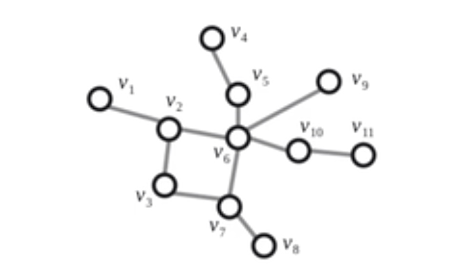
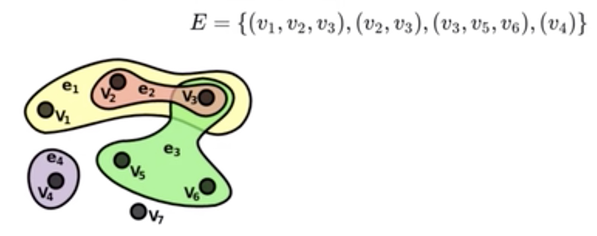
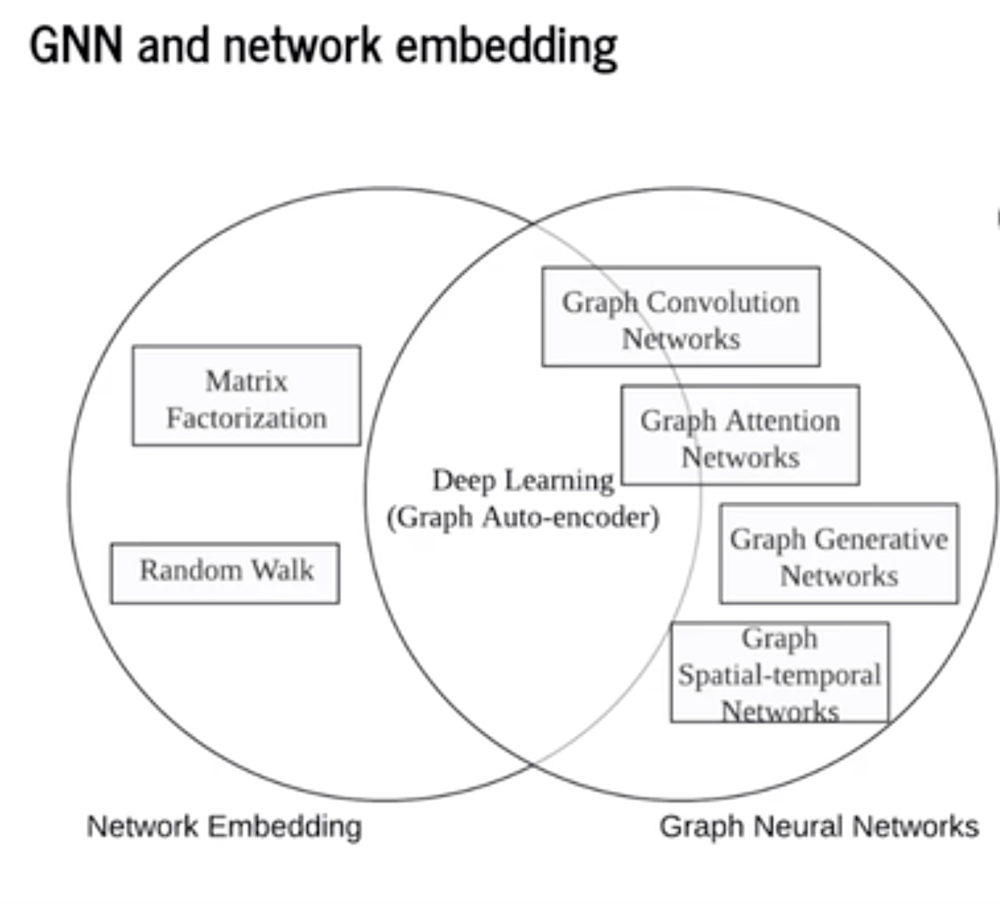
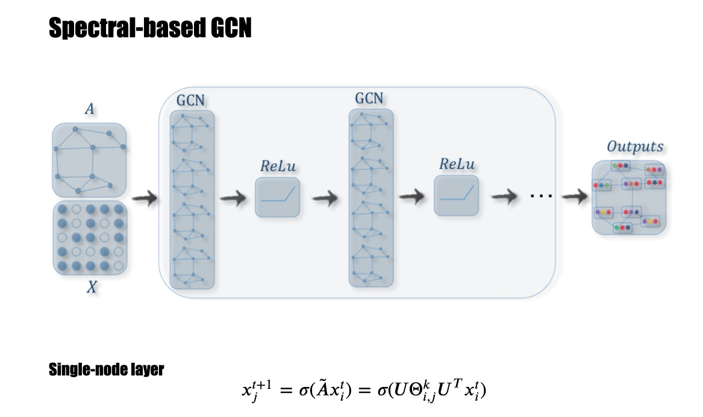
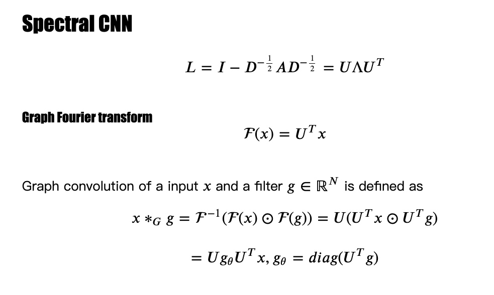
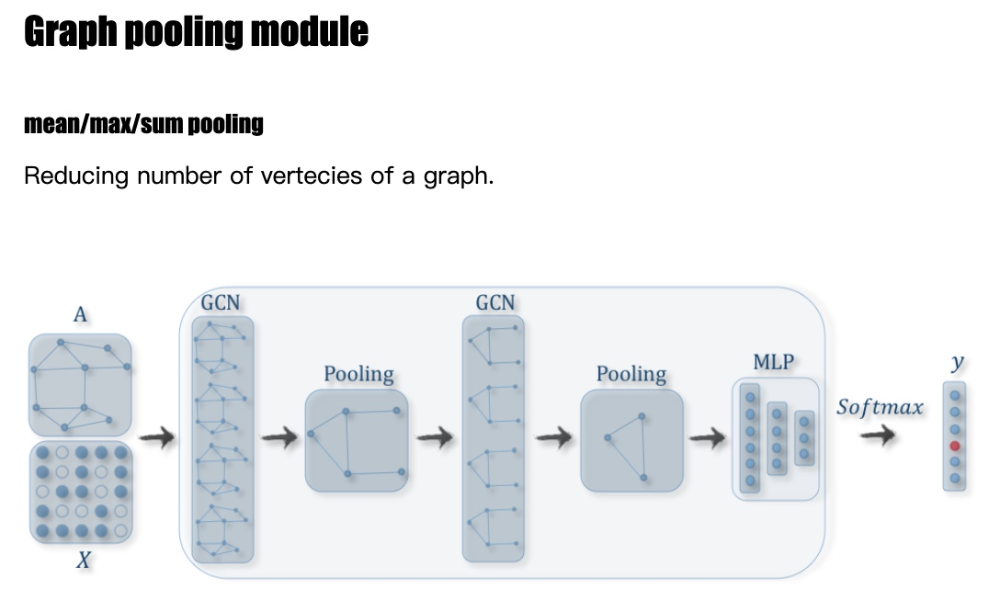
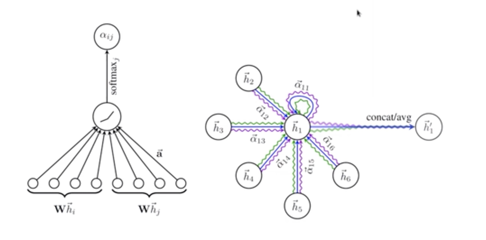
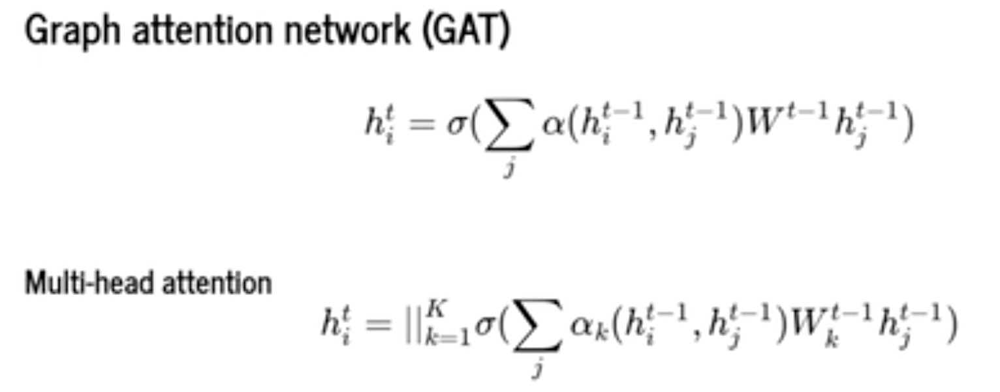
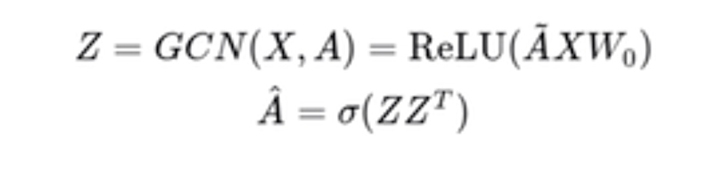
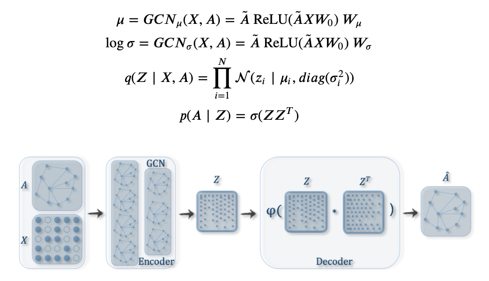

# GNN 简介和入门资料
### 概念
G=(V,E)
V={v1,v2,v3,v4,v5,v6,v7,v8,v9,v10,v11}
E={(v1,v2),(v2,v3),(v2,v6),(v3,v7)...}
|V|=11
|E|=11

Walk: close walk x=y otherwise open walk
Trail: x - y trail is a walk with no repeated edge，没有重复走边
Path: x - y path is a walk with no repeated Vertex,没有走重复的点
Cycle: x - x path is a cycle
Circuit: x - x trail is a circuit
Degree:点有多少个边连出去，度

Regular graph：每个点有相同的度
Complete graph:图像任意两个点都有边
Simple graph:一个图没有self-loop的点
Multigraph: A graph with multiple edges
Pseudograph:有self-loop也有multiple edges

Hypergraph: Allow an edge connected to multiple vertcies

####三类任务：
    1 节点层面任务：比如文章最开始提到的引文网络中，节点论文的分类，社交网络中用户标签的分类等。此时，主要关注节点和边层面的特征。
    2 边层面任务：比如社交网络中，将用户作为节点，用户之间的关注关系建模为边，通过边预测实现社交用户的推荐。此时，主要关注节点和边的特征。
    3 图层面的任务：比如对药物分子的分类。此时，任务不依赖于某个节点或某条边的属性，而是，需要考虑整个图的信息。

####图嵌入、图神经网络、图卷积的关系:
查看图神经网络的资料，最常见图嵌入（Graph Embedding）、图神经网络（GNN）、图卷积（GCN）这三个词，同时，也很容易迷惑：到底这三个说的是三个东西还是一个东西？大家平时说的图网络指的是哪一个？这三个有什么联系？图神经网络是一个很宽泛的概念，图神经网络=图+神经网络。我们通俗讲的图神经网络主要指GNN和GCN（类似于深度学习网络中的前馈全连接DNN和CNN）。
####图嵌入发展较早，在早期是一个相对独立的领域，关注的问题大致分为4类：
1、节点分类
2、链接预测
3、聚类
4、可视化
    
    
####方法主要分为三类：
基于因子分解的方法
基于随机游走的方法
基于深度学习的方法

####GNN的分类：
Graph convolution networks 
Graph attention networks
Graph autoencoders
Graph generative networks
Graph spatial-temporal networks

####GCN分类：
Spectral-based GCN————基于频谱域的GCN
Spatial-based GCN————基于空域的GCN

       x是feature
       把A做特征分解

先拉普拉斯在做特征分解
傅里叶变换 
ChebNet MPNN

节点并缩

####GAT (Graph attention networks)

attention：key和一个query 比较和哪些key相似，得到一个weight
拿中间的点当query---i 和周围的key---j比较
比较像的话α就比较大

transformer --- Multi-head attention

####Graph autoencoder(GAE)

####Variational graph autoencoder(VGAE)

##CVPR/KDD/ECCV/ICML2020的关于图卷积网络的论文：
`[CVPR 2020] Point-GNN: Graph Neural Network for 3D Object Detection in a Point Cloud
[CVPR 2020] Geometrically Principled Connections in Graph Neural Networks [CVPR 2020] SuperGlue: Learning Feature Matching With Graph Neural Networks
[CVPR 2020] Learning Multi-View Camera Relocalization With Graph Neural Networks
[CVPR 2020] Multi-Modal Graph Neural Network for Joint Reasoning on Vision and Scene Text
[CVPR 2020] Social-STGCNN: A Social Spatio-Temporal Graph Convolutional Neural Network for Human Trajectory
[CVPR 2020] Dynamic Multiscale Graph Neural Networks for 3D Skeleton Based Human Motion Prediction
[CVPR 2020] Dynamic Graph Message Passing Networks
[ECCV 2020] Graph convolutional networks for learning with few clean and many noisy labels
[ICML 2020] When Spectral Domain Meets Spatial Domain in Graph Neural Networks
[KDD 2020] Graph Structural-topic Neural Network
[KDD 2020] Towards Deeper Graph Neural Networks
[KDD 2020] Redundancy-Free Computation for Graph Neural Networks
[KDD 2020] TinyGNN: Learning Efficient Graph Neural Networks
[KDD 2020] PolicyGNN: Aggregation Optimization for Graph Neural Networks [KDD 2020] Residual Correlation in Graph Neural Network Regression
[KDD 2020] Spotlight: Non-IID Graph Neural Networks
[KDD 2020] XGNN: Towards Model-Level Explanations of Graph Neural Networks
[KDD 2020] Dynamic Heterogeneous Graph Neural Network for Real-time Event Prediction
[KDD 2020] Handling Information Loss of Graph Neural Networks for Session-based Recommendation
[KDD 2020] Connecting the Dots: Multivariate Time Series Forecasting with Graph Neural Networks
[KDD 2020] GPT-GNN: Generative Pre-Training of Graph Neural Networks
[KDD 2020] Graph Structure Learning for Robust Graph Neural Networks
[KDD 2020] Minimal Variance Sampling with Provable Guarantees for Fast Training of Graph Neural Networks
[KDD 2020] A Framework for Recommending Accurate and Diverse Items Using Bayesian Graph Convolutional Neural Networks
[KDD 2020] Competitive Analysis for Points of Interest
[KDD 2020] Knowing your FATE: Explanations for User Engagement Prediction on Social Apps
[KDD 2020] GHashing: Semantic Graph Hashing for Approximate Similarity Search in Graph Databases
[KDD 2020] Comprehensive Information Integration Modeling Framework for Video Titling`

####相关paper
1.A Comprehensive Survey on Graph Neural Networks
2.Relational inductive biases, deep learning, and graph networks
3.Geometric deep learning: going beyond Euclidean data
4.The Graph Neural Network Model
5.Variational Graph Auto-encoders
6.Neural Message Passing for Quantum Chemistry
7.DIFFUSION CONVOLUTIONAL RECURRENT NEURAL NETWORK: DATA  DRIVEN TRAFFIC FORECASTING
8.GRAPH ATTENTION NETWORKS
9.MOLGAN: An implicit generative model for small molecular graphs

论文综述目前较推荐的有这三篇：
[《Graph Neural Networks: A Review of Methods and Applications》](https://arxiv.org/pdf/1812.08434.pdf)
[《Deep Learning on Graphs: A Survey》](https://arxiv.org/pdf/1812.04202.pdf)
[《A Comprehensive Survey on Graph Neural Networks》](https://arxiv.org/pdf/1812.08434.pdf)
机器之心对这三篇综述还有专门的报道，[《图神经网络概述第三弹：来自IEEE Fellow的GNN综述》](https://zhuanlan.zhihu.com/p/54241746)
[北师大的集智学园](https://space.bilibili.com/238664541?spm_id_from=333.788.b_765f7570696e666f.2)
[中科院的人工智能前沿讲习](https://space.bilibili.com/388690539?spm_id_from=333.788.b_765f7570696e666f.2)
这两个主页上有不少图网络相关的视频，视频质量也不错。

参考文献
[《图嵌入（Graph embedding）综述》](https://zhuanlan.zhihu.com/p/62629465)
[《【论文笔记】DeepWalk》](https://zhuanlan.zhihu.com/p/45167021)
[《The Graph Neural Network Model》](https://repository.hkbu.edu.hk/cgi/viewcontent.cgi?article=1000&context=vprd_ja)
[《GNN 简介和入门资料》](https://zhuanlan.zhihu.com/p/58792104)
[《Learning Convolutional Neural Networks for Graphs》](http://proceedings.mlr.press/v48/niepert16.pdf)
[《Learning Convolutional Neural Networks for Graphs-PPT》](http://www.matlog.net/icml2016_slides.pdf)
[《论文笔记：Learning Convolutional Neural Networks for Graphs》](https://zhuanlan.zhihu.com/p/27587371)
[《Semi-Supervised Classification with Graph Convolutional Networks》](https://arxiv.org/pdf/1609.02907.pdf)
[《Semi-Supervised Classification with Graph Convolutional Networks阅读笔记》](https://zhuanlan.zhihu.com/p/31067515)
[《Abusive Language Detection with Graph Convolutional Networks》](https://arxiv.org/pdf/1904.04073.pdf)
[《Spam Review Detection with Graph Convolutional Networks》](https://arxiv.org/pdf/1908.10679.pdf)
[《Graph Neural Networks: A Review of Methods and Applications》](https://arxiv.org/pdf/1812.08434.pdf)
[《Deep Learning on Graphs: A Survey》](https://arxiv.org/pdf/1812.04202.pdf)
[《A Comprehensive Survey on Graph Neural Networks》](https://arxiv.org/pdf/1901.00596.pdf)
[图神经网络概述第三弹：来自IEEE Fellow的GNN综述》](https://zhuanlan.zhihu.com/p/54241746)
哔哩哔哩上有视频
[《唐杰-图神经网络及认知推理-图神经网络学习班》](https://www.bilibili.com/video/av77934956?from=search&seid=6134263793308325331)
[《图神经网络介绍-Introduction to GNN》](https://www.bilibili.com/video/BV1At411N7nh?from=search&seid=4990552951920070863)