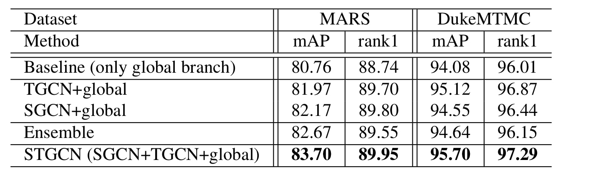

Spatial-Temporal Graph Convolutional Network for Video-based Person Re-identification(CVPR2020)
===============================================================================================
[TOC]
行人重识别
----------

行人重识别（Person
Re-identification），简称为ReID，是利用计算机视觉技术判断图像或者视频序列中是否存在特定行人的技术。广泛被认为是一个图像检索的子问题。给定一个监控行人图像，检索跨设备下的该行人图像。

方法分为以下几类： 
- 基于表征学习的ReID方法 
- 基于度量学习的ReID方法 
- 基于局部特征的ReID方法 
- 基于视频序列的ReID方法 
- 基于GAN造图的ReID方法

本文基于视频序列的ReID方法
--------------------------

通常单帧图像的信息是有限的，因此有很多工作集中在利用视频序列来进行行人重识别方法的研究（本篇论文就是）。基于视频序列的方法最主要的不同点就是这类方法不仅考虑了图像的内容信息，还考虑了帧与帧之间的运动信息等。

### CNN&RNN

利用CNN来提取图像的空间特征，而基于视频序列的方法主要思想是利用CNN
来提取空间特征的同时利用RNN来提取时序特征。

RNN在Re-ID任务中对时间信息的建模效果有限，或者由于其复杂的结构而难以训练。

### AMOC

累计运动背景网络(Accumulative motion context network,
AMOC)。AMOC输入的包括原始的图像序列和提取的光流序列。通常提取光流信息需要用到传统的光流提取算法，但是这些算法计算耗时，并且无法与深度学习网络兼容。

光流法是非常耗时的，并且光流对于遮挡和噪声来说不够健壮。

### temporal pooling & spatial-temporal attenttion

论文：这些方法没有充分考虑人体各部分在不同帧之间的时间关系，效果有限。

### 瓶颈问题

方向的存在挑战： 
- 不同下摄像头造成行人外观的巨大变化； 
- 目标遮挡（Occlusion）导致部分特征丢失； 
- 不同的 View Illumination导致同一目标的特征差异； 
- 不同目标衣服颜色近似、特征近似导致区分度下降；

论文解决挑战：
1.仅使用外观特征不足以区分，但它们的身体结构信息是不同的。利用序列中各部分之间的时空关系可以缓解这些问题。

2.当边界框不完美，或者存在噪声或遮挡时，基于外观的要素可能效果较差，并且基于图像的re-ID在这种情况下可能不能很好地工作。

论文方法解决：显式地利用不同帧之间补丁的时间关系，以缓解遮挡和不对准问题。
具体地说，通过连接不同帧的所有块来构建图来建模时间关系，目的是提供不同块之间的互补信息，从而缓解拥塞和错位问题。另一方面，我们还考虑了帧内的结构信息，通过为视频中的每一帧构造补丁图来提供互补的外观信息。

3.基于图像的识别最具挑战性的难点之一是如何区分视觉上相似的身份，而大多数基于图像的方法只能依赖于提取细粒度的外观特征。

在基于视频的人Re-ID中，相同身份的结构信息(例如形状信息)将更加完整和精确，因为每个视频具有许多帧，这些帧可能覆盖更多的视图和姿势。Structural
GCN Module

### Spatial-Temporal Graph Convolutional Network

《Person re-identification with deep similarity-guided graph neural
network》2018 《Learning context graph for person search》2019 《Videos
as space-time region graphs》2018 --- 视频分类

论文：它们忽略了帧内或帧间不同身体部位之间的关系，是基于图像的，不考虑时间关系。

《Adaptive graph representation learning for video person
re-identification》2019---------引入图神经网络，利用姿态对齐连接和特征相似性连接实现相关区域特征之间的上下文交互。此外，该方法连接了所有帧的不同部分的特征，不对每帧身体部分的空间关系进行建模，忽略了帧内的结构信息。

创新点、贡献
------------

（1）利用GCN来模拟人体不同部位在一帧内和帧间的潜在关系，为人们提供更具鉴别力和鲁棒性的信息
（2）提出了时空GCN框架来联合建模视频层的整体斑块关系和帧级的单个帧的结构信息，该框架可以学习斑块之间的区分和鲁棒的时空关系，从而促进基于视频的Re-ID。

模型设计
--------

设计了3个分支 
- 上部分支是用于从相邻帧上的斑块中提取时间线索的时间分支 
- 中间分支是通过对空间关系建模来提取人体结构信息的空间分支 
- 底层分支是提取行人外观特征的全局分支。

-   首先把每一帧放到CNN中，得到Fi ∈ Rh×w×c，F ={F1,F2,...,FT}，T为帧数。
-   再把没个feature map Fi水平切分成P个patch，pi = 1,...,N。
-   patch数量N为T\*P，把每个P做平均池化后得到patch特征向量为xi ∈ Rc, i =
    1,...,N.

用GCN去学习patches之间的关系。 G(V,E)有N个节点，vi ∈ V,eij = (vi,vj) ∈
E. 每个patches就是图中的节点，边e代表他们之间的关系。 A ∈ RN×N
是这个图的邻接矩阵。 

这个式子，表示两个patch的关系，φ表示原始面要素的对称变换，φ =
wx。w是可通过反向传播学习的d×d维权重。
这个变换的意义是：它允许我们自适应地选择和学习帧内或跨不同帧的不同补丁的相关性，结合其他节点的信息。

归一化 神经网络一般对输入数据的规模很敏感。
对于亲和力矩阵的每一行，所有边值(即连接到面片i的边)的总和应为1。
邻接矩阵的每个元素都应该是非负的，系数应该在(0，1)的范围内。

接着给邻接矩阵加上单位矩阵

这么做是因为将来GCN拿邻接矩阵A和权重相乘，意味着对于每个节点，我们把这个节点的所有邻接节点的feature向量加了起来，但没有加自己这个点。
之后，使用re-normalization技巧来近似图-拉普拉斯：

邻接矩阵乘以度矩阵减小数据规模，度矩阵也反应了一些节点信息。 
####Temporal branch
作用：使用不同帧的所有补丁来构建图，其目的是捕捉跨帧的补丁之间的互补信息。
方法：使用GCN捕获pathches时域关系，构建M层GCN

Xm是第m层隐层特征，X0是通过CNN获得的特征patch。 Wm是被学习的参数矩阵。
每层图卷积后跟一个nomalization层用和LeakyRelu
 最后使用Max
pooling作用于Xm 最后得到 ft ∈ R1×dm 是时域GCN特征，dm设置为2048

#### Structural GCN Module(spatial relations branch)

作用：提供额外的辨别性信息，以加强重新识别系统。
方法：使用GCN捕获不同patch的空间关系。然后，对视频中各帧的GCN特征进行融合，得到视频中的内在结构特征。
Gis (Vis , Eis ), Vis = {xi,1 , xi,2 , . . . , xi,P }
下标i表示第i帧，并且每个帧被分成P个patch

独立地利用每一帧的块之间的关系来捕获视频序列中的结构信息。我们将GCNs的所有输出特征聚合在一起，形成视频的结构特征。

邻接矩阵公式和上面介绍的一样。k为第i帧上的第k层图卷积。 Wik ∈ Rdk ×dk
输出的经过Max pooling降维后的特征矩阵为：XiK ∈ RP ×256
最后，将视频的特征连接起来，最后的特征表示为fs。

####Global branch
全局分支提取每个视频的全局外观特征。

####loss function 
batch hard triplet和softmax cross-entropy Ltriplet
and Lsoftmax 
#####Triplet loss 
Triplet loss学到的是一个好的embedding，相似的图像在embedding空间里是相近的，可以判断是否是同一个人脸。\[3\]

Triplet loos 需要三份数据(可以从一个batch中选择):Anchor、Positive、Positive
- 其中Anchor表示当前数据，Positive是跟A相同人的数据，Positive是不同人的数据。
- 当前向量、同一人不同向量、不同人不同向量
- 将一个图像经过特征提取后是一个向量，让这个向量和postive更近更好，让这个向量和negative越远越好。

目的：让A和P非常接近，A与N尽可能远离
公式：$\lVert f(A)-f(P)\rVert^2 \le \lVert f(A)-f(N)\rVert^2 $ 其中f表示通过网络进行编码。
是否会存在问题？如果f把所有的输入都编码成0，依然成立。
那么，这个目标就改为:$\lVert f(A)-f(P)\rVert^2 - \lVert f(A)-f(N)\rVert^2 + a \le 0$ 
其中a是margin间隔，表示d(A,P)和d(A,N)相差多少。

同类之间的距离至少要比不同类距离要少多少。
Triplet loss:
$$
    \begin{equation}\begin{split} 
    L(A,P,N) = max(\lVert f(A)-f(P)\rVert^2-\lVert f(A)-f(N)\rVert^2 +a,0)
    \end{split}\end{equation}
$$
但是对于约束条件:$d(A,P)+a \le d(A,N)$ 理论上都是A与P很近，A与N较远。
实际中用的最多的是hard negative方法，也就是在选择样本的时候，让$d(A,P)\approx d(A,N)$ 这样给网络一些挑战，才能激励它学习。
- 在同一个人P的特征中找最不像的距离最大的P。
- 在不同人N的特征中找最像的距离最小的N。

 

论文在三个分支上分别计算loss加在一起。

三个分支输出的特征 fglobal , ft, fs。 fall = \[fglobal, ft, fs\]
把fall放到softmax cross-entropy loss

实验
----

###数据集 
DukeMTMC-VideoReID和MARS，是两个行人重识别的数据集。 
- MARS有1261个身份id，的17503个tracklet和3,248个distractor序列。 
- DukeMTMC-VideoReID 有1812个身份id，4832个tracklets

评估协议：累积匹配特性曲线（CMC）和平均精度（map）来评价提出的模型的性能。

###细节(复现用)
CNN模型用的是在imagenet预训练后的ResNet50，并且最后一层必输设为1。
采用受限随机采样策略从每个视频中随机采样T=8帧。
把图片resize为256x128并且随机水平翻转。 模型训练800轮。
初始化学习率为0.0003，每200轮缩小十倍
Adam优化器、16个身份为一个batch每个身份有四个追踪器tracklet,16 × 4 × 8 =
512 images。

TGCN有3层、SGCN有2层 把每个feature map水平切分的P为4

为什么SGCN、TGCN选P=4 当Patch的数量太多时，Patch太小包含不了足够的信息。
相反，当Patch的数量太少时，Patch可能会忽略细微但有区别的线索。

###代码

###性能对比

#### 纵向对比其他模型性能

现有的基于注意力的方法(包括STA、GLTR)独立地处理不同区域和帧，并且它们没有充分考虑补丁之间的内在关系。
M3D,3D卷积运算计算量大，并且对空间不对准很敏感。 Wu et
al. 对比这个图方法的模型，在两个数据集都优于他。

####向内对比，三分支搭配性能

提出的方法综合考虑了人体不同部位在同一帧内和不同帧之间的潜在关系，可以提供更具区分性和鲁棒性的信息，并且能够进行端到端的训练。这些实验结果验证了该方法的优越性。

主要创新点：考虑了人体不同部位在同一帧内和不同帧之间的潜在关系。

####向内对比，替换GCN为全连接层性能
 证明了图卷积的必要性。

结论
----

1.利用斑块间的时间关系缓解遮挡问题，利用斑块间的空间关系区分外观相似的歧义样本的有效性。
2.提出STGCN模型
SGCN:空间分支通过建模各帧面片之间的关系来学习人体的结构信息。
TGCN:时态分支通过对不同帧之间的斑块的时态关系进行建模，可以缓解遮挡问题。

未来方向，问题
--------------

加深层数会使模型效果不好，两层图卷积叫深度？浅层GCN不能有效地将节点信息传播到整个数据图。这个是GCN的过平滑的通病，还没有解决这个问题。

如下图表现的一样。 

我个人觉得这篇论文，在GCN的结构上是可以改进的。是不是可以考虑残差思想来改进GCN网络结构，或者引入其他结构来优化？
而且论文代码暂时未开放，模型的复杂度到底如何，还需进一步看看。

##参考文献
[1][基于深度学习的行人重识别研究综述](https://zhuanlan.zhihu.com/p/31921944)
[2][基于深度学习的person re-identification综述 Deep Learning for
Person Re-identification: A Survey and
Outlook](https://blog.csdn.net/rytyy/article/details/105232594)
[3][Triplet-Loss原理及其实现、应用](https://blog.csdn.net/u013082989/article/details/83537370)
[4][如何通俗的解释交叉熵与相对熵?](https://www.zhihu.com/question/41252833)
[5][卷积神经网络系列之softmax，softmax loss和cross
entropy的讲解](https://blog.csdn.net/u014380165/article/details/77284921)
[6][卷积神经网络系列之softmax
loss对输入的求导推导](https://blog.csdn.net/u014380165/article/details/79632950)
[7][中山大学提出行人重识别新方法和史上最大数据集SYSU-30k，已开源！](https://zhuanlan.zhihu.com/p/329077441)
[8][基于视频的行人再识别（1）：从认识Mars数据集开始](https://blog.csdn.net/qq_34132310/article/details/83869605)

[CVPR 2020 | 旷视研究院提出新方法，优化解决遮挡行人重识别问题](https://mp.weixin.qq.com/s/EhAeaA68Ek27EptkTfZiBQ)
[目标检测中mAP的计算方法](https://zhuanlan.zhihu.com/p/94597205)
[视觉算法的工业部署及落地方面的技术知识，怎么学？](https://www.zhihu.com/question/428800593)
