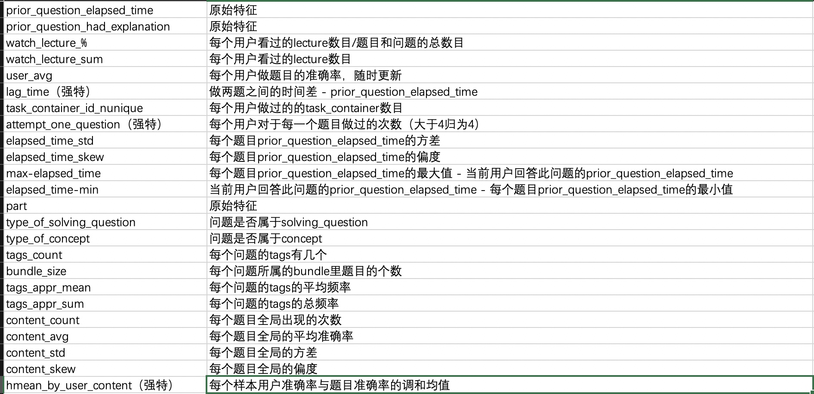
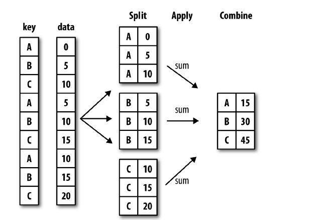

# Kaggle赛题:Riiid! Answer Correctness Prediction
##评估指标
根据预测概率和观测目标之间的ROC曲线下的面积进行的。

## 字段解释
用户表：train

| 字段 | 数据类型 | 解释
| :--- | :--- | :--- |
|row_id|int64|行的ID代码|
|timestamp|int64|从该用户交互到该用户第一次事件完成之间的时间（以毫秒为单位）。|
|user_id|int32|用户的ID代码。
|content_id|int16|用户交互的ID代码 问题id (问题表相关)|
|content_type_id| int8 |如果事件是向用户提出的问题，则为0；如果事件是用户看讲座，则为1。(区分问题和讲座)
|task_container_id|int16|这批问题或讲座的ID代码。例如，用户可能会先看到三个问题，然后再查看其中任何一个的解释。这三个都将共享一个task_container_id。
|user_answer|int8|用户对问题的答案（如果有）。将-1读为null，以进行讲座。(问题表相关)
|answered_correctly|int8|用户是否正确响应。将-1读为null，以进行讲座。可当label(可做标签)
|prior_question_elapsed_time|float32|用户回答上一个问题包中的每个问题(忽略其间的任何讲座)的平均时间(以毫秒为单位)。对于用户的第一个问题包或讲座，为NULL。请注意，该时间是用户解决上一个捆绑包中的每个问题所用的平均时间。(问题表相关)
|prior_question_had_explanation|bool|用户在回答上一个问题包(忽略其间的任何讲座)后是否看到了解释和正确的回答。该值在单个问题包中共享，并且对于用户的第一个问题包或讲座为空。通常情况下，用户看到的前几个问题是入职诊断测试的一部分，在那里他们没有得到任何反馈。(问题相关)


问题表：questions

| 字段 | 数据类型 | 解释
| :--- | :--- | :--- |
|question_id|int16|content_type_id==0时，train和test的content_id列的外键。|
|bundle_id|int16|问题一起发送的代码。类别变量|
|correct_answer|int32|问题的答案。可以与train user_answer列进行比较，以检查用户是否正确。
|part|int8|问题属于哪个组 哪类问题|
|tags| str |问题的一个或多个详细标签代码。不会提供标签的含义，但是这些代码足以将问题聚在一起。  （可以切开做一百多个特征）

讲座表：lectures

| 字段 | 数据类型 | 解释
| :--- | :--- | :--- |
|lecture_id|int16|content_type_id==1时，train和test的content_id列的外键。|
|part|int8|讲座的顶级类别代码。
|tag |int16|一个用于演讲的标签代码。不会提供标签的含义，但是这些代码足以将讲座聚在一起。
|type_of|str|要介绍讲座的核心目的 解决问题类型|


## 提取特征


## 技巧学习总结
1.读取近一亿条数据，pandas比较低效，可选用cuDF或者datatable等，读取更快。注意:datatable目前不支持Windows，cuDF要看cuda版本。

```
iread
(anysource=None, *, file=None, text=None, cmd=None, url=None, columns=None, sep=None, dec=".", max_nrows=None, header=None, na_strings=None, verbose=False, fill=False, encoding=None, skip_to_string=None, skip_to_line=None, skip_blank_lines=False, strip_whitespace=True, quotechar='"', tempdir=None, nthreads=None, logger=None, errors="warn", memory_limit=None)

```
2.因为riid的RAM限制为16G,看大家把.csv文件换成序列化可以节省读取时间和RAM消耗。

    将创建的格式包括：
- Pickle--非常适合对象序列化，虽然与其他格式相比，它的性能较慢，但它可能适用于我们的porpuse。
- Feather--是一种快速、轻量级、易于使用的二进制文件格式，用于存储数据帧。
- Parquet—-与传统的以行为导向存储数据的方法相比，Parquet在存储和性能方面更为高效。
- Jay—-也是一种二进制格式，这意味着它是一种快速、轻量级、易于使用的二进制文件格式，用于存储数据帧。
```python
    #CSV: 1min 42s
    #Pickle: 4.45s
    #Feather: 4.35s
    #Parquet: 8.31s
    #Jay: 8.12ms or 0.0812s (blazing fast!)

    # writing dataset as pickle
    train.to_pickle("jane_street_train.pkl.gzip")
    
    # writing dataset as feather
    train.to_feather("jane_street_train.feather")
    
    # writing dataset as parquet
    train.to_parquet("jane_street_train.parquet")
    
    # writing dataset as jay
    dt.Frame(train).to_jay("jane_street_train.jay")
    
    # writing dataset as hdf5
    train.to_hdf("jane_street_train.h5", "jane_street_train")
```

3.内存管理
- 内存追踪
Tracker帮助我们找出对象的内存使用情况。我们可以使用下面的代码使用排序来查找前10个对象。

```python
from operator import itemgetter
from pympler import tracker
    
mem = tracker.SummaryTracker()
print(sorted(mem.create_summary(), reverse=True, key=itemgetter(2))[:10])
```
4.groupby穿越问题 https://www.kaggle.com/c/riiid-test-answer-prediction/discussion/189437
- 如果计算每个user_id的平均回答正确数，那么将把将来的信息泄露到您的平均值中。这将使的模型过于自信，这将对测试集不利。
- 应该在每个用户的基础上预先标记一个按时间顺序与您的培训集分开的验证集。也就是说。对于任何给定用户，列车集合中的最高时间戳小于VAL集合中的最低时间戳。加上 验证集没有新用户 线上分数就会降下来


    
## 方法学习总结
###数据清洗方法
1、解决缺失值：平均值、最大值、最小值或更为复杂的概率估计代替缺失的值
2、去重：相等的记录合为一条记录(即合并/清除)
3、解决错误值：用统计分析的方法识别可能的错误值或异常值，如偏差分析、识别不遵守分布或回归方程的值，也可以用简单规则库（常识性规则、业务特定规则等检数据值，或使用不同属性间的约束、外部的数据来检测和清理数据
4、解决数据的不一致性：比如数据是类别型或者次序型

###数据清洗八大场景
1、删除多列 
2、更改数据类型
3、将分类变量转换为数字变量 
4、检查缺失数据 
5、删除列中的字符串 
6、删除列中的空格
7、用字符串连接两列（带条件）
8、转换时间戳（从字符串到日期时间格式）


## 参考
好文：
https://zhuanlan.zhihu.com/p/104254984 luke
https://zhuanlan.zhihu.com/p/64400152 凯菜 petfinder
https://mp.weixin.qq.com/s/bK6U7NQUa1c1yPZBkGNsCg Kaggle宠物收养比赛亚军复盘
https://mp.weixin.qq.com/s/qqY9HuYew3ivpkJRS3GKHw 康兵兵 nlp入门之路

[浅谈机器学习评估中的穿越问题](https://blog.csdn.net/phrmgb/article/details/79997057)
[媲美Pandas？Python的Datatable包怎么用？](https://blog.csdn.net/weixin_42232219/article/details/92825468)
[盘点数据挖掘竞赛中的泄露（Leak）](https://mp.weixin.qq.com/s/19vwPoDSh1vI5lp5ZjjEqg)
[浅谈机器学习评估中的穿越问题](https://blog.csdn.net/phrmgb/article/details/79997057)
[Python机器学习：GroupBy 和 Shift实现 Pandas分组错位](https://blog.csdn.net/hawkman/article/details/103909704)
[Pandas数据处理三板斧——map、apply、applymap详解](https://zhuanlan.zhihu.com/p/100064394?utm_source=wechat_session)

[Kaggle TensorFlow 2.0 Question Answering 21名复盘总结](https://zhuanlan.zhihu.com/p/104254984)
[Kaggle-PetFinder Competition Top2%方案总结](https://zhuanlan.zhihu.com/p/64400152)



groupby后可以应用agg或apply的函数

|函数|	解释|
| :--- | :--- |
|max|	最大值
|min|	最小值
|mean	|平均值
|count|计数(不包含空值)
|describe|统计信息(max,min,mean,count同时显示)
|size	|行数，即包含空值得count，类似于SQL里面的count(*)
|last	|最后一行，就是排序后取最后一个，如果是数值排序,就是最小值,注意不包含NA值
|first|第一行，就是排序后取第一个，如果是数值排序,就是最大值,不包含NA值
|nth(0)/nth(1)/nth(3)|	取第n大的行(数)，如果是数值，就是取第1大/2大/3大的数值,不包含NA值
|head(1)/head(2)	|取前n行，如果是数值就是取前1/2大的数,不包含NA值
|nlargest	|和head()一样，取前几个最大的数,不包含NA值
|sum	|求和
|median	|中位数
|std|	标准差
|var	|方差
|prod	|内积，即连乘，所有数连乘
|shift|	移位，时间序列中常用，就是把shift(1)整体数据往下移一行，shift(-1)上移一行
|diff	|做差，diff(1)做一阶差，diff(2)做2阶差
|rank|	排序，可以设置rank(method=first，min，max，mean方法)
|nunique	|去重后的个数，即返回唯一值的个数
|len	|等同于size
|mad|	平均绝对偏差
|cumsum	|累计和
|cummax|	到目前为止的最大值
|cummin|	到目前为止的最小值
|quantile	|分位数
|skew	|偏度
|kurt|	峰度

