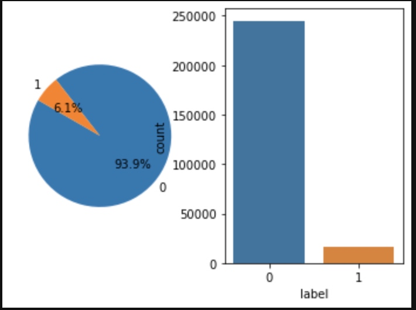
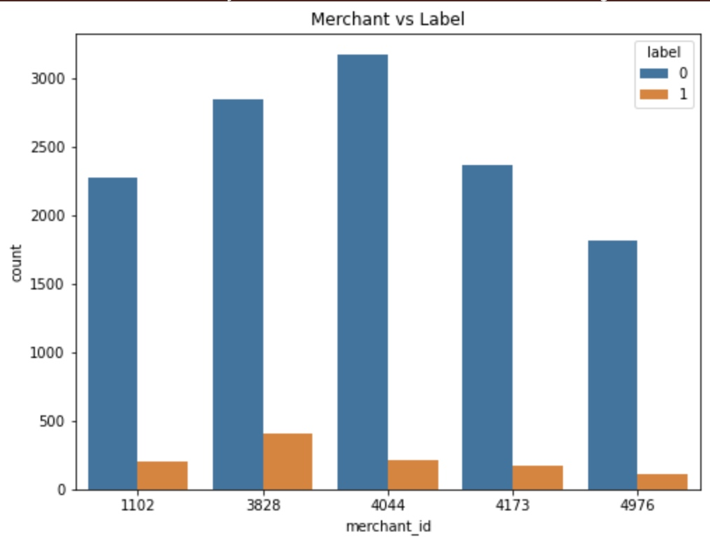
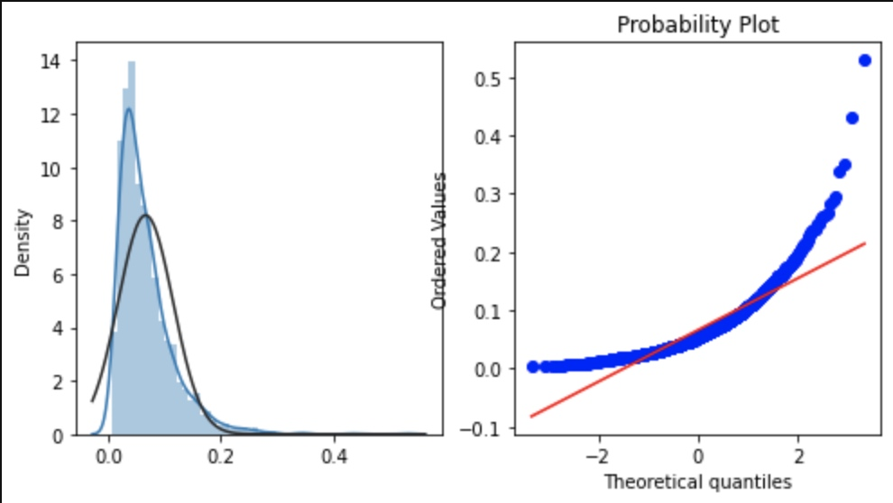
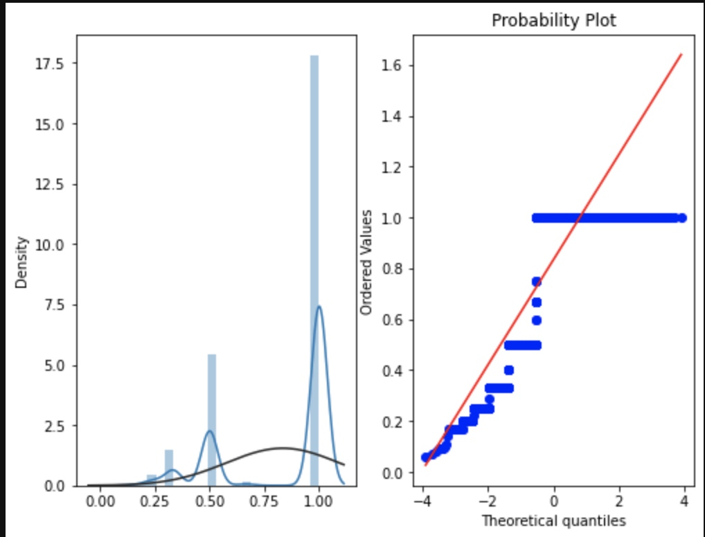
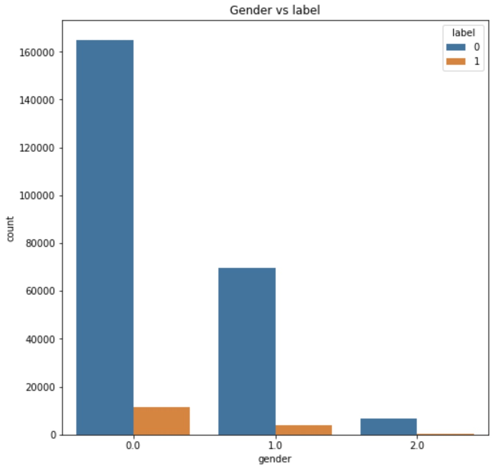
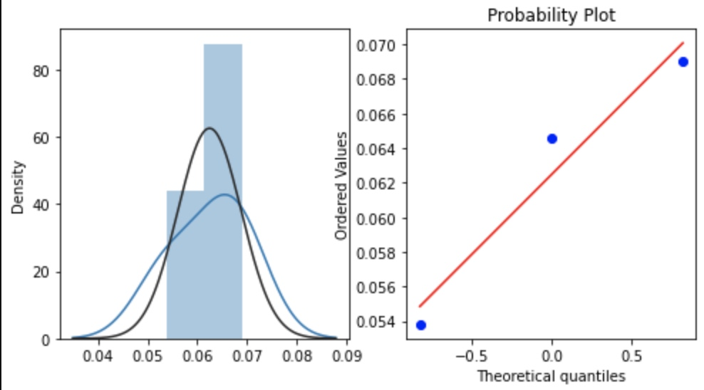
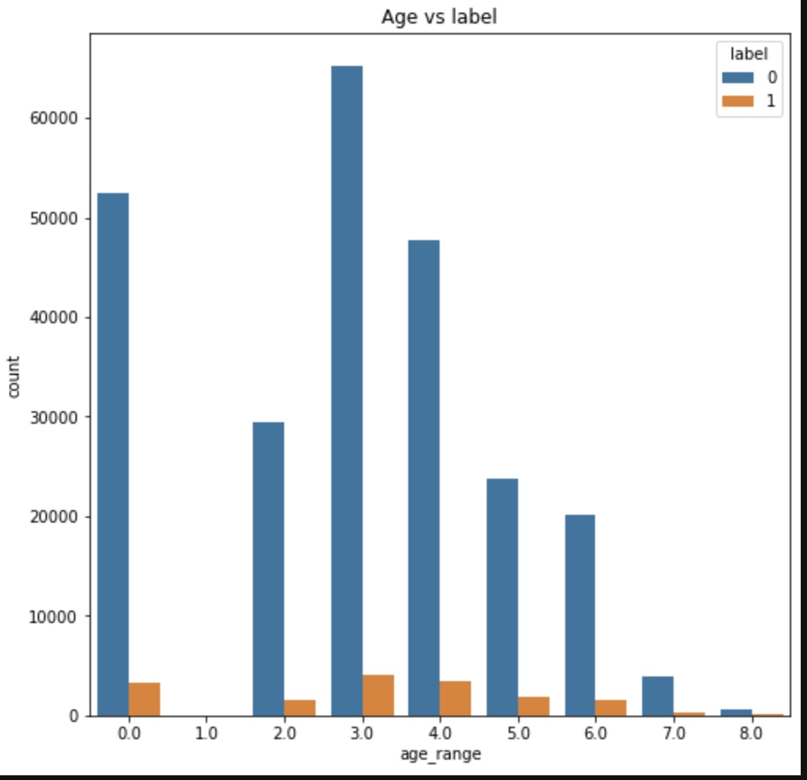
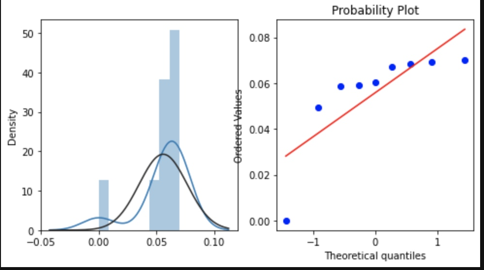
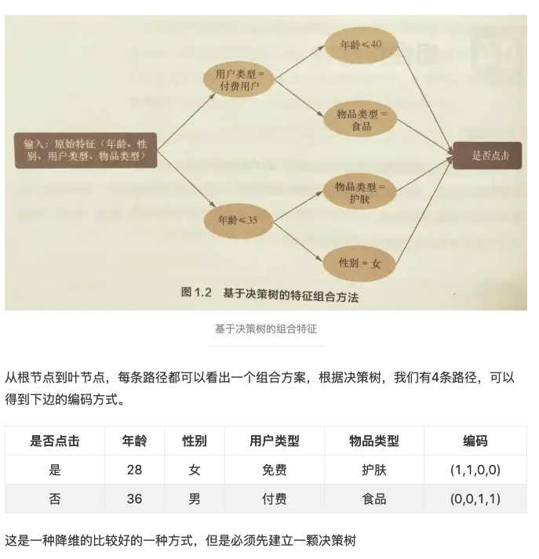

# 天池赛题:天猫重复购学习笔记(我的EDA模板)

字段解释都在:[这里](https://tianchi.aliyun.com/competition/entrance/231576/information)
代码在GitHub:[这里](https://github.com/Coding-Zuo/DataGame/tree/main/tianchi/%E5%A4%A9%E7%8C%AB%E7%94%A8%E6%88%B7%E9%87%8D%E5%A4%8D%E8%B4%AD)
- 复购率 = 重复购买用户数量/用户样本数量
- 复购率 = 重复购买行为次数(或 交易次数)/用户样本数量

[TOC]

##EDA步骤

###1.看数据类型、数量、样例
无疑是一些pd.read_csv(_)和data.info()、data.head()。大致看一看
查看是否有单一值变量
```python
#查看训练集测试集中特征属性只有一值的特征
train_one_value = [col for col in train.columns if train[col].nunique() <= 1]
test_one_value = [col for col in test.columns if test[col].nunique() <= 1]
print('one value featrues in train:',train_one_value)
print('one value featrues in test: ',test_one_value)
```

###2.区分类别变量和连续变量
一般类别变量的处理和连续型变量的处理不一样
类别型可能会encode，看一些数量分布。
连续型可能会看一看核分布。
```python
#区分类别特征与连续特征
def split_features(df,colnums,nums=30):
    label_features={}
    continue_features={}
    for key in colnums:
        nunique=df[key].nunique()
        if np.issubdtype(df[key][0],np.int) and nunique<=nums:
            label_features.update({key:nunique})
        elif np.issubdtype(df[key][0],np.float) and nunique<=nums:
            label_features.update({key:nunique})
        else:
            continue_features.update({key:nunique})
    print(label_features)
    #return label_features,continue_features

user_info_colnums=user_info.columns.values
user_log_colnums=user_log.columns.values
train_colnums=train.columns.values
lable_nunique_maxnums=20
print('user_info:')
split_features(user_info,colnums=user_info_colnums,nums=lable_nunique_maxnums)
print('user_log :')
split_features(user_log,colnums=user_log_colnums,nums=lable_nunique_maxnums)
print('train :')
split_features(train,colnums=train_colnums,nums=lable_nunique_maxnums)
```
可知 
user_info:
{'age_range': 9, 'gender': 3}
user_log :
{'action_type': 4}
train :
{'label': 2}

###3.看是否有缺失值

插补方法|说明|优点|缺点|使用环境
| :--- | :--- | :--- |:--- |:--- |
|类均值插补|数值型：均值。<br>非数值型：众数（出现频率最高的值）值比较稳定性；低估资料变异|简单易行：被插补的值比较稳定|不能反映缺失值的变异性；低估资料变异|低缺失率首选
|类随机插补|聚类填充；使用所有可能的值填充；组合完整化方法|能体现数据变异性|依赖于观测值|低缺失率
回归插补|基于完整的数据集，建立回归方程（模型）|方差估计好|稳定性依赖于辅助变量，抽样误差不易控制|变量间的相关性强
Em 插补|通过观测数据的边际分布可以对未知参数进行极大似然估计|利用充分，考虑了缺失值的不确定性|计算复杂|高缺失率
多重插补 MCMC| 估计出持插补的值，然后加上不同的噪声，形成多组可选插补值|利用充分，考虑了缺失值的不确定性|计算复杂|高缺失率首选

```python
# 有时0代表缺失值，对于缺失值严重的一般删除处理
# 缺失值较少一般三种：
#统计量填充：连续值推荐用中位数，离散值：用众数，不能用均值和中位数
#特殊值填充：正常范围内取值
#不处理：xgb、lgb对缺失值不太敏感，算法本身有一套缺失值处理方法
def missing_value_rate(data,col_name):
    rate_list = {}
    for col in col_name:
        rate = (data.shape[0]-data[col].count())/data.shape[0]
#         na_zero_num = data[data[col].isna() | (data[data[col]==0])].count()
        lable_foamt = 'rate:{}'.format(rate)
        rate_list[col]=lable_foamt
    return rate_list
```

```python
print('age_range:',user_info[user_info['age_range'].isna() | (user_info['age_range']==0)].count())
print()
print('gender:',user_info[user_info['gender'].isna() | (user_info['gender']==0)].count())
missing_value_rate(user_info,user_info.columns)
```

###4.观察数据分布、不均衡样本
不均衡样本，可采用
- 随机欠采样
- 随机过采样
- 基于聚类的过采样
- SMOTE算法
- 基于数据清洗的SMOTE

首先describe()看一看。
#### 正负样本分布
```python
label_gp = train.groupby('label')['user_id'].count()
print('正负样本数量:',label_gp)
```

```python
fig = plt.figure()
# 样本分布不均匀 可采用负样本过采样技术，训练多个模型后求平均或者调整模型的损失函数样本比例的权重
ax = plt.subplot(1,2,1)
labels = [0,1]
sizes = [label_gp[0],label_gp[1]]
explode = (0,0)
plt.pie(sizes,explode=explode,labels=labels,autopct='%1.1f%%',shadow=False,startangle=150)

plt.subplot(1,2,2)
sns.countplot(train['label'])
plt.show()  
```

####对店铺的分析
```python
#top5销量店铺
train.merchant_id.value_counts().head()
train_data_merchant = train.copy()
train_data_merchant['TOP5']=train_data_merchant['merchant_id'].map(lambda x:1 if x in [4044,3828,4173,1102,4976] else 0)
train_data_merchant = train_data_merchant[train_data_merchant['TOP5']==1]
plt.figure(figsize=(8,6))
plt.title('Merchant vs Label')
sax = sns.countplot('merchant_id',hue='label',data=train_data_merchant)
```
对比一下top5店铺回购的比例，可看出不同店铺复购率不同，可能与店铺售卖商品和运营有关。

```python
# 查看店铺的复购分布
merchant_repeat_buy = [rate for rate in train.groupby(['merchant_id'])['label'].mean() if rate<=1 and rate>0]

plt.figure(figsize=(8,4))

import scipy.stats as stats
ax = plt.subplot(1,2,1)
sns.distplot(merchant_repeat_buy,fit=stats.norm)
ax = plt.subplot(1,2,2)
res = stats.probplot(merchant_repeat_buy,plot=plt)
```
不同店铺有不同的复购率，在0到0.3之间。


####对用户方面的分析
通过user_id/age_range/gender等方面
```python
# 对用户分析
user_repeat_buy = [
    rate for rate in train.groupby(['user_id'])['label'].mean()
    if rate <=1 and rate>0
]

plt.figure(figsize=(8,6))
ax = plt.subplot(1,2,1)
sns.distplot(user_repeat_buy,fit=stats.norm)
ax = plt.subplot(1,2,2)
res = stats.probplot(user_repeat_buy,plot=plt)
```
看出进六个月用户复购概率很小，基本为一次买主

```python
# 用户性别分析
train_user_info =train.merge(user_info,on=['user_id'],how='left')

plt.figure(figsize=(8,8))
plt.title('Gender vs label')
ax = sns.countplot('gender',hue='label',data=train_user_info)
for p in ax.patches:
    height = p.get_height()
```

```python
# 不同性别对用户的复购率不同
repeat_buy = [rate for rate in train_user_info.groupby(['gender'])['label'].mean()]

plt.figure(figsize=(8,4))
ax = plt.subplot(1,2,1)
sns.distplot(repeat_buy,fit=stats.norm)

ax = plt.subplot(1,2,2)
res = stats.probplot(repeat_buy,plot=plt) 
```
probplot主要是直观的表示观测与预测值之间的差异。一般我们所取得数量性状数据都为正态分布数据。预测的线是一条从原点出发的45度角的虚线，事件观测值是实心点。
偏离线越大，则两个数据集来自具有不同分布的群体的结论的证据就越大。

```python
# 对用户年龄分析
plt.figure(figsize=(8,8))
plt.title('Age vs label')
ax = sns.countplot('age_range',hue='label',data = train_user_info)
```

```python
# 用户年龄复购的分布
# 不同年龄段对用户的复购率不同
repeat_buy = [rate for rate in train_user_info.groupby(['age_range'])['label'].mean()]

plt.figure(figsize=(8,4))

ax = plt.subplot(1,2,1)
sns.distplot(repeat_buy,fit=stats.norm)
ax = plt.subplot(1,2,2)
res = stats.probplot(repeat_buy,plot=plt)
```


###5.对比训练集和测试集分布
```python

```
###6.探查重要影响因素
```python
colormap = plt.cm.viridis
plt.figure(figsize=(14,12))
plt.title('Pearson Correaltion of Feature',y=1.05,size=15)
sns.heatmap(train_user_info.astype(float).corr(),linewidths=0.1,vmax=1.0,square=True,cmap=colormap,linecolor='white',annot=True)
```

## 特征工程
类别型特征的转换：决策树等少数模型能直接处理字符串形式的输入。
逻辑回归、svm等需类别型特征处理成数值型特征后才能工作。
现在比赛基本上都是lightgbm和xgb这些GDBT比较有优势，所以也不用怎么做。了解一些处理方法。
- 序号编码
- 独热编码
- 二进制编码


### 特征组合
1、离散特征可两两组合成高阶组合特征，高维组合特征处理的目的是提高复杂关系的拟合能力。
如： 语言：中文、英文
    剧集类型：电影电视剧
    可组合成：中文电影、中文电视剧、英文电影、英文电视剧
当引入ID特征时，通常要降维。以推荐为例。通常有：

是否点击|uid=1,item=1|uid=2,item=2|....|uid=n,item=n
| :--- | :--- | :--- |:--- |:--- |
0|1|0|...|0
1|0|1|...|0
当uid有10000个，item有10000个时有100000000一般可采用SVD分解降低参数，还可以增加参数的迭代拟合数量，防止过拟合。

2、决策树组合特征：


    
    
## 模型训练
##模型验证
##特征优化


##EDA代码技巧罗列(方便快速拷贝)

###画字段测试集和训练集数量对比饼图
```python
#画字段测试集和训练集数量对比饼图
def pie_category(train,test):
    plt.figure(figsize=[9,7])
    train.value_counts().plot.pie()
    print("train:",Counter(train))  
    print("test:",Counter(test))  

pie_category(train.XINGBIE,test.XINGBIE)
```
###选择Dataframe数据集中的某几列
```python
#选择Dataframe数据集中的某几列
from sklearn.base import BaseEstimator,TransformerMixin

class DataFrameSelector(BaseEstimator,TransformerMixin):
    def __init__(self,attribute_names):
        self.attribute_names = attribute_names
    def fit(self,X,y=None):
        return self
    def transform(self,X):
        return X[self.attribute_names]
        
lianxu_train = DataFrameSelector(column_lianxu).transform(train)
lianxu_test =  DataFrameSelector(column_lianxu).transform(test)
```
###多列KDE分布
```python
# 多列KDE分布
dist_cols = 3
dist_rows = len(column_lianxu)
plt.figure(figsize=(4 * dist_cols, 4 * dist_rows))

lianxu_train = DataFrameSelector(column_lianxu).transform(train)
lianxu_test =  DataFrameSelector(column_lianxu).transform(test)

i = 1
for col in column_lianxu:
    ax = plt.subplot(dist_rows, dist_cols, i)
    ax = sns.kdeplot(lianxu_train[col], color="Red", shade=True)
    ax = sns.kdeplot(lianxu_test[col], color="Blue", shade=True)
    ax.set_xlabel(col)
    ax.set_ylabel("Frequency")
    ax = ax.legend(["train", "test"])

    i += 1
plt.show()
```
### 包库常用设置拷贝
```python
# 包库常用设置拷贝
import seaborn as sns
import pandas as pd
import numpy as np
import lightgbm as lgb
from scipy import stats
import matplotlib
from sklearn.metrics import roc_auc_score
from sklearn.model_selection import train_test_split
import gc
import warnings
from collections import Counter
warnings.filterwarnings("ignore")
import matplotlib.pyplot as plt
plt.rcParams.update({'figure.max_open_warning': 0})
pd.set_option('expand_frame_repr', False) #数据超过总宽度后，是否折叠显示
pd.set_option('display.width', 100) #数据显示总宽度
pd.set_option('max_rows', 100) #显示最多行数，超出该数以省略号表示
pd.set_option('max_columns', 100) #显示最多列数，超出该数以省略号表示
pd.set_option('max_colwidth', 16) #设置单列的宽度，用字符个数表示，单个数据长度超出该数时以省略号表示
pd.set_option('large_repr', 'truncate') #数据超过设置显示最大行列数时，带省略号显示/若是info则是统计信息显示
pd.set_option('show_dimensions', True) #当数据带省略号显示时，是否在最后显示数据的维度

sns.set_style("whitegrid")
matplotlib.rcParams['font.sans-serif'] = ['SimHei']
matplotlib.rcParams['font.family']='sans-serif' 
matplotlib.rcParams['axes.unicode_minus'] = False
matplotlib.fontsize='20'
```
###查看类别特征是否测试集类别有不在训练集的
```python
#查看类别特征是否测试集类别有不在训练集的
test_outof_train=[]
for key in label_features:
    test_unique=test_df[key].unique().tolist()
    train_unique=train_df[key].unique().tolist()
    for index in test_unique:
        if index not in train_unique:
            test_outof_train.append(key)
            break
test_outof_train
```
### 类别特征分布
```python
# 类别特征分布
def show_label_features_distribution(df1,df2,Y=None):
    df1=df1.value_counts().sort_index()
    df2=df2.value_counts().sort_index()
    df=pd.concat([df1,df2],axis=1)
    feature_name=df.columns[0]
    df.columns=['train','test'] 
    df.plot.bar(title=feature_name)
    print(feature_name,'\n',df)

for key in label_features:q
    show_label_features_distribution(train_df[key],test_df[key])
```
### 连续特征分布
```python
# 连续特征分布
def show_continue_features_distribution(df1,df2):
    feature_name=df1.name
    g = sns.kdeplot(df1.values, color="Red", shade = True)
    g = sns.kdeplot(df2.values, ax =g, color="Green", shade= True)
    g.set_xlabel(feature_name)
    g.set_ylabel("Frequency")
    g = g.legend(["train","test"])
    plt.show()
    describe=pd.concat([df1.describe(),df2.describe()],axis=1)
    describe.columns=[f'train {feature_name}',f'test {feature_name}']
    print(describe)

for key in continue_featues:
    show_continue_features_distribution(train_df[key],test_df[key])
```
### 清理缓存
```
def clear_mem():
    %reset -f out
    %reset -f in
    gc.collect()
```
##参考文献
[matplotlib 知识点11：绘制饼图（pie 函数精讲）](https://www.cnblogs.com/biyoulin/p/9565350.html)
[决策树中的类别特征问题（关于label encode还是one-hot的讨论）](https://blog.csdn.net/m0_37870649/article/details/104551969)
[kaggle编码categorical feature总结](https://zhuanlan.zhihu.com/p/40231966)
[TF-IDF算法介绍及实现](https://blog.csdn.net/asialee_bird/article/details/81486700)
[Python中的TfidfVectorizer参数解析](https://blog.csdn.net/laobai1015/article/details/80451371)
[关于target encoding与count encoding](https://blog.csdn.net/ssswill/article/details/90271293)