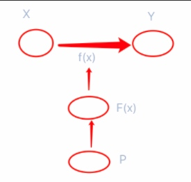
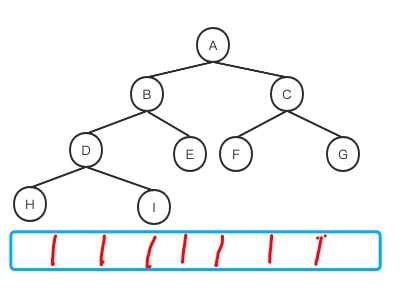

#XGB 原理推导

[TOC]

##XGBoost
$$
\begin{equation}\begin{split} 
XGBoost &= eXtreeme + GDBT \\
    &= eXtreme + (Gradient + BDT) \\
    &= eXtreme + Gradient + (Boosting+DecisionTree)\\
\end{split}\end{equation}
$$
XGB：是GDBT做了大量工程改进。
GBDT(梯度提升决策树)：在集成决策树基础上加上了一阶梯度，作为残差拟合对象。
BDT(集成决策树)：用boosting方法把决策树集成

$$
Boosting\rightarrow BDT \rightarrow GBDT \rightarrow XGBoost
$$

### 原理：

####提升方法(Boosting)
提升方法：加法模型+前向分布算法。

#####加法模型
$$\begin{equation}\begin{split} f(x)=\sum_{i=1}^N \beta_mb(x;\gamma_m)\end{split}\end{equation}
$$
一些个基模型加权累加，可以是任何模型。
其中，$b(x;\gamma_m)$ 为基函数，$\gamma_m$ 为基函数的参数，$\beta_m$为基函数的系数。

在给定训练数据 $\lbrace(x_i,y_i)^N_{i=1}\rbrace$ 及损失函数$L(y,f(x))$的条件下，学习加法模型$f(x)$成为经验风险极小化问题：
$$
\begin{equation}\begin{split} 
\min_{\beta_m\gamma_m}\sum_{i=1}^M L
\begin{pmatrix}y_i,\sum_{m=1}^M\beta_mb(x_i;\gamma_m)\end{pmatrix}
\end{split}\end{equation}
$$

前向分布算法求解这一优化问题的思路：因为学习的是加法模型，可从前向后，每次只学习一个基函数模型和系数，逐步逼近优化目标函数(3),则可以简化优化复杂度。具体的每步只需要优化如下损失函数：
$$ 
\begin{equation}\begin{split} 
\min_{\beta_m\gamma_m}\sum_{i=1}^M L
\begin{pmatrix}y_i,\beta b(x_i;\gamma)\end{pmatrix}
\end{split}\end{equation}
$$

#####前向分步算法

拿这个$f(x)=0$ 基础模型举例
输入：
- 训练数据 $T=\lbrace (x_1,y_1),(x_2,y_2),...,(x_N,y_N)\rbrace$;
- 损失函数 $L(y,f(x))$
- 基函数集合 $\lbrace b(x;y) \rbrace$

输出：
1、 初始化 $f_0(x)=0$  基础模型
2、 对 $ m=1,2,...,M $
- a. 极小化算是函数
    $$ 
    \begin{equation}\begin{split} 
    (\beta_m,\gamma_m)=arg\min_{\beta_m\gamma_m}\sum_{i=1}^M L(y_i,f_{m-1}(x_i)+\beta b(x_i;\gamma))
    \end{split}\end{equation}
    $$
上一步的模型加当前要学习的模型，在损失函数极小化后得到参数 $\beta_m,\gamma_m$ 是当前这步的基模型对应的参数集。

- b. 更新,在m-1步的基础上构建新的精度更高的模型：
$$ 
    \begin{equation}\begin{split} 
    f(x)=f_{M}(x)+\beta_m b(x;\gamma_m)
    \end{split}\end{equation}
    $$
    
3、不断累加得到加法模型
$$
\begin{equation}\begin{split} 
f(x) = f_M(x) = \sum_{m=1}^M \beta_mb(x;\gamma_m)
 \end{split}\end{equation}
$$
把一个整体的函数学习问题，转化为一个循环迭代过程，每一步只学习其中一部分 $f_{m-1}(x_i)+\beta b(x_i;\gamma)$

-------

#### 提升决策树(BDT,Boosting Decision Tree)：
其实就是boosting集成了树模型。
在这Boosting基础上定两个约束：
- 基模型=决策树模型
- $\beta_m$都约束为1:每一颗决策树权重都为1

提升决策树模型：
$$
\begin{equation}\begin{split}
f_M=\sum_{m=1}^MT(x;\Theta_m)
 \end{split}\end{equation}
$$
其中:$T(x;\Theta_m)$ 表示决策树；$\Theta_m$为决策树的参数；M为树的个数。

学习过程：
采用前向分步算法，首先确定初始提升决策树 $f_0(x)=0 $ (单根节点=0的树), 第m步的模型是
$$
\begin{equation}\begin{split}
f_M(x) = f_{m-1}(x)+T(x;\Theta_m)
 \end{split}\end{equation}
$$
其中，$f_m-1(x)$ 为当前模型，通过经验分享极小化确定下一颗决策树的参数$\Theta_m$,
$$
\begin{equation}\begin{split}
\hat\Theta_m = arg\min_{\Theta_m}\sum_{j=1}^NL(y_i,f_{m-1}(x_i)+T(x_j;\Theta_m))
 \end{split}\end{equation}
$$

已知训练数据集 $T=\lbrace(x_1,y_1),(x_2,y_2),...,(x_N,y_N)\rbrace , x_i \in \chi \subseteq R^n$, $\chi$ 为输入空间，Y为输出空间。
如果将输入控件$\chi$ 划分为J个互不相交的区域 $R_1,R_2,...R_j$ (树模型本质离散化) ,并且在每个区域上确定输出的常量 $c_j$ 。那么决策树可表示为：
$$
\begin{equation}\begin{split}
T(x;\Theta) = \sum_{j=1}^j c_jI(x\in R_j)
 \end{split}\end{equation}
$$
每一个区域判断x属不属于Rj，用cj进行输出，不是输出0
结构上是一颗树，但在公式表示上，我只关心x落在哪个叶子节点上。
其中，参数$\Theta = \lbrace(R_1,c_1),(R_2,c_2),...,(R_j,c_j)\rbrace$  表示决策树的区域划分和各区域上的常量值。J 是决策树的复杂度即叶子节点个数。

提升决策树使用以下前向分步算法：
$$
\begin{equation}\begin{split} 
    f_0(x) &= 0 \\
f_m(x)&= f_{m-1}(x) + T(x;\Theta_m) ,m=1,2,...,M \\
f_M(x)&= \sum_{m=1}^M T(x;\Theta_m)
\end{split}\end{equation}
$$
在前向分步算法的第m步，给定当前模型 $f_{m-1}(x)$,需要求解
$$
\begin{equation}\begin{split} 
    \Theta_m = arg\min_{\Theta_m} \sum_{i=1}^N L(y_i,f_{m-1}(x_i)+ T(x_j;\Theta_m))
\end{split}\end{equation}
$$
得到 $\hat\Theta_m$, 即第m颗树的参数。
当采用平方误差损失函数时，
$$
\begin{equation}\begin{split} 
    L(y,f(x))=(y-f(x))^2
\end{split}\end{equation}
$$
其损失变为
$$
\begin{equation}\begin{split} 
L(y,f_m-1(x)+T(x;\Theta_m)) &= [y-f_{m-1}(x)-T(x;\Theta_m)]^2 \\ 
&=[r-T(x;\Theta_m)]^2
\end{split}\end{equation}\\
r=y-f_{m-1}(x)
$$
其中，r是当前模型拟合数据的残差(residual)。对回归问题的提升决策树，只需要简单地拟合当前模型的残差。 
对比公式(14)和(15)中的r，如果把r作为一个实际输出的话，公式(15)就是在r这个实际输出上去学习一个决策树模型。换句话说，在当前步T的学习过程中，不是奔着y去学习的，而学习的是实际输出y与上一个模型已经学号的部分的差值(没学好的那部分)。

回归问题的提升决策树的算法过程：
- 输入:训练数据集 $T=\lbrace(x_1,y_1),(x_2,y_2),...,(x_N,y_N)\rbrace$
- 输出：
    提升决策树 $f_M(x)$
    (1)初始化 $f_0(x)=0$
    (2)对 $m=1,2,...,M$
    -  a. 按照式(15)计算残差
    $$ r_{m i}=y_i - f_m-1(x_i) , i=1,2,...,N $$
    -  b.拟合残差$r_{m i}$ 学习一个回归树，得到$T(x;\Theta_m)$
    -  c.更新 $f_m(x)=f_{m-1}(x)+T(x;\Theta_m)$
得到回归提升决策树
$$ f_M(x)=\sum_{m=1}^MT(x;\Theta_m)$$

-------

#### 梯度提升决策树(GBDT,Gradient Boosting Decision Tree)

梯度提升算法使用损失函数的负梯度在当前模型的值，不再去学习残差，而是学习一个损失函数关于梯度的负值。

为什么是负梯度？
$$
\begin{equation}\begin{split} 
    \frac {\partial L(y,f(x_i))}{\partial f(x_i)} &= f(x_i)-y_i \\
    y_i - f(x_i) &= - \frac {\partial L(y,f(x_i))}{\partial f(x_i)}
\end{split}\end{equation}
$$
所以我们可以把残差解释为负梯度.

$$
\begin{equation}\begin{split} 
    -\left[\frac {\partial L(y,f(x_i))}{\partial f(x_i)}\right]_{f(x)=f_{m-1}(x)}
\end{split}\end{equation}
$$
作为回归问题提升决策树算法中残差的近似值，拟合一个回归树。
如果xgboost在这里改进的话可以采用二阶梯度，因为一个函数泰勒展开项阶数越高精度约大。(xgboost第一个改进)

为什么用负梯度？

首先我们要学习的是从输入空间x到输出空间y的一个映射f。
因为这样的f有很多个，所以构建一个F叫假设空间。
要在假设空间F中找一个$f*$最优的映射。
f的最终表示可以用w和b这种权重和偏置来表示。
所以最终的学习，是学习使损失函数最小的参数的问题。
所以除了F假设空间外，还有个P空间，也就是参数空间。
在参数空间找w和b，由最优w和b去确定f，由f去完成映射。
而最优参数$w*$ 如何学习，就是由 
$\begin{equation}\begin{split} 
\frac {\partial f(w)}{\partial w}=0
\end{split}\end{equation}$ 求得 $w*$
$w*$如何求得？
$ w^* =arg\min L(w)$
就是由$w-\alpha\frac {\partial f(w)}{\partial w}$ 迭代求得，也就是梯度下降法。
也就是在参数空间下来做的。
那么能不能直接在假设空间F上来做？
$F^w = arg\min L(f) \\ \frac {\partial L(f)}{\partial f}=0\\ f=f-\beta\frac {\partial L(f)}{\partial f}  ,\beta=1$

那么没有了参数，函数如何表示？
$$
\begin{equation}\begin{split}
T(x;\Theta) = \sum_{j=1}^j c_jI(x\in R_j)
 \end{split}\end{equation}
$$
还是决策树的本质问题，把输入空间划分为不同的离散区域，确定每个区域的输出值。这样直接对一棵树进行学习就好了。

梯度提升算法过程：
- 输入:训练数据集 $T=\lbrace(x_1,y_1),(x_2,y_2),...,(x_N,y_N)\rbrace$
- 输出：梯度提升决策树$\hat f(x)$
    (1)初始化
    $$
    \begin{equation}\begin{split}
    f_0(x)=arg\min_c\sum_{i=1}^NL(y_i,c)
    \end{split}\end{equation}
    $$
    (2) 对 $m=1,2,...,M$
    - (a) 对 $i=1,2,...,N$ 计算
        $$ r_{mi} = -\left[\frac {\partial L(y,f(x_i))}{\partial f(x_i)}\right]_{f(x)=f_{m-1}(x)}
$$
    - (b) 对$r_mi$拟合一个回归树，得到第m颗树的叶节点区域 $R_{mj},j=1,2,...,J$
    - (c) 对 $R_{mj},j=1,2,...,J$，计算
        $$
        c_{mj}=arg\min_c\sum_{x\in R_{mj}}L(y_i,f_{m-1}(x_i)+c)
        $$
    这个地方也是将来xgboost要改进的点。经验风险最小化容易导致过拟合，可以采用正则化项。(xgboost第二个改进)
    
    - (d) 更新$f_m(x)=f_{m-1}(x)+\sum_{j=1}^J c_{mj}I(x \in R_{mj})$
    
    (3)得到回归梯度提升决策树
    $$
    \begin{equation}\begin{split}
    \hat f(x)=f_M(x)=\sum_{m=1}^M\sum_{j=1}^Jc_{mj}I(x \in R_{mj})
    \end{split}\end{equation}
    $$

-------

####极限梯度提升 (XGBoost, eXtreme Gradient Boosting)

训练数据集 $D=[(x_i,y_i)]$, 其中 $\overrightarrow x_i=(x_1,x_2,..x_m)^T,x_i\in R^m, y_i \in R, |D|=n$,
决策树模型
 $$
    \begin{equation}\begin{split}
    f(x)=w_{q(x)}
    \end{split}\end{equation}
 $$
 其中，$q:R^T \rightarrow \lbrace 1,...,T \rbrace$ 是由输入x向叶子节点编号的映射， $w \in R^T ,\overrightarrow w=(w_1,w_2,..w_m)^T$ 是叶子节点向量,w存储的是当前叶子节点存储的输出值，T为决策树叶子节点数。
 给一个向量可以通过q映射到那个叶子节点下。
 假设树已经生成，如何生成在下面。

提升决策树模型输出
$$
    \begin{equation}\begin{split}
    \hat y_i = \phi(x_i) = \sum_{k=1}^K f_k(x_i)
    \end{split}\end{equation}
$$
其中，$f_k(x)$ 为第k棵决策树。
加了正则化目标函数
 $$
    \begin{equation}\begin{split}
    \tau(\phi) = \sum_i l(\hat y_i,y_i) + \sum_k \Omega(f_t)
    \end{split}\end{equation}
 $$
 $f_k$ 是一棵树。正则化项表征当前模型的复杂程度(模型复杂度是指非确定模型的假设空间的大小，假设空间越大，模型越复杂)[1]
 $$
    \begin{equation}\begin{split}
    \Omega(f) = \gamma T+ \frac 1 2 \lambda \lVert w\rVert^2 =\gamma T+ \frac 1 2 \lambda\sum_j^Tw_j^2
    \end{split}\end{equation}
 $$
 T是当前这颗树的叶子节点个数，表征当前模型的复杂程度。叶子节点约少模型约简单。
 第t轮目标函数
 $$
    \begin{equation}\begin{split}
    \iota^(t) = \sum_{i=1}^nl(y_i,\hat y_i^{(t-1)}+ f_t(x_i))+\Omega(f_t)
    \end{split}\end{equation}
 $$
 第t轮目标函数$L^{(t)}$ 在 $\hat y^(t-1)$的二阶泰勒展开
 $$
    \begin{equation}\begin{split}
    f(x^t) = f(x^{t-1}+\Delta x )&=f(x^{t-1})+f'(x^{t-1})\Delta x + \frac 1 2f''(x^{t-1})\Delta^2x \\
    \hat y_i^{(t-1)} &=x^{t-1}, f_t(x_i)=\Delta x
    \end{split}\end{equation}
 $$
  $$
    \begin{equation}\begin{split}
    \iota^{(t)} &\approx \sum_{i=1}^n \left[ l(y_i,\hat y^{t-1})+ l'_{y^{t-1}}(y_i,\hat y^{t-1})f_t(x_i) + \frac 1 2 l''_{y^{t-1}}(y_i,\hat y^{t-1}f_t^2(x_i)) \right] +\Omega(f_t)\\
    &= \sum_{i=1}^n \left[ l(y_i,\hat y^{t-1}) + g_if_i(x_i) + \frac 1 2h_if_i^2(x_i) \right] + \Omega(f_t)
    \end{split}\end{equation}
 $$
 其中，$ g_i = l'_{\hat y^{t-1}}(y,\hat y^{t-1}) , h_i = l''_{\hat y^{t-1}}(y,\hat y^{t-1})$
 第t轮目标函数$\iota^{(t)}$的二阶泰勒展开，并移除关于$f_t(x_t)$常数项
 从第t轮看t-1轮$y^{t-1}$是已知的，所以剔除$l(y_i,y^{t-1})$ 
 $$
    \begin{equation}\begin{split}
    \iota^{(t)} &= \sum_{i=1}^n \left[ g_if_i(x_i) + \frac 1 2h_if_i^2(x_i) \right] + \Omega(f_t)\\
    &= \sum_{i=1}^n \left[  g_if_i(x_i) + \frac 1 2h_if_i^2(x_i) \right] + \gamma T + \frac 1 2 \gamma\sum_{j=1}^Tw_j^2
    \end{split}\end{equation}
 $$
 n是数据集的个数，第一个累加符号是在整个数据集中计算这个式子。第二个累加符号是在叶子节点累加。
 
 定义叶子节点j上的样本的下标集合$I_j= \lbrace i|q(X_i)=j \rbrace$ (关键),则目标函数可表示为按叶子节点累加的形式。
 例如遍历一个花名册，念完每个人都遍历到了，或者每个人都被编入到每个小组里面，那么我想要遍历每个人，可以变成我对每个小组里的人进行遍历。两次遍历的结果是一样的。
 $$
    \begin{equation}\begin{split}
    \iota^{(t)} = \sum_{j=1}^T \left[(\sum_{i\in I_j}g_i)w_j + \frac 1 2(\sum_{i\in I_j}h_j+\lambda)w^2_j  \right]+\lambda T 
    \end{split}\end{equation}
$$
为什么 $f_i(x_i)=w^2_j$ 见公式(20) (精髓啊)
目标函数写完以后，最优解就是使目标函数最小的映射输出。
由于 $ w_j^* = arg\min_{w_j}\hat\iota^{(t)}$
令$\frac {\partial \hat\iota^{(t)}}{\partial w_j}=0$
$$
    \begin{equation}\begin{split}
    w_j^* = - \frac {\sum_{i \in I_j} g_i}{\sum_{i \in I_j} h_i+\lambda}
    \end{split}\end{equation}
$$
在将这个最优w(每个叶子节点j的最优分数)，得到最优化目标函数值：
$$
    \begin{equation}\begin{split}
    \hat \iota^{(t)}(q) = -\frac 1 2\sum_{j=1}^T \left[\frac{(\sum_{i\in I_L} g_i)^2}{\sum_{i\in I_L} h_i + \lambda} \right]+\gamma T     \end{split}\end{equation}
$$
假设$I_L$和$I_R$ 分别为分裂后左右节点的实例集，令$I=I_L \cup I_R$ , 则分裂后损失减少量由下式得出

$$
    \begin{equation}\begin{split}
    \iota'_{split} =\frac 1 2 \left[ \frac {(\sum_{i\in I_L} g_i)^2 }{\sum_{i\in I_L} h_i + \lambda} + \frac {(\sum_{i\in I_R} g_i)^2 }{\sum_{i\in I_R} h_i + \lambda} - \frac {(\sum_{i\in I_I} g_i)^2 }{\sum_{i\in I_I} h_i + \lambda}\right]-\gamma 
    \end{split}\end{equation}
$$
左子树的损失值+右子树的损失值-整棵树的损失值，表征当前特征分裂的重要依据

算法：分裂查找的精确贪婪算法
- 输入：当前节点实例集 I；特征维度d = M
- 输出：根据最大分值分裂
(1) $gain \leftarrow 0$
(2) $G \leftarrow \sum_{i\in I}g_i,H \leftarrow \sum{_i\in I} h_i$
(3) for k = 1 to d do
(3.1) $ G \leftarrow 0 , H_L \leftarrow 0$
(3.2) for j in sorted(I, by $X_{jk}$) do
(3.2.1) $G_L \leftarrow G_L + g_j , H_L \leftarrow H_L + h_j$
(3.2.2) $G_R \leftarrow G-G_L, H_R=H-H_L$
(3.2.3) score $\leftarrow max(score, \frac{G_L^2}{H_L+\lambda} +\frac{G_R^2}{H_R+\lambda}+\frac{G^2}{H+\lambda})$
(3.3) end
(4)end

##参考文献
[【机器学习基础】一文说透正则项与模型复杂度](https://blog.csdn.net/fengdu78/article/details/107118381)
[markdown中公式编辑教程](https://www.jianshu.com/p/25f0139637b7)
[markdown 数学公式符号大全](https://blog.csdn.net/weixin_43510203/article/details/106869895) 
[【机器学习】经验风险最小化与结构风险最小化](https://blog.csdn.net/pxhdky/article/details/83544932)
[Gradient Boosting 原理、推导及代码实现](https://zhuanlan.zhihu.com/p/64863699)