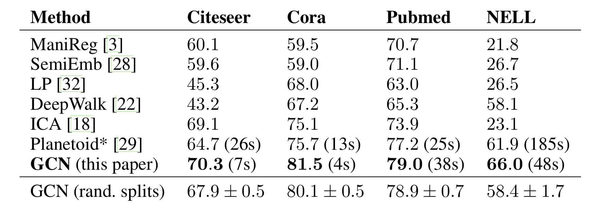

# SEMI-SUPERVISED CLASSIFICATION WITH GRAPH CONVOLUTIONAL NETWORKS(ICLR 2017)
GitHub:https://github.com/tkipf/gcn
基于图卷积网络的半监督分类

[TOC]

## 摘要
应用：关于图结构数据中的聚类问题
- 通过谱图卷积（spectral graph convolutions） 的局部一阶近似，来确定卷积网络结构。
- 该模型在图的边数上线性缩放
- 该模型学习隐藏层表示，这些表示既编码局部图结构、也编码节点特征
- 通过图结构数据中部分有标签的节点数据对卷积神经网络结构模型训练，使网络模型对其余无标签的数据进行进一步分类

## 介绍
###前人工作及存在的问题

作者借助基于图的正则化形式将标签信息与图结构数据平滑的结合，其具体操作是在代价函数中加入图形化的拉普拉斯正则项。
$$
    \begin{equation}\begin{split} 
    \mathscr{L} &= \mathscr{L}_0+\lambda\mathscr{L}_{reg} \\
    \mathscr{L}_{reg} &= \sum_{i,j}A_{i,j}\begin{Vmatrix}f(X_i)-f(X_j)\end{Vmatrix}^2 = f(X)^T\bigtriangleup f(X)
    \end{split}\end{equation}
$$
$L_0$ 表示图结构中有标签的部分数据的监督代价。$f$ 是可微的，神经网络的梯度函数。X 是特征向量，$\bigtriangleup =D - A$ 是无向图$G=(V,E)$ 的拉普拉斯矩阵。$\lambda$ 是加权系数。 
但式（1）的局限性在于它依赖于图中的相连节点倾向性的有着相同坐标这个假设，而实际情况下，图中的边可能并不一定能够反应出节点之间的相似性而可能是一些其他的信息，因此这个假设可能会限制模型的效果。

###改进处、两个贡献
1、作者对于直接操作于图结构数据的网络模型，根据频谱图卷积使用一阶近似简化计算的方法，提出了一种简单有效的层式传播方法。
2、作者验证了图结构神经网络模型可用于快速可扩展式的处理图数据中节点半监督分类问题，作者通过在一些公有数据集上验证了自己的方法的效率和准确率能够媲美现有的顶级半监督方法。

###技术思路介绍
作者是基于频谱图卷积提出来的，因此先介绍频谱图卷积。
基于图形数据操作的频谱卷积被定义为信号输入量x与经过傅里叶域参数化的滤波器$g_\theta$ 进行相乘操作：
$$
    \begin{equation}\begin{split} 
    g_\theta \star x = U g_\theta U^T x
    \end{split}\end{equation}
$$
x是特征向量，$g_\theta$ 是L拉普拉斯算子特征值的一个函数为$g_\theta(\Lambda)$ U是$L=I_N - D^{- \frac {1}{2}}AD^{- \frac {1}{2}}$ 的特征向量的矩阵。$\Lambda$ 是特征值矩阵

但这个公式计算开销过于庞大，特征向量矩阵U的相乘运算时间复杂度是N的平方，此外，L的特征分解运算开销在处理数据量大的图结构时也很大，为了解决这个问题，2011年Hammond等人提出gθ(Λ)可以通过一个切比雪夫多项式Tk(x)的截断展开为第K阶：
$$
    \begin{equation}\begin{split} 
    g_{\theta'}(\Lambda) \approx \sum_{k=0}^K \theta'_kT_k(\hat \Lambda)
    \end{split}\end{equation}
$$
其中：$\hat\Lambda = \frac {2}{\lambda_{max}}\Lambda-I_N$
$\lambda_{max}$ 是L的最大特征值。$\Theta'$ 是切比雪夫系数向量。
切比雪夫多项式递归：$T_k(x)=2xT_{k-1}(x)-T_{k-2}(x),T_0(x)=1,T_1(x)=x$ 
所以代入得：
$$
    \begin{equation}\begin{split} 
    g_\theta \star x \approx \sum_{k=0}^K \theta'_kT_k(\hat L)x
    \end{split}\end{equation}
$$
其中：$\hat L = \frac {2}{\lambda_{max}}L-I_N$ 这个表达式现在是K的范围内了。因为$g_{\theta}$被约等于拉普拉斯算子中的一个K阶多项式了，运算过程只和卷积位置的节点K步（边长）范围内的点有关，式(4)的计算复杂度则变成了O(|ε|)
利用这个K-局部化卷积来定义图上的卷积神经网络。

接着上述的工作，作者提出了层状线性模型。
现在，假设我们将分层卷积运算限制为K=1(参见公式)。5)，即线性的w.r.t.函数。L，因此是图的拉普拉斯谱上的线性函数。
借助这种线性运算方式，作者仍然可以通过堆叠多个这样的卷积层运算来恢复卷积滤波函数的表达能力，而且作者摆脱了受限于切比雪夫不等式进行显式化参数设置的限制。作者直观的觉得他的这个模型能够通过较宽的节点分布来减轻分类问题中节点邻近区域结构的过拟合问题，此外。从运算开销来看，将K设置为1得到的层状线性运算也能够进一步构建更深的网络模型（例如运用何凯明提出残差结构构筑更深的图形化卷积网络模型）

在上面提到的将K设为1的图形化卷积的线性运算基础上，由于作者期望神经网络模型中的参数能够适应训练过程中的变化，作者进一步近似的令λmax约等于2，式(4)在这个改变下进一步简化为：
$$
    \begin{equation}\begin{split} 
    g_\theta \star x \approx \Theta_0' + \Theta_1'(L-I_N)x = \Theta_0'x - \Theta_1'D^{-\frac {1}{2}}AD^{-\frac {1}{2}}x
    \end{split}\end{equation}
$$
两个自由参数 $\Theta_0',\Theta_1'$ 参数可以在整个图表上共享。然后，连续应用这种形式的滤波器有效地卷积节点的第k阶邻域，其中k是神经网络模型中连续滤波操作或卷积层的数目。
连续应用这种形式的滤波器，然后有效地卷积节点的k阶邻域，其中k是神经网络模型中连续滤波操作或卷积层的数目。
进一步限制参数的数量以解决过度拟合问题并最小化每层的运算(例如矩阵乘法)数量可能是有益的。进一步得到：
$$
    \begin{equation}\begin{split} 
    g_\theta \star x \approx \Theta(I_N+D^{-\frac {1}{2}}AD^{-\frac {1}{2}})x
    \end{split}\end{equation}
$$
$I_N+D^{-\frac {1}{2}}AD^{-\frac {1}{2}}$计算过程使得特征值处于[0,2]之间
但当在深度神经网络模型中使用时，重复应用该运算符可能导致数值不稳定和爆炸/消失梯度，为了解决这个问题，再提出renormalization trick(再归一化技巧):$I_N+D^{-\frac {1}{2}}AD^{-\frac {1}{2}} \rightarrow \hat D^{-\frac {1}{2}}\hat A\hat D^{-\frac {1}{2}}, \hat A= A+I_N,\hat D_ii=\sum_j\hat A_{ij}$ 
借助该改进作者将该定义泛化到一个有C个输入通道的输入量（或者图数据中每个节点都是C维的特征向量）与F个滤波器运算定义如下：
$$
    \begin{equation}\begin{split} 
    Z = \hat D^{-\frac {1}{2}}\hat A\hat D^{-\frac {1}{2}}X\Theta
    \end{split}\end{equation}
$$
式中θ是滤波器参数的矩阵形式，Z是卷积后得到的输出矩阵，整个卷积操作时间复杂度为$O(|\epsilon|FC)$

## 收尾
其实不管是谱域也好空域也好，各种GNN无非就那三个步骤：
1.信息传递
2.信息聚合
3.信息更新
每种GNN只是在这三步里面细节各有千秋。
论文剩下的部分就是普通的神经网络进行传播了，做一些对比试验。

两层GCN的表达式：
$$
    \begin{equation}\begin{split} 
    Z=f(X,A)=softmax(\hat A'_1 \sigma(\hat A'_0 XW^{(0)}) W^{(1)} )
    \end{split}\end{equation}
$$

## 参考文献
[【GCN】图卷积网络初探——基于图（Graph）的傅里叶变换和卷积](https://blog.csdn.net/qq_41727666/article/details/84622965)
[【GCN】论文笔记：SEMI-SUPERVISED CLASSIFICATION WITH GRAPH CONVOLUTIONAL NETWORKS](https://blog.csdn.net/qq_41727666/article/details/84640549)
[【GCN】图卷积网络初探——基于图（Graph）的傅里叶变换和卷积](https://blog.csdn.net/qq_41727666/article/details/84622965)
[Graph Convolution Network图卷积网络（二）数据加载与网络结构定义](https://blog.csdn.net/weixin_36474809/article/details/89379727)
[增加可视化+代码注释 of GitHub项目：Graph Convolutional Networks in PyTorch](https://blog.csdn.net/qq_41683065/article/details/104206575)
[如何通俗易懂地解释卷积？](https://www.zhihu.com/question/22298352)
[卷积(convolution)为什么叫「卷」积(「convolut」ion)？](https://www.zhihu.com/question/54677157/answer/141245297)
[Understanding Convolutions](http://colah.github.io/posts/2014-07-Understanding-Convolutions/)
[如何理解 Graph Convolutional Network（GCN）？](https://www.zhihu.com/question/54504471/answer/332657604)
[谱聚类（spectral clustering）原理总结](https://www.cnblogs.com/pinard/p/6221564.html)
[Chebyshev多项式作为GCN卷积核](https://zhuanlan.zhihu.com/p/106687580)
[解读三种经典GCN中的Parameter Sharing](https://zhuanlan.zhihu.com/p/72373094)
[向往的GAT（图注意力模型）](https://zhuanlan.zhihu.com/p/81350196)
[如何解决图神经网络（GNN）训练中过度平滑的问题？](https://www.zhihu.com/question/346942899/answer/848298494)
[图卷积网络到底怎么做，这是一份极简的Numpy实现](https://mp.weixin.qq.com/s/sg9O761F0KHAmCPOfMW_kQ)
[清华大学孙茂松组：图神经网络必读论文列表](https://mp.weixin.qq.com/s/3CYkXj2dnehyJSPLBTVSDg)
[graph convolutional network有什么比较好的应用task？](https://www.zhihu.com/question/305395488/answer/554847680)
[从 Graph Convolution Networks (GCN) 谈起](https://zhuanlan.zhihu.com/p/60014316)