# GNN & GCN 总结

引入了图论中抽象意义上的图(Graph)来表示非欧几里得结构化数据。并利用图卷积网络对来图(Graph)数据进行处理，以深入发掘其特征和规律。
[TOC]
## 基础
###数据
常见的非欧几里得结构化数据主要包含：
- 1D：社交网络(eg：Facebook，Twitter等)等；
- 2D：生物网络(基因，分子，大脑连接)等；
- 3D：基础设施网络(eg：能源，交通，互联网，通信等)等；

图的定义和结构老生常谈了，随便一篇文章都有，略了。

图的表示形式：
- 邻接矩阵( Adjacency matrix )
    $$
    \begin{equation}\begin{split} 
    A \in R^{N\times N}, A_{ij}=\lbrace a_{ij}\neq0 ,  e_{ij} \in \epsilon 0, otherwise \rbrace
    \end{split}\end{equation}
    $$
    若图中存在一条连接顶点和的边1，否则为0。
    应用：当图是稠密时，邻接矩阵是比较合适的表达方法。
- 度矩阵( Degree matrix )
    $D_{i,i}$ 为节点 $v_i$ 的度的对角矩阵：
    $$
    \begin{equation}\begin{split} 
    D\in R^{N\times N}, D_{ii}=\sum_j A_{ij}
    \end{split}\end{equation}
    $$
    是个对角矩阵
    
- 邻域( Neighborhood )
    表示与某个顶点有边连接的点集，其定义如下所示：
    $$
    \begin{equation}\begin{split} 
    N\lbrace (v_i) \rbrace =  \lbrace v_j | e_{ij} \in \epsilon \rbrace
    \end{split}\end{equation}
    $$

### 任务
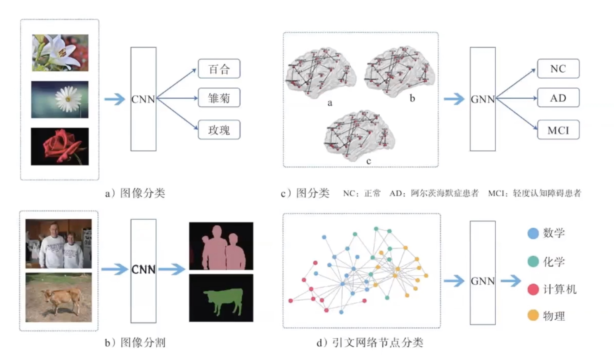
图像分割：其实是对像素点进行分类和GNN节点分类类似。
图像分类：其实是对整个图进行识别和GNN图分类类似。

- 图节点分类任务：
图中每个节点都有对应的特征，当我们已知一些节点的类别的时候，可以设计分类任务针对未知节点进行分类。我们接下来要介绍的 GCN、GraphSAGE、GAT模型都是对图上的节点分类。

- 图边结构预测任务：
图中的节点和节点之间的边关系可能在输入数据中能够采集到，而有些隐藏的边需要我们挖掘出来，这类任务就是对边的预测任务，也就是对节点和节点之间关系的预测。

- 图的分类：
对于整个图来说，我们也可以对图分类，图分类又称为图的同构问题，基本思路是将图中节点的特征聚合起来作为图的特征，再进行分类。 

### 空域GCN
图卷积中，大致分为两类：
1、谱域图卷积
- 根据图谱理论和卷积定理，将数据由空域转换到谱域做处理
- 理论基础坚实

2、空域图卷积
- 不依靠图谱卷积理论，直接在空间上定义卷积操作。
- 定义知观，灵活性更强。

**各种GNN无非就那三个步骤：1.信息传递；2.信息聚合；3.信息更新。每种GNN只是在这三步里面细节各有千秋。**

图形卷积网络(GCN)是一种能够直接处理图形并利用其结构信息的卷积神经网络。
GCN解决了图(如引文网络)中的节点分类(如文档)问题，可进行半监督学习半监督学习。

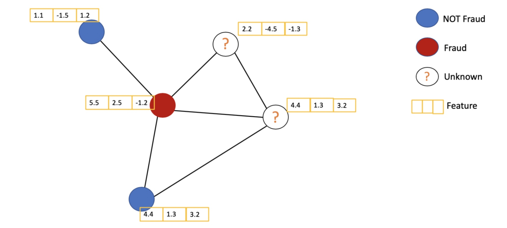
[SEMI-SUPERVISED CLASSIFICATION WITH GRAPH CONVOLUTIONAL NETWORKS(ICLR 2017)]()

####GCN 与 CNN 对比
相似之处：
- 不管是CNN还是GCN，本质上都是聚合邻域信息，CNN聚合卷积核内，GCN聚合节点的邻居。只不过邻域规定方式、作用对象是不一样的。
- CNN的感受野是由卷积核计算得来，GCN的感受野是一阶邻域二阶邻域这种叠上来的。
不同之处：
聚合对象不同
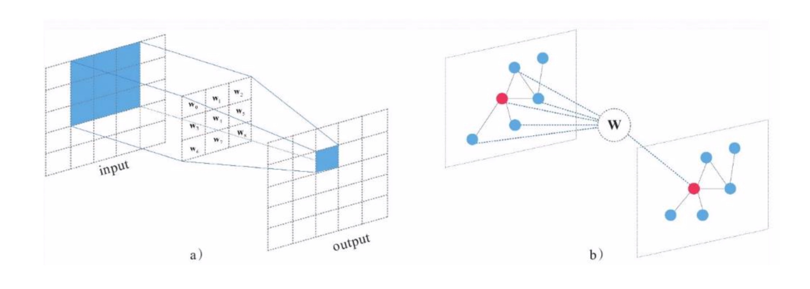
 
图卷积的单层公式：
$$
    \begin{equation}\begin{split} 
    Z = \sigma(A'FW+b)
    \end{split}\end{equation}
$$
为什么是A‘而不是A呢？因为GCN会对原始图结构A做一些归一化等等变换，更有利于计算，在后面详写。
这个公式其实只比普通神经网络多一个图结构，$\sigma(Wx+b)$ ，x也是特征向量。
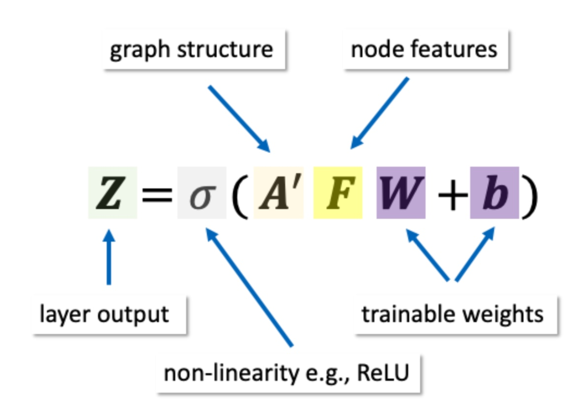

####GCN的主要思路
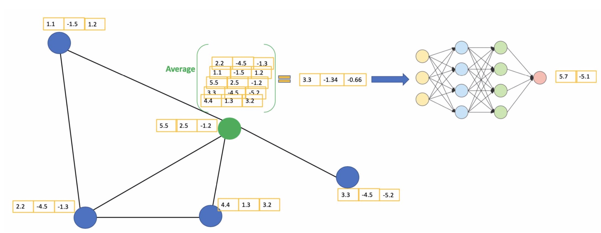
开始对于每一个节点，从自己的邻居节点获取他们的特征信息，再加上自己的特征信息做均值。得到的值当成一个类似CNN网络中的节点。

那么如何实现这种信息传递呢？
最简单的办法：
可以用图的邻接矩阵A和所有节点的特征向量X进行相乘。
邻接矩阵相邻节点值为1，和特征矩阵相乘就有值，为0的没有边相乘就没有值。
对于cora数据集，feature X是找出1473个高频词汇，看他们在论文中是否出现，出现就写1没有就写0。
但是这种方法有个弊病，邻接矩阵对角线元素为0。没有加上自己这个元素的特征。
$ \hat A=A+\lambda I$
那就给A加一个单位矩阵变成 $\hat A$ 
然后吧之前的度矩阵D相应的更新一下 变成 $\hat D$
因为神经网络模型对数据的规模量纲特别敏感，一般是要对数据做归一化在处理的。
对于图结构矩阵A，数据本身就是1和0，再乘以一个对角线矩阵(度矩阵)，降低了它的数据规模。因为度矩阵其实也反应了一点图结构信息。
对于度矩阵 $\hat D$ 再求逆相当于归一化为 $\hat D^{-1}$
矩阵相乘一行乘一列，为了完整的利用行和列的结构信息在A两边都成了D
因为取倒数-1和取-1/2没大区别,可以再减小一部分数据规模。
最终得到 $A'=\hat D^{-\frac {1}{2}}\hat A\hat D^{-\frac {1}{2}}$

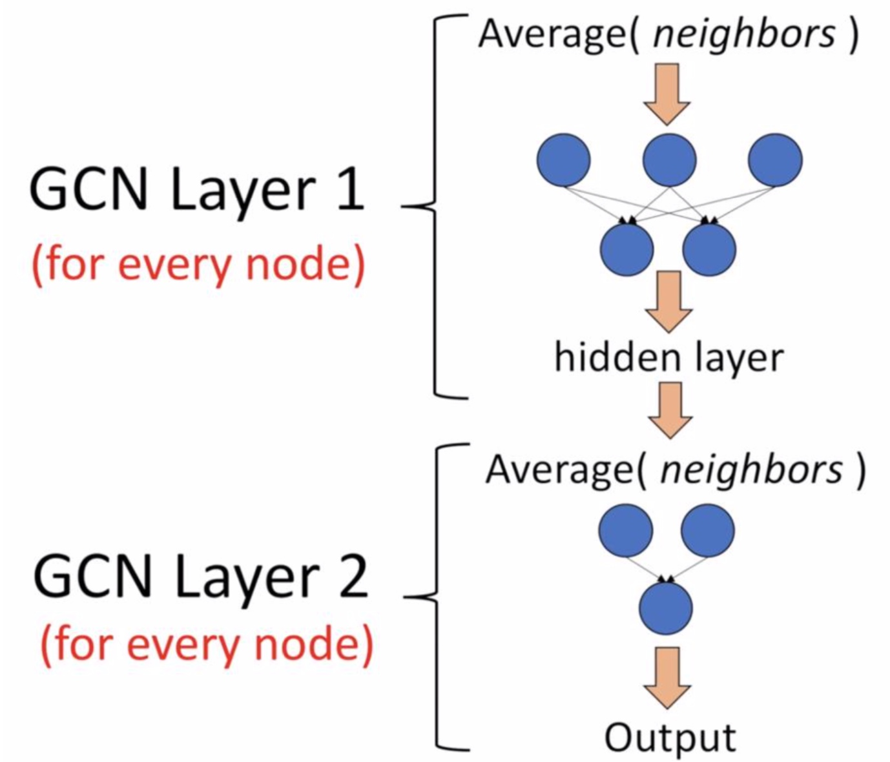

两层GCN公式，做分类激活函数换成softmax：
$$
    \begin{equation}\begin{split} 
    Z=f(X,A)=softmax(\hat A'_1 \sigma(\hat A'_0 XW^{(0)}) W^{(1)} )
    \end{split}\end{equation}
$$

### 谱域GCN
####什么是卷积？
根据卷积定理，两信号在空域（或时域）的卷积的傅里叶变换等于这俩个信号在频域中的傅里叶变换的乘积：
$$
    \begin{equation}\begin{split} 
    \mathcal{F} \left[f_1(t) \star f_2(t)  \right] = F_1(w) \cdot F_2(w)
    \end{split}\end{equation}
$$
$f(t)$ 为空域上的信号，$F(w)$ 谱域上的信号 $\mathcal{F}$ 傅里叶变换，$\star$ 表示卷积。
也可以通过反变换的形式来表达：就是傅里叶逆变换。

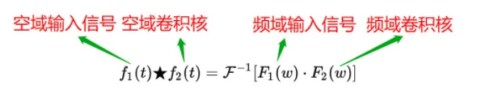
如此卷积操作有什么意义呢？
- 将空域型号转换到频域，然后相乘。
- 将相乘的结果再转换到空域。

经典的卷积操作具有序列有序性和维数不变性的限制，使得经典卷积难以处理图数据，也就是说对于一个3x3的卷积核，它的形状是固定的，它的感受野的中心节点必须要有八个领域才能使用卷积核，但是图上的节点的领域节点是不确定的，此外图上节点的领域节点也是没有顺序的，这就不能直接在空域使用经典的卷积。但是当我们把数据从空域转换到频域，在频域处理数据时，只需要将每个频域的分量放大或者缩小就可以了，不需要考虑信号在空域上存在的问题，这个就是谱域图卷积的巧妙之处。

如何定义图上的傅里叶变换呢？
基于图谱理论，我们可以使用图傅里叶变换。
经典傅里叶变换：
$$
    \begin{equation}\begin{split} 
    x(t) = \frac {1}{n}\sum_{w=0}^{n-1}e^{i\frac {2\pi}{n}tw }X(w)
    \end{split}\end{equation}
$$
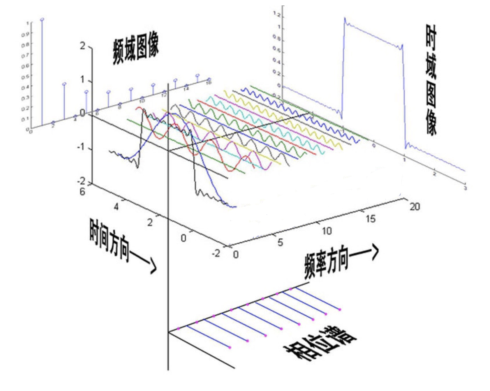

图傅里叶变换：
$$
    \begin{equation}\begin{split} 
    x(i) = \sum_{l=1}^n \hat x(\lambda_l)u_l(i)
    \end{split}\end{equation}
$$

####拉普拉斯矩阵
定义为： 拉普拉斯矩阵=度矩阵-邻接矩阵
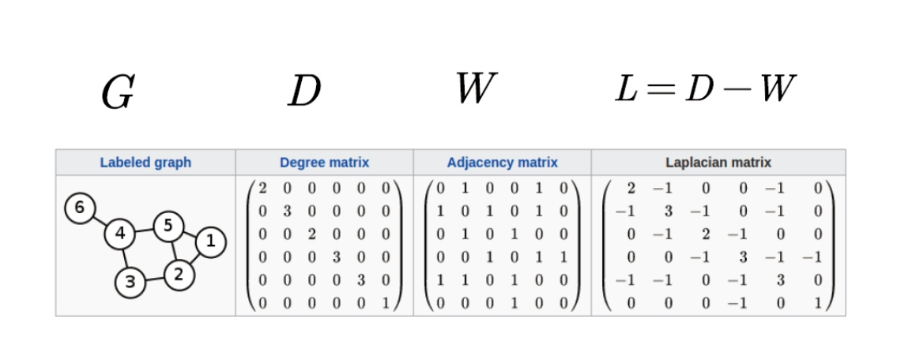
我们常见的拉普拉斯矩阵为对称归一化的拉普拉斯矩阵：
$$
    \begin{equation}\begin{split} 
    L^{sys} &= D^{-\frac {1}{2}} LD^{-\frac {1}{2}} \\
    &= I- D^{-\frac {1}{2}} AD^{-\frac {1}{2}}\end{split}\end{equation}
$$
这个拉普拉斯矩阵是对称半正定矩阵，证明如下：
对任意向量 $f=\left[f_1,f_2,...,f_n \right]^T$
$$
    \begin{equation}\begin{split} 
    f^TLf &= f^TDf -f^TAf = \sum_{i=1}^n d_if_i^2 - \sum_{i=1}^nf_if_jA_{ij} \\
    &= \frac {1}{2}(\sum_{i=1}^nd_if_i^2 - 2\sum_{i,j=1}^n f_if_jW_{ij}+\sum_{j=1}^nd_jf_j^2)\\
    &= \frac {1}{2}(\sum_{i,j=1}^n W_{ij}(f_i-f_j)^2) \geq 0
    \end{split}\end{equation}
$$
作为对称的半正定矩阵，拉普拉斯矩阵有如下性质：
- n阶对称矩阵一定有n个线性无关的特征向量。
- 对称矩阵的不同特征值对应的特征向量相互正交，这些正交的特征向量构成的矩阵是正交矩阵。
- 实对称阵的特征向量一定是实向量。
- 半正定矩阵的特征值一定非负。

拉普拉斯矩阵的特征分解，也叫谱分解。是将矩阵分解为由特征值和特征向量表示的矩阵之积的方法。
$$
    \begin{equation}\begin{split} 
    L&=U\Lambda U^{-1}=U\begin{pmatrix} \lambda_1 & 0 & ... &0 \\ 0 & \lambda_2 & ... & 0\\ ...\\0&0&...&\lambda_n \end{pmatrix} U^{-1} \\
    U&=(\vec u_1,\vec u_2,...,\vec u_n),\vec u_i \in R^n
    \end{split}\end{equation}
$$
因为
n阶对称矩阵一定有n个线性无关的特征向量（对称矩阵性质）
n维线性空间中的n个线性无关的向量都可以构成它的一组基（矩阵论知识）
所以
拉普拉斯矩阵的n个特征向量是线性无关的，他们是n维空间中的一组基。
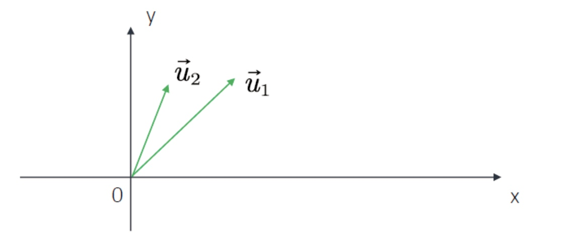
如在二维空间中有$\vec u_1,\vec u_2$两个线性无关的向量，则它们可以表示这个二维空间中的所有向量，它们就是二维空间中的一组基。
又因为
对称矩阵的不同特征值对应的特征向量相互正交，这些正交的特征向量构成的矩阵为正交矩阵(对称矩阵性质)
拉普拉斯矩阵的n个特征向量是n维空间中的一组标准正交基。
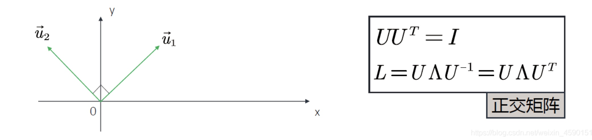

但是为什么拉普拉斯矩阵是度矩阵减邻接矩阵，也就是L = D − W 呢？原因是拉普拉斯矩阵是图上的一种拉普拉斯算子，下面接着看什么是拉普拉斯算子：
拉普拉斯算子$\bigtriangleup$ 的定义是梯度gradient $\bigtriangledown$的散度 $\bigtriangledown\cdot$
$$
    \begin{equation}\begin{split} 
    \bigtriangleup f=\bigtriangledown \cdot(\bigtriangledown f)=dic(grad(f))
    \end{split}\end{equation}
$$
对于n维欧几里得空间，我们可以认为拉普拉斯算子是一个二阶微分算子。即在各个维度求二阶导数后求和。
$$
    \begin{equation}\begin{split} 
    \bigtriangleup f=\sum_i \frac {\partial^2 f}{\partial x_i^2}
    \end{split}\end{equation}
$$
三维的话就是
$$
    \begin{equation}\begin{split} 
    \bigtriangleup f=\frac{\partial^2 f}{\partial x^2}+\frac{\partial^2 f}{\partial y^2}+\frac{\partial^2 f}{\partial z^2}
    \end{split}\end{equation}
$$
离散情况下二维欧式空间的拉普拉斯算子，可以理解为中心节点与周围节点的差值，然后求和。
$$
    \begin{equation}\begin{split} 
    \bigtriangleup f=\frac{\partial^2 f}{\partial x^2}+\frac{\partial^2 f}{\partial y^2}=f(x+1,y)+f(x-1,y)+f(x,y-1)+f(x,y+1) - 4f(x,y)
    \end{split}\end{equation}
$$
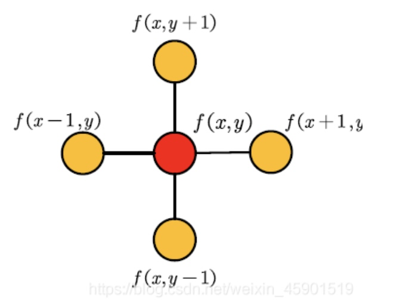

结论：拉普拉斯矩阵是图上的一种拉普拉斯算子。

[未完]

## 常见数据集
➢ KarateClub:数据为无向图，来源于论文An Information Flow Model for Conflict and Fission in Small Groups;

➢ TUDataset:包括58个基础的分类数据集集合，数据都为无向图，如“IMDB-BINARY”， “PROTEINS”等，来源于TU Dortmund University

➢ Planetoid:引用网络数据集，包括“Cora”, “CiteSeer” and “PubMed”，数据都为无向图，来源 于论文Revisiting Semi-Supervised Learning with Graph Embeddings。节点代表文档，边代表引 用关系。

➢ CoraFull:完整的“Cora”引用网络数据集，数据为无向图，来源于论文Deep Gaussian Embedding of Graphs: Unsupervised Inductive Learning via Ranking。节点代表文档，边代表引 用关系。
 
➢ Coauthor:共同作者网络数据集，包括“CS”和“Physics”，数据都为无向图，来源于论文Pitfalls of Graph Neural Network Evaluation。节点代表作者，若是共同作者则被边相连。学习任务是将作者映射到 各自的研究领域中。

➢ Amazon:亚马逊网络数据集，包括“Computers”和“Photo”，数据都为无向图，来源于论文Pitfalls of Graph Neural Network Evaluation。节点代表货物，边代表两种货物经常被同时购买。学习任务是将货物 映射到各自的种类里。

➢ PPI:蛋白质-蛋白质反应网络，数据为无向图，来源于论文Predicting multicellular function through multi- layer tissue networks

➢Entities:关系实体网络，包括“AIFB”, “MUTAG”, “BGS” 和“AM”，数据都为无向图，来源 于论文Modeling Relational Data with Graph Convolutional Networks

➢ BitcoinOTC:数据为有向图，包括138个“who-trusts-whom”网络，来源于论文EvolveGCN: Evolving Graph Convolutional Networks for Dynamic Graphs，数据链接为Bitcoin OTC trust weighted signed network

**行为识别的：**
➢ Kinetics 400 600 700 
人类行为数据集（dynamics）包含从YouTube上检索到的大约30万个视频片段。
这些视频涵盖了多达400个人类动作课程，从日常活动、体育场景到复杂的互动动作。每个剪辑动力学持续约10秒。
➢NTU RGB+D
这个数据集包含每个样本的RGB视频、深度图序列、3D骨架数据和红外(IR)视频。每个数据集由三个Kinect V2摄像机同时捕获。
RGB视频的分辨率为1920x1080，深度图和IR视频均为512x424，3D骨骼数据包含每帧25个人体关节的3D坐标。

## 参考文献
[什么是卷积(convolution)](https://zhuanlan.zhihu.com/p/196786958)
[图卷积神经网络系列：1. | 谱域卷积与拉普拉斯](https://zhuanlan.zhihu.com/p/137791565)
[傅里叶分析之掐死教程（完整版）更新于2014.06.06](https://zhuanlan.zhihu.com/p/19763358)
[图卷积神经网络笔记——第二章：谱域图卷积介绍（1）](https://blog.csdn.net/weixin_45901519/article/details/106388964)
[图卷积网络 GCN Graph Convolutional Network（谱域GCN）的理解和详细推导-持续更新](https://blog.csdn.net/yyl424525/article/details/100058264/)