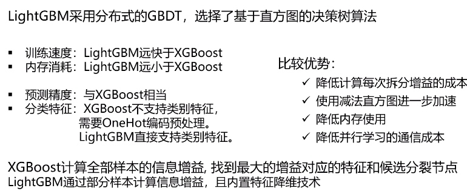
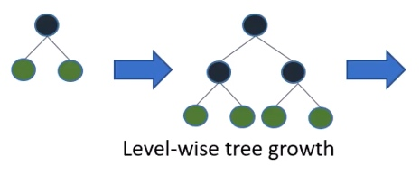

# lightgbm 原理
$$
\begin{equation}\begin{split} 
LightGBM &= XGBoost + Histogram +Goss + EFB\\
\\
    XGBoost&=eXtreeme + GDBT \\
    &= eXtreme + (Gradient + BDT) \\
    &= eXtreme + Gradient + (Boosting+DecisionTree)\\
\end{split}\end{equation}
$$

[TOC]

##设计理念
Histogram算法：直方图算法
GOSS算法：基于梯度的单边采样算法
EFB算法：互斥特征捆绑算法

通过引入这三个算法，LightGBM生成一篇叶子需要的复杂度大大降低了，从而极大节约了计算时间。
同时Histogram算法还将特征由浮点数转换成0-255位的整数进行存储，从而极大节约了内存存储。

##与xgboost对比
|    | XGBoost | LightBGM |
| --- | --- | --- |
| 树的生长算法 |按层生长,找到最优特征,有利于工程优化,但模型的效率不高| 叶向最大深度限制 用较小的计算量得到更好的树，也可以避免过拟合。
| 分裂搜索算法|预排序算法|直方图算法
|内存开销| $2*feature*data*4byte$|$feature*data*1byte(8*smaller)$
|分割增益的计算 | $O(data*features)$|$O(bin*features)$
Cache-line aware optimization| 无 | 40% 加速在Higgs data
|类别特征支持|无|8x 加速在Expo data

##原理

###基于leaf-wise的决策树生长策略
对于大部分决策树算法使用的level-wise生长策略，即同一层的叶子节点每次都一起分裂，但实际上一些叶子节点的分裂增益较低，这样分裂会增加不小的开销。
可以并行化。

LightGbm使用的leaf-wise策略，每次在当前叶子节点中，找出分裂增益最大的叶子节点进行分裂，而不是所有节点都进行分裂，这样可以提高精度。

###直方图优化
直方图算法是替代XGBoost的预排序(pre-sorted)算法的。
直方图基本概念：直方图分为频数直方图和频率直方图，横轴标为相关数据，纵坐标则为该数据出现的频数或者频率。

先对特征值进行装箱处理，把连续的浮点特征值离散化成k个整数，形成一个一个的箱体(bins).同时构造一个宽度为k的直方图，在遍历数据的时候，根据离散化后的值作为索引在直方图中累积统计量(频数直方图)，当遍历一次数据后，直方图累积了需要的统计量，然后根据直方图的离散值，找到最优的分割点。

对于连续特征来说，装箱助理就是特征工程中的离散化：如[0,10)区间的值都可以赋值为0，[10,20)区间的值都可以赋值为1等，这样就可以把众多的数值划分到有限的分箱中，在Lightgbm中默认的分箱数(bins)为256。

对于分类特征来说，则是每一种取值放入一个分箱(bin),且当取值的个数大于最大分箱数时，会忽略那些很少出现的分类值。

直方图算法还能做减法直方图加速。当节点分裂成两个时，右边叶子节点的直方图等于其父节点的直方图减去左边叶子节点的直方图。从而大大减少构建直方图的计算量。

###GOSS算法
单边梯度采样GOSS算法(Gradient-based One-Side Sampling)

通过对样本采样的方法来减少计算目标函数增益时候的复杂度。
在算法中，梯度更大的样本点在计算信息增益时会占有更重要的作用。
当我们对样本进行下采样的时候，保留这些梯度较大的样本点，并随机去掉梯度小的样本点。
- 首先把样本安装梯度排序，选出梯度最大的a%个样本，然后在剩下小梯度数据中随机选取b%个样本，在计算信息增益的时候，将选出来的b%小梯度样本的信息增益夸大 $1-\frac {a}{b}$的倍数。

###EFB算法
Exclusive Feature Bundling，即互斥特征绑定算法。
- 将互斥特征绑在一起以减少特征维度。
- 可以有效减少用于构建直方图的特征数量，从而降低计算复杂度，尤其是特征中包含大量系数特征时。
LightGBM可以直接将每个类别取值和一个bin关联，从而自动地处理他们，无需与处理成onehot编码。

###并行学习
LightGBM支持特征并行和数据并行两种。

传统的特征并行主要思想是在并行化决策树中寻找最佳切分点，在数据量大时难以加速，同时需要对切分结果进行通信整合。

LightGBM则是使用分散规约(Reduce scatter)，它将直方图合并的任务分给不同的机器，降低通信和计算的开销，并利用直方图做加速训练，进一步减少开销。

##参数

###防止过拟合
- 减小 max_bin  - feature --- 分桶略微粗一些  
- 减小 num_leaves --- 不要在单棵树上分的太细
- 控制 min_data_in_leaf and min_sum_hessian_in_leaf ---- 确保叶子节点还有足够多的数据
- Sub-sample --- 在构建每棵树的时候，在data上做一些sample
- Sub-feature  --- 在构建每棵树的时候，在feature上做一些sample  
- bigger training data -更多的训练数据
- lambda_l1, lambda_l2 and min_gain_to_split to reqularization -正则
- max_depth to avoid growing deep tree - 控制树深度

### 常见超参数
| 参数| 意义 | 取值 |
| :---: | :---: | --- |
| boosting_type | 使用的树模型 | string，取值范围为:{'gbdt','dart','goss','rf'},即四种提升树，默认gbdt
| num_leaves| 最大叶子数量| int，默认31
| max_depth | 决策树最大深度| int，默认-1不设置具体深度，分裂至不可分裂为止
| n_estimators | 弱学习器的个数，或者叫若学习器的最大迭代次数| int,默认100
| learning_rate | 弱分类器的权重缩减系数| 取值范围为(0.1]，取值较小意味着达到一定的误分类数或学习效果，需要更多迭代次数和更多的弱学习器，默认0.1
| subsample_for_bin| 用来构建直方图的数据的数量| int,默认200000
| objective | 定义目标函数| string，默认None
| min_split_gain | 执行切分的最小增益| float，默认0
| class_weight | 与类别相关的权重| 取值范围为：{字典，字符串,'balanced',None}，取值为字典时：字典给出每个分类的权重；取为'balanced':每个分类的权重与该分类在样本集中出现的频率成反比代表样本数量少的类别所对应的样本权重更高；取值为None：每个分类权重都为1，默认None
| min_child_weight| 实例最小权重和 | float，默认为1e-3
| min_child_samples| 叶子最小数据量| int,默认20
| subsample| 子采样比例| 取值范围为(0,1],取值为1代表在建立回归树时使用所有样本，取值小于1代表通过不放回抽样使用部分样本，默认为1
| subsample_freq |子采样频率| int，默认为0
| colsample_bytree| 构造每棵树列的子采样率| flaot，默认1
| reg_alpha | 权重的L1正则化| float，默认0
| reg_lambda| 权重的L2正则化| float，默认1
| random_state| 设定随机状态| int或None，随机数生成器种子
| n_jobs| 用于运行LightGBM的并行线程数| int，默认-1
| silent| 运行时是否输出信息| 布尔型，默认True
| importance_type| 计算特征重要性的方法| string，默认gain

 
##参考文献
[GBDT、XGboost、lightGBM 之feature_importances_ 的计算方法](https://blog.csdn.net/scott198510/article/details/102563953)