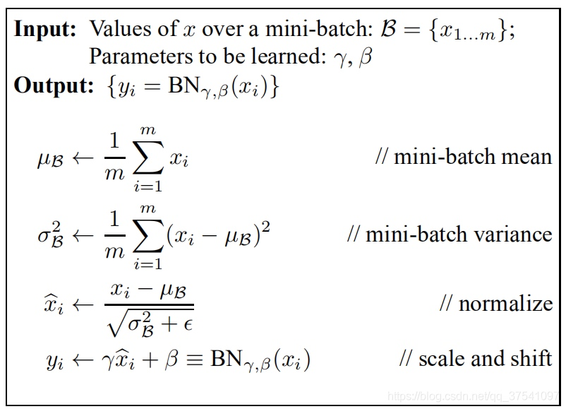
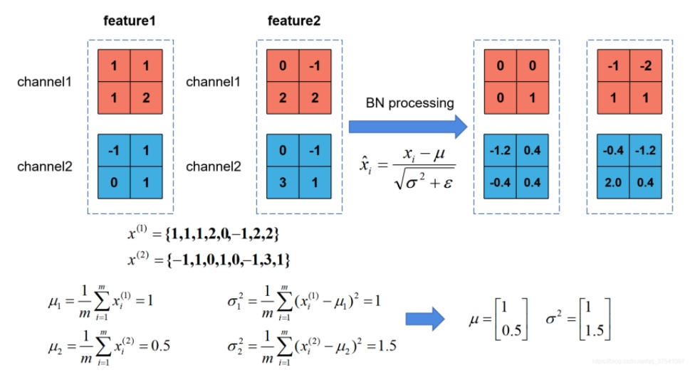
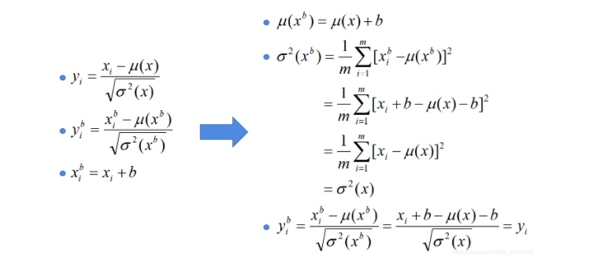
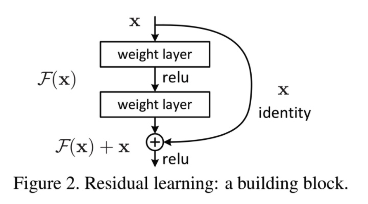
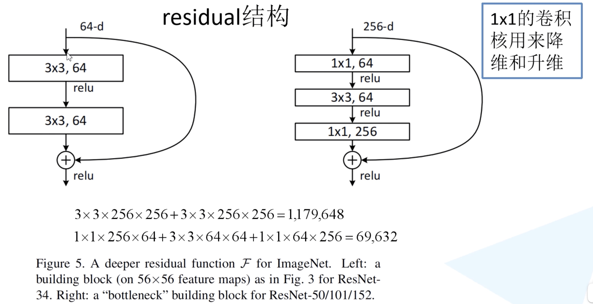
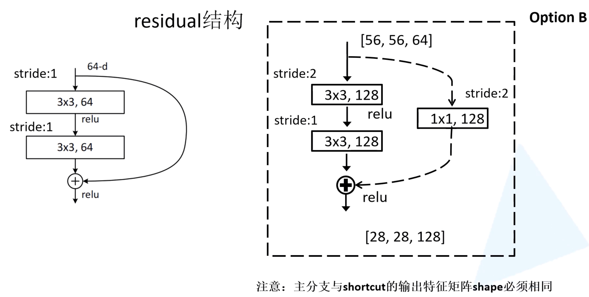
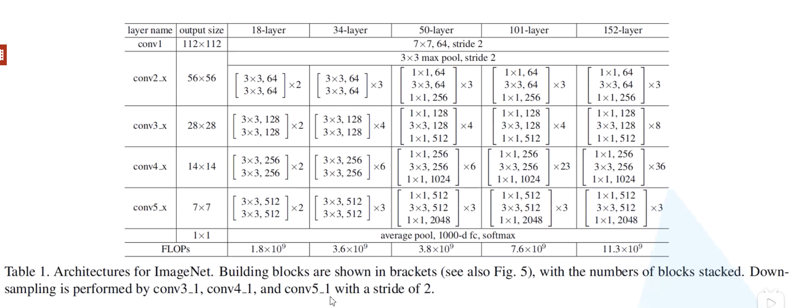

# Deep Residual Learning for Image Recognition(CVPR2016)

[TOC]
##总体介绍

##思想介绍

###网络亮点
- 超深的网络结构(突破1000层)
- 提出residual模块
- 使用BatchNormalization加速训练(丢弃dropout)

提出一种解决深度网络训练难的方法
- 恒等映射
- 跳层连接

可以将提出的残差结构加入任何深度神经网络设计中。

###为什么想到使用残差？

- 对于VLAD和Fisher Vector来说，对残差向量编码比对原始向量编码效率更高。
- 用Multigrid解偏微分方程（Partial Differential Equations，PDE）时，使用残差向量对于优化更好，收敛速度更快。

###为什么想到使用跨层连接？
- 在多层感知机（multi-layer perceptrons，MLP）中加一层从输入到输出的线性层
- GoogLeNet中使用辅助分类器防止梯度爆炸 / 消失
- 在此之前已有研究者使用跨层连接对响应和梯度中心化（center）处理
- inception结构本质也是跨层连接
- highway网络也使用到了跨层连接

###前人工作及存在的问题

现象：更深的神经网络训练效果不好
传统思路：深层次表征信息是很多视觉任务的核心点

问题：简单的叠加更多神经网络可以吗？
- 明显的梯度消失、爆炸问题，难以收敛 -- 正则化解决
- 模型退化问题凸显，准确率饱和
- 模型退化问题并非过拟合导致，增加深度导致训练集错误率提升
- 深层网络不能比浅层网络错误率更高 -- identity mapping

###改进之处
引入residual层

明确地让这些层拟合残差映射，而不是希望每几个堆叠的层直接拟合期望的基础映射。
不添加多余的参数，也不增加模型复杂度。

残差网络:
两个设计原则：
- 具有相同输出和特征图大小的网络层卷积核数量相同。
- 特征图大小减半，则卷积核数量加一倍，保证时间复杂度

方法:Residual Learning --残差学习
- 学习残差函数 -- Residual Function
- 容易优化，随深度提升，准确率提升显著
- 很好的学习了深度特征表示，即通俗理解的高级语义信息

###Batch Normalization原理介绍
Batch Normalization是google团队在2015年论文《Batch Normalization: Accelerating Deep Network Training by Reducing Internal Covariate Shift》提出的。通过该方法能够加速网络的收敛并提升准确率。

Batch Normalization的目的是使我们的一批(batch)feature map满足均值为0，方差为1的分布规律。

我们在图像预处理过程中通常会对图像进行标准化处理，这样能够加速网络的收敛，如下图所示，对于Conv1来说输入的就是满足某一分布的特征矩阵，但对于Conv2而言输入的feature map就不一定满足某一分布规律了（注意这里所说满足某一分布规律并不是指某一个feature map的数据要满足分布规律，理论上是指整个训练样本集所对应feature map的数据要满足分布规律）。而我们Batch Normalization的目的就是使我们的feature map满足均值为0，方差为1的分布规律。

$\mu_\beta$ 是feature map每个维度channel的均值，是一个向量不是一个值。
$\sigma_\beta$ 是feature map每个维度channel的标准差，是一个向量不是一个值。

$\gamma$ 是用来调整数值分布的方差大小。默认1。调整方差大小
$\beta$ 是用来调节数值均值的位置。默认0。调整均值，
因为均值为0方差为1模型不一定是最好的，所以有$\gamma$ $\beta$ 来进行调整。
这两个参数是在反向传播过程中学习到的。而均值和方差是一批批数据进行统计得到的。

让feature map满足某一分布规律，理论上是指整个训练样本集所对应feature map的数据要满足分布规律，也就是说要计算出整个训练集的feature map然后在进行标准化处理，对于一个大型的数据集明显是不可能的。

所以，也就是我们计算一个Batch数据的feature map然后在进行标准化（batch越大越接近整个数据集的分布，效果越好）。

示例

在我们训练网络的过程中，我们是通过一个batch一个batch的数据进行训练的，但是我们在预测过程中通常都是输入一张图片进行预测，此时batch size为1，如果在通过上述方法计算均值和方差就没有意义了。所以我们在训练过程中要去不断的计算每个batch的均值和方差，并使用移动平均(moving average)的方法记录统计的均值和方差，在我们训练完后我们可以近似认为我们所统计的均值和方差就等于我们整个训练集的均值和方差。然后在我们验证以及预测过程中，就使用我们统计得到的均值和方差进行标准化处理。

均值 $\mu_\beta$ 和方差$\sigma_\beta^2$ 是通过计算当前批次数据得到的记为 $\mu_{now}$ $\sigma_{now}^2$, 而我们在的验证以及预测的过程中所使用的均值方差是一个统计量记为 $\mu_{statistic}$ 和 $\sigma_{statistic}^2$。
$\mu_{statistic}$ 和 $\sigma_{statistic}^2$。具体更新策略如下，其中momentum=0.1
$$
\begin{equation}\begin{split} 
\mu_{statistic+1} &= (1-momentum)* \mu_{statistic} + momentum*\mu_{now}\\
\sigma_{statistic+1}^2 &= (1-momentum)*\sigma_{statistic+1}^2+momentum*\sigma_{now}^2
\end{split}\end{equation}
$$

注意：
对当前批次feature进行bn处理时使用的$\sigma_{now}^2$ 是总体标准差，计算公式：
$$
\begin{equation}\begin{split} 
\sigma_{now}^2 = \frac {1}{m}\sum_{i=1}^m (x_i-\mu_{now})^2
\end{split}\end{equation}
$$

在更新统计量$\sigma_{statistic}^2$ 时采用的是 $\sigma_{now}^2$是样本标准差，计算公式：
$$
\begin{equation}\begin{split} 
\sigma_{now}^2 = \frac {1}{m-1}\sum_{i=1}^m(x_i - \mu_{now})^2
\end{split}\end{equation}
$$

使用BN时要注意的问题：
- 训练的时候和验证过程时在使用框架事可能有设置的不同。
- batch size尽可能设置大点，设置小后表现可能很糟糕，设置的越大求的均值和方差越接近整个训练集的均值和方差。
- 建议将bn层放在卷积层（Conv）和激活层（例如Relu）之间，且卷积层不要使用偏置bias，因为没有用，参考下图推理，即使使用了偏置bias求出的结果也是一样的$y_{i}^{b}=y_{i}$
 

##残差原理介绍

残差块：
$F(x)=H(x)-x$
其中$H(x)$ 为底层映射，$F(x)+x$为原始映射
假设优化残差映射比优化原始的、未引用的映射更容易
如果identity mapping是最优的，那么将残差推到零要比通过非线性层来拟合identity mapping容易得多。
shortcut connections只执行identity mapping
identity shortcut connections既不增加额外参数，也不增加计算复杂度。

$$
\begin{equation}\begin{split} 
y = F(x_i{W_i}) + x
\end{split}\end{equation}
$$
x和y分别为输入输出向量。
$F(x_i{W_i})$ 是被学习的残差映射。
F -- 要学习的残差映射，维度与x一致
F+x -- 跳跃连接，逐一加和，最后输出经过激活函数Relu
x和F的维度必须相等。
我们可以通过快捷连接来执行线性投影$W_s$，以匹配尺寸：
$$
\begin{equation}\begin{split} 
y = F(x_i{W_i}) + W_sx
\end{split}\end{equation}
$$

##实验效果：

##复现

左边34层使用的残差结构，右边是50/101/152层使用的。
注意:主分支和shortcut的输出特征矩阵shape必须是相同的。是相加不是拼接。

虚线结构做维度的变换。

下采样是通过conv3_1/conv4_1/conv5_1的第一层来做

###迁移学习trick
注意：使用别人预训练模型参数时，要注意别人的预处理方式。否则有坑，容易不收敛。
常见的迁移学习方式：
1. 载入权重后训练所有参数 
2. 载入权重后只训练最后几层参数
3. 载入权重后在原网络基础上再添加一层全连接层，仅训练最后一个全连接层

##参考文献

[ResNet Identity Mapping](https://blog.csdn.net/qq_38807688/article/details/84259547)
[ResNet论文笔记及代码剖析](https://zhuanlan.zhihu.com/p/56961832)
[Batch Normalization详解以及pytorch实验](https://blog.csdn.net/qq_37541097/article/details/104434557)
[论文阅读之identity mapping](https://blog.csdn.net/qq_34272713/article/details/107018792)