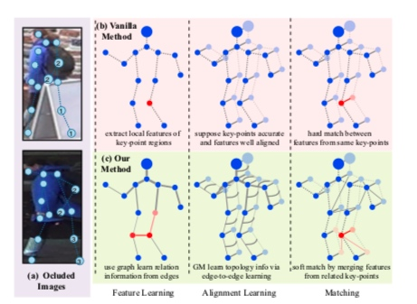
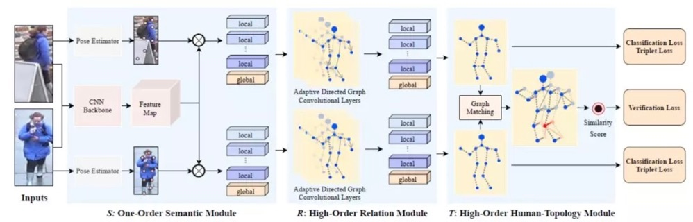
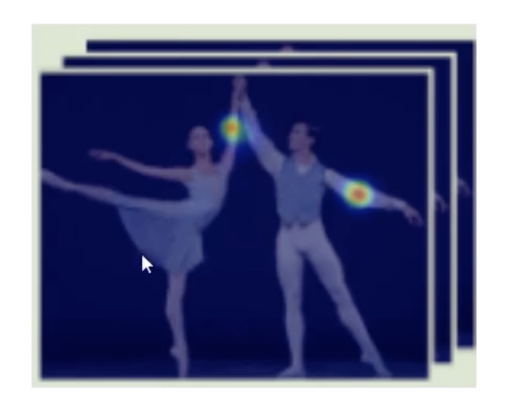
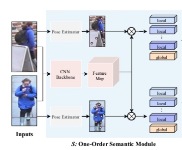
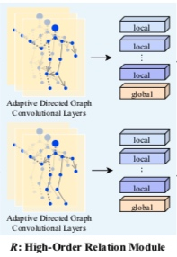
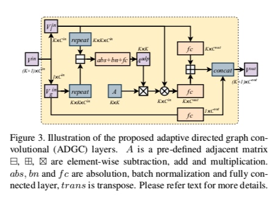
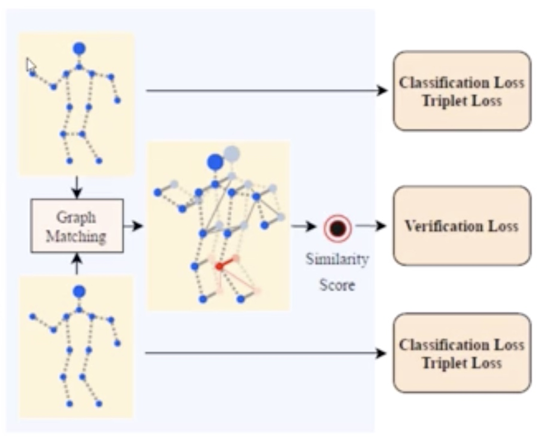
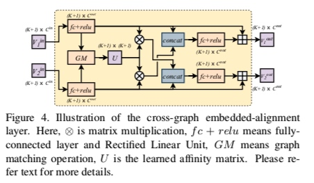

# High-Order Information Matters: Learning Relation and Topology for Occluded Person Re-Identification(CVPR2020)(泛读)

https://arxiv.org/abs/2003.08177
##解决方案
主要解决遮蔽现象。
整体思路可以再各种跟验证相关的任务中去套用。

针对遮蔽数据集Occluded-DukeMTMC
提出三阶段模型：
- 关键点局部特征提取 (关键点数据集或者关键点识别模型)
- 图卷积融合关键点特征
- 基于图匹配的方式来计算相似度并训练模型
完成特征提取，重点解决遮蔽问题。

关键点可以学习人体走路运动的先验知识。

1、关键点局部特征提取 
关键点数据集或者关键点识别模型

2、图卷积融合贯机电特征
传统算法是点与点进行匹配，但当两个图像遮蔽位置不一致时，就没法进行对比关键点。
图卷积就会好好利用未被遮挡的区域。

3、基于图匹配的方式来计算相似度并训练模型
匹配图像中哪些能用哪些不能用，能用的该怎么用，不能用的该怎么减少。
计算U匹配矩阵(13x13)关键点。

###第一阶段S(关键点局部特征提取)
根据CNN提取到feature map和十三个关键点的信息。
local是十三个关键点信息。
global是feature map(global average pooling得到)

热度图是关键点乘以feature map
选择一个pose estimation模型即可，得到的是各个关键点的热度图信息，通过热度图得到原始特征图的局部信息。

用feature map和关键点信息相乘，相当于在特征图中把信息画出来。
得到一共十四个特征+global
把local和global都进行训练，添加多个损失。

###第二阶段R(如何利用各个点的特征，用图卷积局部特征关系整合)

做特征的整合，得到的还是local和global，是一个有了相互关系的拓扑结构，相当于一个attention机制。
将得到的邻接矩阵A来指导每个关键点特征如何跟其他关键点特征进行计算，并且A矩阵也要进行学习。

如何利用好局部特征？加入关系
先初始化邻接矩阵来进行图卷积，邻接矩阵在学习过程中更新，综合利用各关键点直接的信息。

如何才能更好的针对每个输入利用不同的局部特征？没有边的就不用

和整体差异越大的，越离群。
利用差异特征来学习邻居矩阵A
有了A就能开始图卷积了，用他来指导如何利用不同关键点的特征进行组合，最终再与输入的局部特征进行整合。

$K=13$ 13个关键点
$V_l^{in}$ 关键点特征向量 $batch*13*2048$
$V_g^{in}$ 全局特征向量   $1*13*2048$
repeat调整向量大小把$1*13*2048$变成$batch*13*2048$后做减法
然后经过abs绝对值、bn层、fc层后得到一个$K*K$的矩阵$A^{adp}$。
用学习到的$A^{adp}$和邻接矩阵A做乘法。$A'=A^{adp}*A$
之后在用$V_l^{in}$和上面相乘得到的结果当成$V_l^{in}*A'$相当于图卷积过程。
再将本身特征$V_l^{in}$和图卷积后的关系特征相加。
再concat全局特征向量$V_g^{in}$得到输出

###第三阶段T(图匹配，相似度计算)

输入两张图像(经过了前两阶段后的结果)

Graph Matching 计算一个14X14的相似度矩阵U，对一下关键点。表示两个图之间的关系。

进入了新的验证损失函数。
就是sigmoid(emb1,emb2)的结果。

输入两个编码后的特征向量。
先经过fc+relu提取下特征，再进行图匹配得出相似度矩阵U。
然后是一个交叉cross的过程，分别交叉来得到个子匹配的特征结果。知道了哪里该匹配哪里不该，再进过fc+relu得到最终特征。

## 参考文献
[这篇的旷世推文](https://mp.weixin.qq.com/s/EhAeaA68Ek27EptkTfZiBQ)
[【CVPR2020】：High-Order Information Matters: Learning Relation and Topology for Occluded Person Re-Ide](https://blog.csdn.net/baidu_41617231/article/details/107421943)
[【唐宇迪】CVPR2020最新行人重识别论文解读](https://www.bilibili.com/video/BV1764y1c7jZ?p=3)
[图解行人重识别论文系列](https://www.bilibili.com/video/BV13W411K7jM?from=search&seid=5052861388779194545)