#计算机网络面试

[TOC]

## 请详细介绍一下TCP的三次握手机制，为什么要三次握手？
- 为什么需要握手？
- 为什么是3次
- 为什么关链接是4次建立时候是三次
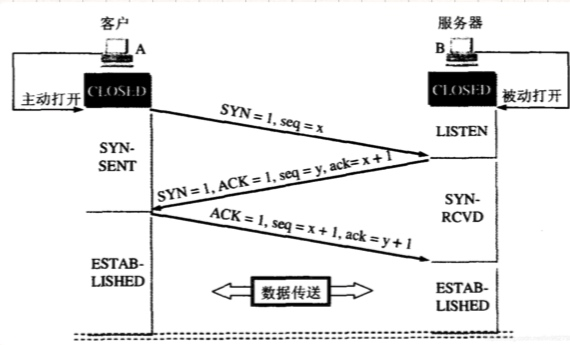
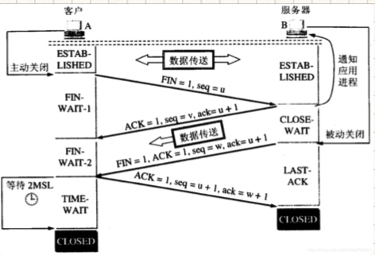

问两个点，回答可以三个点。
1、TCP有一个重要的特性就是可靠性。我发送一个数据一定要收到确认才算消息发送成功，如果没回答就要重发。怎么证明发出去收到确认了，就要有个seq序列号。序列号不能从0开始，链接会混淆。
2、关链接的时候，可以让链接处于半打开状态，让链接继续传送消息。但建立链接时，不可以使用半打开状态进行传输消息。sever在回复的时候必须把syn、ack返回回来。

##能否简单介绍下http协议中的缓存处理流程？
- 缓存的应用流程是什么？
- 与缓存相关的http头部是什么？

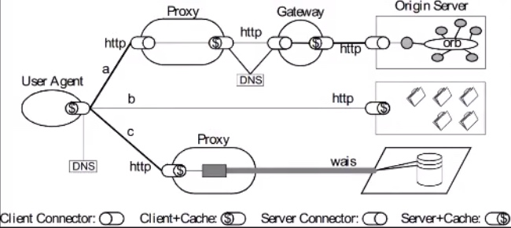
resful架构 $是缓存 因为cache和钱发音相似。
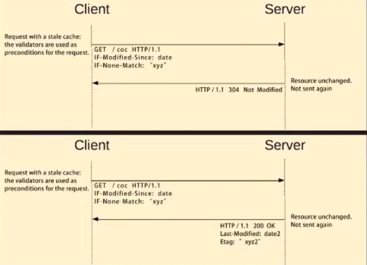
浏览器缓存过期了，浏览器不会立刻把缓存扔掉，会给缓存打一个标签，标签叫摘要。摘要可以根据它的长度和时间生成，这个摘要是由服务器生成的。访问时客户端会把摘要带给服务器，服务器会根据摘要信息判断，摘要对应的缓存是不是最新的，如果发生了变化，会发送200跟新，没变化就304。

###过期的共享缓存作用？
比如为了提升用户体验、防止高并发请求把服务打挂。

###Cache- Control 头部在请求中的值

max-age：告诉服务器，客户端不会接受 Age 超出 max-age 秒的缓存

max-stale：告诉服务器，即使缓存不再新鲜，但陈旧秒数没有超出 max-stale 时，客户端仍打算使用。若 max-stale 后没有值，则表示无论过期多久客户端都可使用。

min-fresh：告诉服务器，如果缓存距离过期还有至少 min-fresh 秒才可使用

no-cache：告诉服务器，不能直接使用已有缓存作为响应返回，除非带着缓存条件到上游服务端得到 304 验证返回码才可使用现有缓存

no-store：告诉各代理服务器不要对该请求的响应缓存（实际有不少不遵守该规定的代理服务器

no-transform：告诉代理服务器不要修改消息包体的内容

only-if-cached：告诉服务仅能返回缓存的响应，否则若没有缓存则返回 504 错误码

###在地址栏键入URL后，网络世界发生了什么？
1.域名转IP地址经过DNS
经历缓存，缓存未命中，经历正向代理。
正向代理和反向代理中间可能还会经历DNS
反向代理到后面的原服务器。

2.http会把请求进行编码
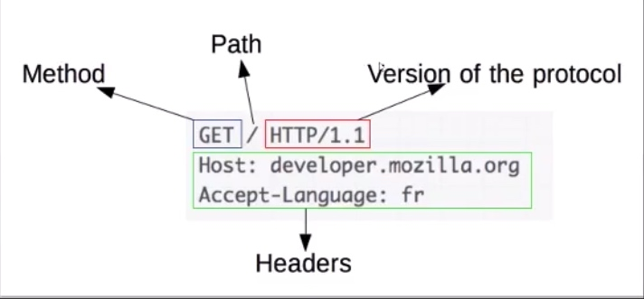
3.网络分层与报文传输
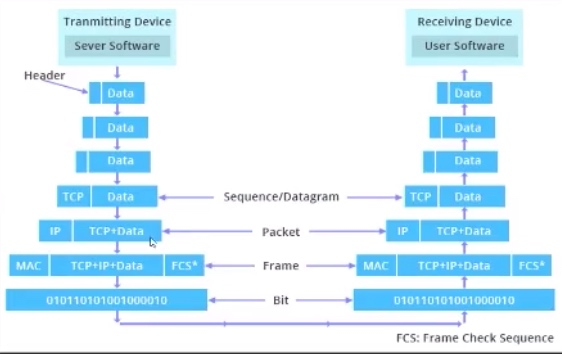
运输层是解决进程到进程的。
IP层是解决主机到主机的路由。
数据链路层是解决一个局域网内的通讯。

##使用HTTP长连接有哪些优点？
- 减少握手次数
- 减少慢启动影响
- 有什么缺点？

http长短链接如何区分？
通过http header的connection后是close就是短连接。长连接是connection后是keepalive

TCP做到了不管传多大数据都能传。TCP自带流控，但带宽有限。就采用慢启动。队头阻塞，多路复用，丢包了就会重传。

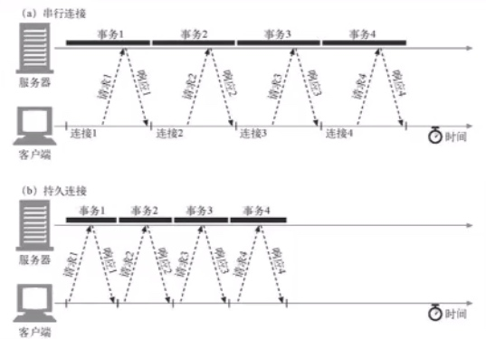

##介绍下CLOSE_WAIT状态产生的原因
四次挥手中，看到这个状态程序一般就有bug。
主动端、被动端。
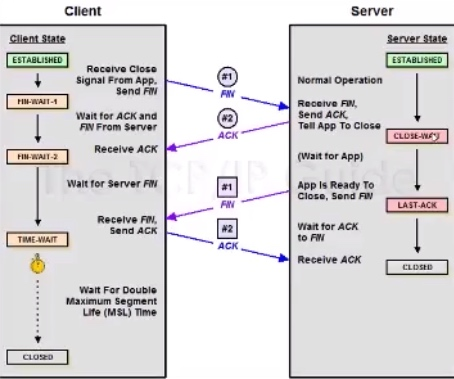
只有一端可以发消息，一端不可以发了。

##能介绍下多播是怎样实现的吗？
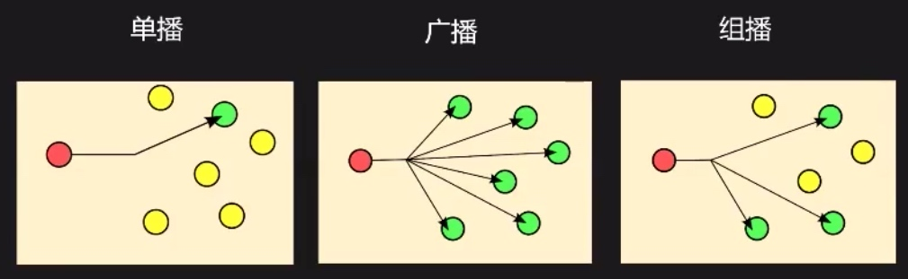
多播一般在局域网使用。5G有个newIP概念就是在互联网上实现多播。
TCP是点对点通信的，广播发给255.255.255.255
一个主机给100个主机发不上多播，会产生一百倍的流量。
多播是在路由器做这件事的，对发送端有性能提升，网络消耗少。

为什么可以实现广播？IP地址和mac地址的特点

##服务器的最大并发连接数是多少？
并发连接是由TCP四元组决定的。
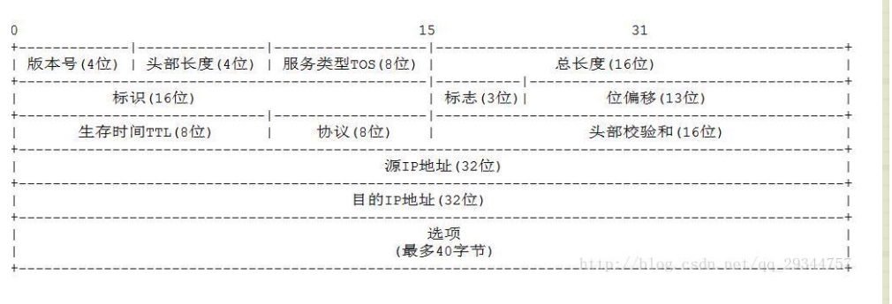
源IP地址和目的IP地址，这样就不会受制于端口。
端口和进程是相关联的。
一台服务器目的端口和目的IP定下来可以有2的32+16=48次方并发连接能力。
还有，在linux上怎么实现并发连接数？
可以说 考虑到ip local pockrange端口是受限的把它打开，另外一台服务器ip可以有很多虚拟ip地址，有很多网卡。

延伸
- 怎么实现高并发？
实现的一个难点是不要处理一个链接的时间太长。
可以用事件驱动，无阻赛，才能满足这样的要求。

- linux下的高并发优化？

## TCP和UDP协议如何选择？
UDP：
- 一对多通讯
- 效率高
- 简单
- 实时性更好
- 无队头阻塞问题

TCP：
- 传递任意长度消息(字符流协议)
- 可靠
- 流量控制
- 拥塞控制

## TLS/SSL协议是怎样保障信息安全的？
PKI证书体系
秘钥交换协议
对称加密算法

##HTTP协议有哪些优点？
GRPC基于http2.0
多路复用，消息推送
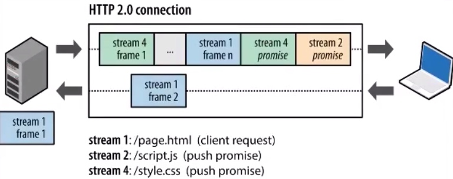
HPACK编码
- 动态表
- 静态表
- 静态Huffman
- 整数编码
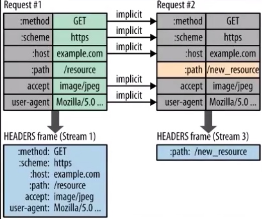

steam优先级
- 父子依赖
- 权重

##参考文献
[10 道大厂面试必考的计算机网络问题](https://www.bilibili.com/video/BV1gk4y1o7pX?from=search&seid=15196385580765218312)
