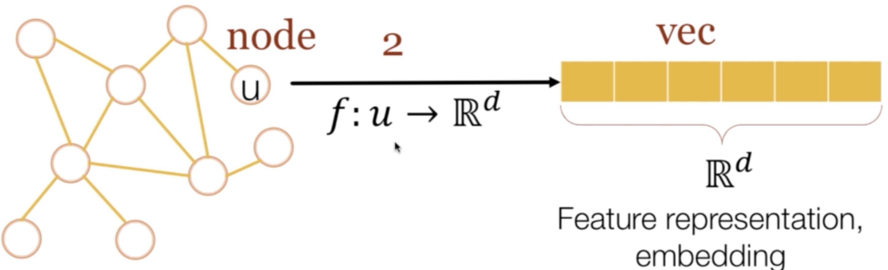
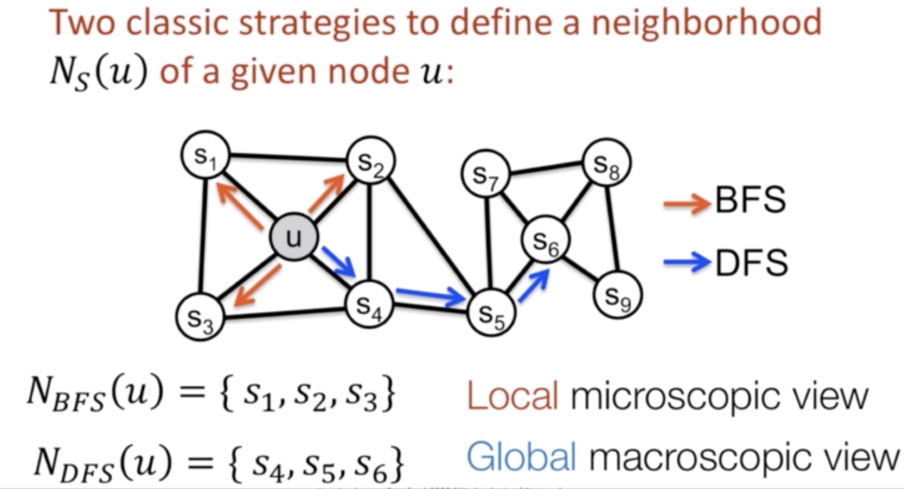
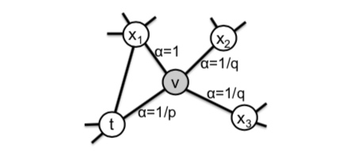
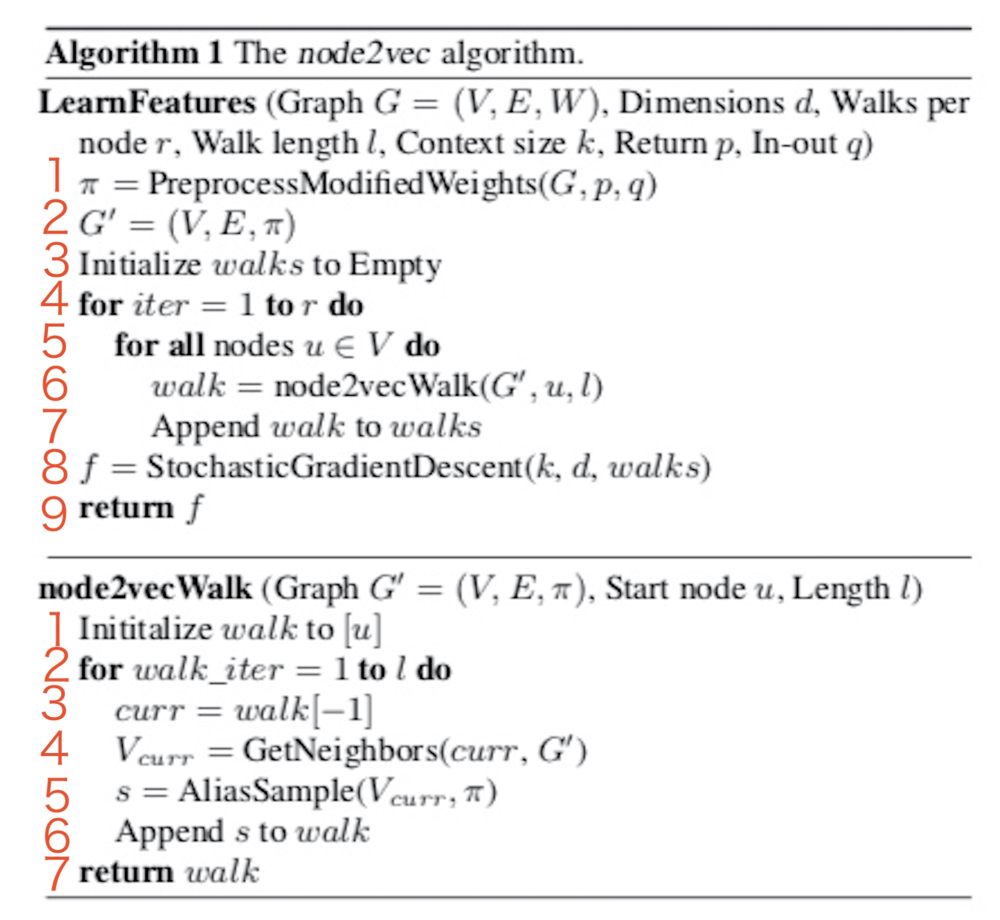
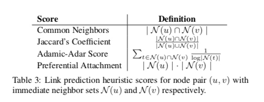

# node2vec: Scalable Feature Learning for Networks (kdd2016)

[TOC]
 
##思想
生成随机游走，对随机游走采样得到（节点，上下文）的组合，然后用处理词向量的方法对这样的组合建模得到网络节点的表示。不过在生成随机游走过程中做了一些创新。

###关键点
- word2vec训练框架
- 基于random walk产生训练序列
- 性能采样--alias sampling[Alias sampling（根据概率的一种高效采样方法）](https://blog.csdn.net/zsycode/article/details/105075303)
- 实验设置丰富

###创新点
- 讨论dfs和bfs的语义
- 设计biased random walk
- 实验论证效果丰富

###启发点
- 图的理解对网络表征学习的作用
- 基于random walk方法启发了大量工作(metapath2vec)
- 算法复杂度高效

## 摘要
- 强调之前的基于特征工程的工作缺点，从而引出node2vec并能探索邻域的多样性。
- 学习原始节点表征，用低维空间来表示。
- 通过biased random walk算法提出可调的灵活的搜索策略，生成不同语义的节点序列信息。
- 讨论算法的高效性、鲁棒性，从案例分析和大量实验论文模型的特点。

## Introduction
复杂网络面对的任务：
- 网络节点分类：网络中节点进行聚类，关心哪些节点具有类似的属性，就分为一类。
- 网络连接预测：预测网络中哪些顶点有潜在的关联。

要完成这些任务首先要解决的就是网络嵌入，以前的手工提取特征的方式有很多不足。
一种替代提取网络特征的方法是通过解优化函数的方式学习网络的表示特征，但这种方法面临一个计算效率和准确度的平衡问题，无法兼顾二者。

一种通过传统降维方法如PCA应用到网络表示中也有一定效果，缺点是会设计矩阵分解，运算量大，同时准确率也不高，而且有些方法知识针对特定的任务才有效。

这篇文章要尝试解决，设计出又能保持节点邻居新而且有容易训练的模型。

##算法

###损失函数

通过f对节点u学习到一个d维向量。

将Skip-gram结构扩展到网络。我们寻求优化下面的目标函数，该目标函数根据由f给出的特征表示来最大化节点u的网络邻域NS(U)的观测对数概率：
$$
    \begin{equation}\begin{split} 
    max_f\sum_{u\in V}logPr(N_s(u)|f(u))
    \end{split}\end{equation}
$$
$f(u)$ 就是当前节点向量， $N_s$ 就是邻居节点（以s的方法采样得到的）公式的意思是用节点u的向量，预测他的邻居集合$N_s$。

为了让这个结果更容易计算，引入了两个假设，其实这都是skip-gram模型中的。

**第一个假设是条件独立（Conditional independence）**，即采样每个邻居是相互独立的，所以如果要计算采样所有邻居的概率只需要将采样每个邻居的概率相乘就行了，公式化表达就是：
$$
    \begin{equation}\begin{split} 
    Pr(N_s(u)|f(u)) = \prod_{n_i\in N_s(u)}Pr(n_i|f(u))
    \end{split}\end{equation}
$$

**第二个假设是特征空间的对称性(Symmetry in feature space)**,比如一条边链接了A和B，那么映射到特征空间时，A对B的影响和B对A的影响应该是一样的，用一个模型来表示一个(节点，邻居)对：
$$
    \begin{equation}\begin{split} 
    Pr(n_i|f(u)) = \frac{exp(f(n_i)\cdot f(u))}{\sum_{v\in V} exp(f(v)\cdot f(u))}
    \end{split}\end{equation}
$$
综合以上三个式子可推导：
$$
    \begin{equation}\begin{split} 
    \sum_{u\in V}logPr(N_s(u)|f(u)) &= \sum_{u\in V}log\prod_{n_i\in N_s(u)}Pr(n_i|f(u))\\
    &= \sum_{u\in V}\sum_{n_i\in N_s(u)}logPr(n_i|f(u))\\
    &= \sum_{u\in V}\sum_{n_i\in N_s(u)}log\frac{exp(f(n_i)\cdot f(u))}{\sum_{v\in V} exp(f(v)\cdot f(u))}
    \end{split}\end{equation}
$$
令$Z_u=\sum_{v\in V}exp(f(v)\cdot f(u))$ 得最终结果：
$$
    \begin{equation}\begin{split} 
    max_f\sum_{u\in V}[-logZ_u+\sum_{n_i\in N_s(u)} f(n_i) \cdot f(u)]
    \end{split}\end{equation}
$$

基于Skip-gram体系结构的特征学习方法最初是在自然语言的上下文中开发的。给定文本的线性性质，可以使用连续单词上的滑动窗口来自然地定义邻域的概念。然而，网络不是线性的，因此需要一个更丰富的邻里概念。为了解决这个问题，我们提出了一种随机过程，该过程对给定源节点u的许多不同的邻域进行采样。邻域$N_s(u)$不仅限于直接邻域，而且根据采样策略S可以具有非常不同的结构。

### 经典搜索策略(BFS/DFS)

上面的公式需要注意两点：
- $Z_u$ 直接计算特别费时，本文用Negative Sampling方法解决的。
- $N_s(u)$ 未必是u的直接邻居，知识用s方法采样得到的邻居，跟具体的采样方法有关。

本文将源节点的邻域抽样问题看作是局部搜索的一种形式。

一种结构特征是很多节点会聚集在一起，内部的连接远比外部的连接多，我们称之为社区。另一种结构特征是网络中两个可能相聚很远的点，在边的连接上有着类似的特征。比如下图， $u,s_1,s_2,s_3,s_4$ 就属于一个社区，而 $u,s_6$ 在结构上有着相似的特征。

那么要设计的网络表示学习算法的目标必须满足这两点：
- 同一个社区内的节点表示相似
- 拥有类似结构特征的节点表示相似。

给定一个源节点u，我们打算生成(样本)它的邻居$N_s(u)$
为了能够公平地比较不同的采样策略S，我们应该将邻域集合$N_s(u)$ 的大小限制为k个节点，然后对单个节点u的多个集合进行采样。通常，有两种极端采样策略用于生成k个节点的邻域集合$N_s(u)$：
- BFS(Breadth-first Sampling)(结构属性)
- DFS(Depth-first Sampling)(社群属性)

###创新部分(有偏随机游走)
在上述观察的基础上，论文设计了一种灵活的邻域采样策略，使能够在BFS和DFS之间平滑地插值。我们通过开发一种灵活的偏向随机游走程序来实现这一点，该程序可以以BFS和DFS的方式探索社区。

**随机游走算法**
传统的随机游走不具备探索节点不同类型领域的能力。
给定当前顶点v，访问下一个顶点x的概率为:
$$
    \begin{equation}\begin{split} 
    P(c_i=x|c_{i-1}=v)=\begin{cases}
\frac {\pi_{vx}}{Z}, & if (v,x) \in V \\
0, & \text{otherwise}
\end{cases}
    \end{split}\end{equation}
$$
表示从i-1时刻在v节点到i时刻x节点的概率
$\pi_{vx} = w_{vx}$是顶点v和顶点x之间的未归一化转移概率，$w_{vx}=1$无权图，Z是归一化常数，一个点可能有很多边，Z就是把各个边权重加起来做归一化。

**node2vec**
BFS可以搜索结构等价的节点特征，DFS可以搜索结构相似的节点特征。而现实世界通常是两种方法的混合。所以定义如下随机游走策略。

所以定义了具有两个参数p和q的二阶随机行走，这两个参数指导行走：考虑刚刚穿过边(t，v)并且现在驻留在节点v处的随机行走(如图)。现在，遍历需要决定下一步，以便评估从V开始的边(v，x)上的转移概率$\pi_{vx}$。我们将非正规化转移概率设置为$\pi_{vx}=\alpha(t,x)\cdot w_{vx}$，其中:
$$
    \begin{equation}\begin{split} 
    \alpha(t,x)=\begin{cases}
\frac {1}{p}, & if  d_{tx}=0 \\
1, & if  d_{tx}=1\\
\frac{1}{q} , & if  d_{tx}=2
\end{cases}
    \end{split}\end{equation}
$$
$d_{tx}$为顶点t和顶点x之间的最短路径距离。
p、q控制了从源点(v)离开其邻居的快慢。
p:
- p值大：倾向不回溯，降低了2-hop的冗余度
- p值小：倾向于回溯，采样序列集中在起始点的周围

- return parameter p.p仅作用于$d_{tx}=0$的情况，而$d_{tx}=0$ 表示顶点x就是访问当前顶点v之前刚刚访问过的节点。
​	
论文：参数p控制即时重新访问遍历中的节点的可能性。将其设置为较高的值(>max(q，1))可确保在以下两个步骤中不太可能对已访问的节点进行采样(除非遍历中的下一个节点没有其他邻居)。该策略鼓励适度探索，避免了采样中的2跳冗余。另一方面，如果p是低的(<min(q，1))。它将引导遍历回溯一步，这将使遍历局部靠近起始节点u。

q:
- q>1:BFS行为，具备特征
- q<1:DFS行为，全局特征

- In-outparameter q.q控制着游走是向外还是向内，若q>1，随机游走倾向于访问和t接近的顶点(偏向BFS)。若q < 1，倾向于访问远离t的顶点(偏向DFS)。

**与纯BFS或DFS相比随机游走的好处：**
随机游走在空间和时间要求方面都是比较有效的。
1.原先存储图中每个节点的直接邻居的空间复杂度为O(|E|)。
对于二阶随机游走，不止存一阶邻居，这会产生$O(a^2|V|)$的空间复杂度，其中a是图的平均度，对于现实世界的网络，a通常很小，V个点有a个邻居。
2.通过在样本生成过程中施加图连通性，随机游走提供了一种方便的机制，通过跨不同源节点重用样本来提高有效采样率。通过模拟长度l>k的随机游动，我们可以一次为l个−k个节点生成k个样本，这是由于Markovian随机游走的本质。时间复杂度$O(\frac{1}{k(l-k)})$

###算法流程
采样完顶点序列后，剩下的步骤就和deepwalk一样了，用word2vec去学习顶点的embedding向量。
值得注意的是node2vecWalk中不再是随机抽取邻接点，而是按概率抽取，node2vec采用了Alias算法进行顶点采样。

传入的参数：图G、向量维度d、每个节点生成的游走个数r、游走长度l、上下文窗口长度k、控制参数p和q。
1.根据p和q和公式6、7计算出第一个节点到它邻居的转移概率。
2.$G'=(V,E,\pi)$ 将这个转移概率添加到图形G中形成G'
3.定义walks用来存储随机游走，先初始化为空。
4.外循环r次表示每个节点作为初始节点要生产r个随机游走。
5.在遍历图中每个节点。
6.生成一条随机游走walk
7.添加到walks中保存
8.用SGD对walks进行训练。

其中第6步node2vecWalk：
1.将初始节点u添加进walk
2.walk长度为l，因此还要循环添加l-1个节点
3.当前节点设置为walk最后添加的节点
4.找出当前节点的所有邻居节点
5.根据转移概率负采样选择某个邻居s
6.将s添加到walk中

采样技巧是使用负采样降低时间复杂度为O(1)
后续介绍负采样，用在了得到V到各个邻居的概率之后下一步该走到哪个点。

 
##实验

### 边的预测

链接预测算法（Link Prediction algorithms）
下面算法有助于确定一对节点的紧密程度。然后，我们将使用计算的分数作为链接预测解决方案的一部分:
（１）Adamic Adar（algo.linkprediction.adamicAdar）
 (２）Common Neighbors（相同邻居，algo.linkprediction.commonNeighbors）
（３）Preferential Attachment（择优连接，algo.linkprediction.preferentialAttachment）
（４）Resource Allocation（资源分配，algo.linkprediction.resourceAllocation）
（５）Same Community（相同社区，algo.linkprediction.sameCommunity）
（６）Total Neighbors（总邻居，algo.linkprediction.totalNeighbors）
###案例分析(case study)

###多标签分类(multi-label classification)
所有这些网络都表现出相当的同质性和结构等价性。例如，
- 我们期望博客的社交网络表现出强烈的基于同源的关系；然而，也可能有一些“熟悉的陌生人”，即不互动但有共同兴趣的博客，因此在结构上是等价的节点。
- 蛋白质-蛋白质相互作用网络中蛋白质的生物态也表现出这两种类型的等价性。例如，当蛋白质执行与邻近蛋白质互补的功能时，它们表现出结构上的等价性，而在其他时候，它们基于同源性组织，以帮助邻近蛋白质执行相似的功能。
- 单词同现网络是相当密集的，因为在维基百科语料库中，在2个长度的窗口中共现的单词之间存在边缘。因此，具有相同词性标签的词并不难找到，具有高度的亲和性。同时，由于限定词后面的名词、名词后面的标点符号等句法语法模式的影响，我们期望词性标签在结构上是对等的。

##结论
相比Deepwalk、Line，node2vec的搜索策略既灵活又可控，通过参数p和q探索网络邻域，虽然这些搜索参数有直观的解释，但当我们可以直接从数据中学习它们时，我们在复杂网络上获得了最好的结果。从实用的角度来看，node2vec是可伸缩的，并且对扰动具有健壮性。
 
## 参考文献
  [snap社交网络数据集](http://snap.stanford.edu/data/)
  
  [机器学习经典算法之PageRank](https://www.cnblogs.com/jpcflyer/p/11180263.html)
  
  [理解 Word2Vec 之 Skip-Gram 模型](https://zhuanlan.zhihu.com/p/27234078)
  
  [分类问题的几个评价指标（Precision、Recall、F1-Score、Micro-F1、Macro-F1）](https://blog.csdn.net/sinat_28576553/article/details/80258619)
  
  [基于密集连接卷积神经网络的链路预模型]
  
  [哈达玛积 Hadamard Product](https://zhuanlan.zhihu.com/p/161464118)
  
  [node2vec&社交网络](https://www.cnblogs.com/gaowenxingxing/p/12862857.html)