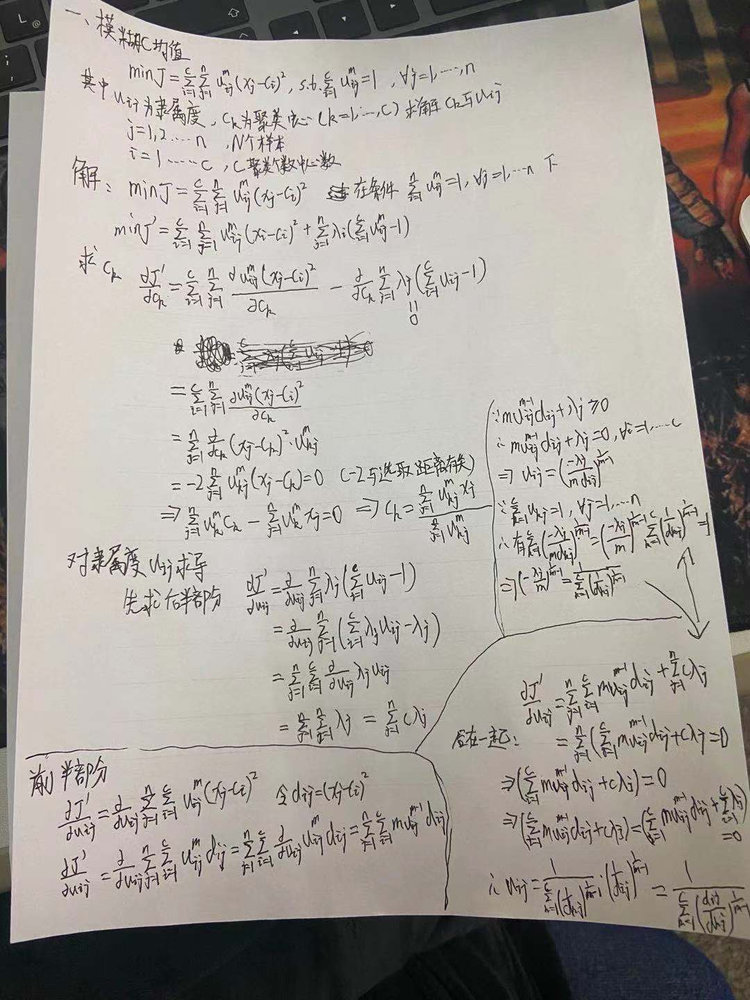
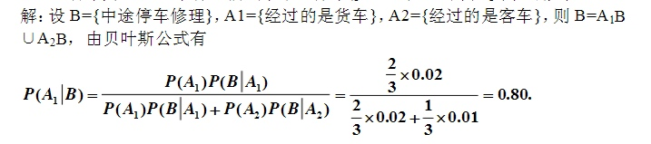
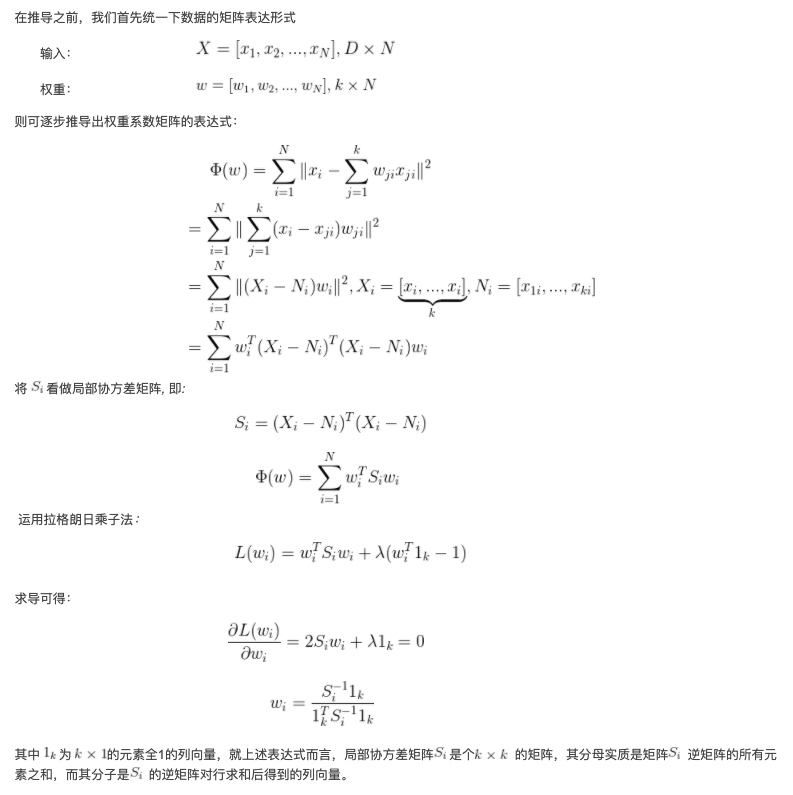
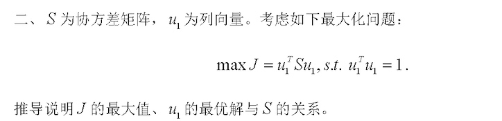
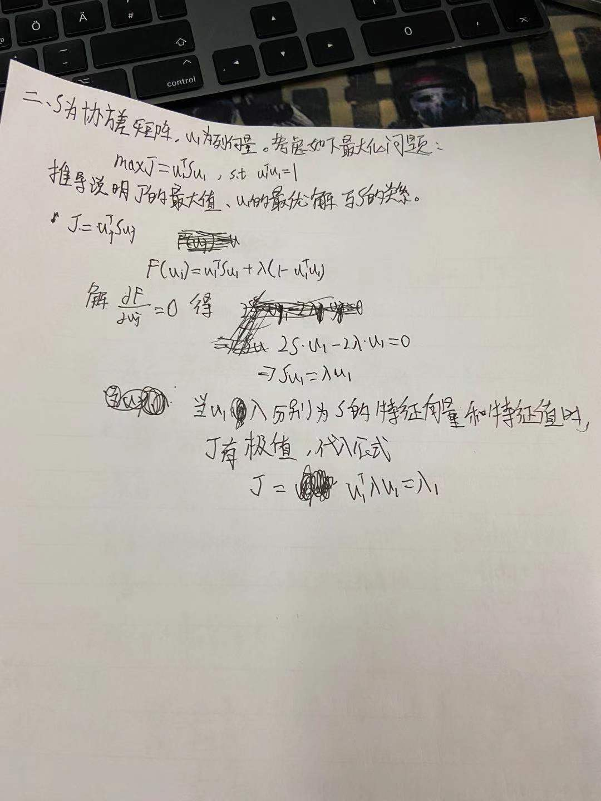
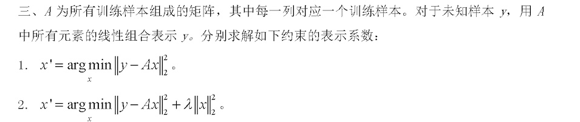
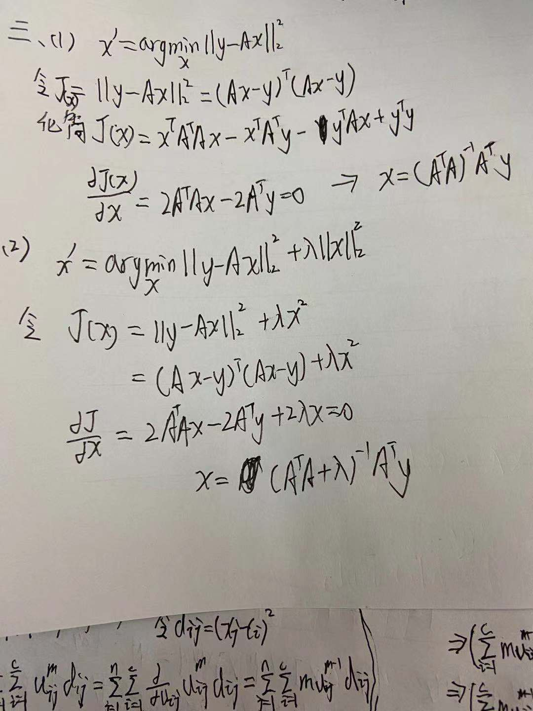

# 模糊C均值聚类Fuzzy C-Means(FCM)

首先，学习这种古老的算法，学习思想和解决问题的思路就好，因为这种算法基本上以后不可能直接用到。

[TOC]

##C均值聚类(KMeans)
先看普通C均值，也就是kmeans算法的过程：
- 随机选取k个初始聚类中心
- 循环：把每个暑假对象重新分配到k个聚类中心处，形成k个簇重新计算每一个簇的聚类中心。
- 聚类中心更新，直到中心不再变化。

最邻近的度量
- 欧式空间中一般才采用欧式距离
$$
\begin{equation}\begin{split} 
d(x,y)=\sqrt{\sum_{i=1}^n(x_i-y_i)^2}
\end{split}\end{equation}
$$
- 处理文档中采用的是余弦相似度(余弦值越接近1，就表明夹角越接近0度，也就是两个向量越相似)
$$
\begin{equation}\begin{split} 
cos(\theta) = \frac {\vec a \cdot \vec b}{\Vert a\Vert \Vert b\Vert}
\end{split}\end{equation}
$$

欧氏距离衡量的是空间各点的绝对距离，跟各个点所在的位置坐标直接相关；而余弦距离衡量的是空间向量的夹角，更加体现在方向上的差异，而不是位置


```
from sklearn.datasets import load_iris
import numpy as np

iris = load_iris()
data = iris.data

"""
1、随机生成中心
2、求样本到中心的聚类（欧式距离）
3、将样本归类
4、寻找新类中心
5、判定一下，如果算法稳定，跳出，如果不稳定跳回第二部
"""
n = len(data)
k = 3

# 第一步
center = data[:k, :]
center_new = np.zeros([k, data.shape[1]])

# 第二步，拿样本减去中心
dist = np.zeros([n, k + 1])
while True:
    for i in range(n):
        for j in range(k):
            dist[i, j] = np.sqrt(sum((data[i, :] - center[j, :]) ** 2))  # 算出一个元素到中心的距离

        # 第三步
        dist[i, k] = np.argmin(dist[i, :k])

    # 第四步 求他们每一列的均值
    for i in range(k):
        index = dist[:, k] == i
        center_new[i, :] = data[index, :].mean(axis=0)

    # 第五步 判定
    if np.all(center == center_new):  # 想得到全为真
        break
    center = center_new

```

##模糊是什么意思？
FCM就是引入了模糊的概念，让c均值聚类得到的结果更灵活。
首先说明隶属度函数的概念，是表示一个对象x隶属于集合A的程度的函数，通常记做 $\mu_A(x)$,其自变量范围是所有可能隶属于集合A的对象(也就是集合A在空间中的所有点)，取值范围是[0,1]
$\mu_A(x)=1$ 表示x完全隶属于集合A也就是$x\in A$


##FCM算法思想
模糊c均值聚类融合了模糊理论的精髓。相较于k-means的硬聚类，模糊c提供了更加灵活的聚类结果。

**思想**：划分到同一簇的对象之间相似度最大，不同簇的相似度最小。
模糊C均值算法是普通C均值算法的改进，普通C均值算法(也就是kmeans)对于数据的划分是硬性的(0就不是1就是)，而FCM则是一种柔性的模糊划分。
$$
\begin{equation}\begin{split} 
A = \lbrace (\mu_A(x_i),x_i) | x_i \in X\rbrace
\end{split}\end{equation}
$$
**也就是说**：讨论域U内的某个元素是否属于集合A，可以用一个数值来表示。在经典集合中，要么0，要么1。

现在我可以给出一个0~1之间的数来回答。因为在某两个集合中可能存在交叉的情况，谁也说不好是属于谁，所以就提出这个模糊的概念，方便以后优化。相当于**对每个对象和每个簇赋予一个权值，指明对象属于该簇的程度**。

当然，基于概率的方法也可以给出这样的权值，但是有时候我们很难确定一个合适的统计模型，因此使用具有自然地、非概率特性的模糊c均值就是一个比较好的选择。

###引出公式推导
上面提到的变化就可以根据这个模糊值进行最小化目标函数的操作：
$$
\begin{equation}\begin{split} 
minJ_m = \sum_{i=1}^N \sum_{j=1}^C u_{ij}^m\Vert x_i-c_j\Vert^2
\end{split}\end{equation}
$$
$m$ :聚类的簇数
$i,j$ :类标号
$u_{ij}$ :样本$x_i$属于j类的隶属度。
$i$ :第i个样本
$x$ :具有d为特征的样本
$c_j$ :j簇的中心
$\Vert * \Vert$ : 距离的度量
也就是说：**我们的目标就是让每个点距离每个中心的隶属度加和最小，聚类效果也就越好**。 
不停的迭代中心，优化J，终止条件是
$$
\begin{equation}\begin{split} 
max_{ij}(\Vert u_{ij}^{(l+1)}-u_{ij}^(l)\Vert) < \epsilon
\end{split}\end{equation}
$$
k : 迭代步骤
$\epsilon$ : 阈值

该过程收敛于目标$J_m$的局部最小值或鞍点

##FCM公式推导
$$
\begin{equation}\begin{split} 
minJ_m = \sum_{i=1}^N \sum_{j=1}^C u_{ij}^m\Vert x_i-c_j\Vert^2
\end{split}\end{equation}
$$
因为我们想要聚类精准就需要隶属度u的值接近于1，所以问题转化为在公式6上以 $s.t. \sum_{i=1}^c u_{ij}^m=1$ 为条件的极值问题。

那么就要用拉格朗日数乘法：
$$
\begin{equation}\begin{split} 
minJ_m’ = \sum_{i=1}^N \sum_{j=1}^C u_{ij}^m\Vert x_i-c_j\Vert^2 + \sum_{j=1}^n \lambda_i(\sum_{ij}^c u_{ij}^m -1)
\end{split}\end{equation}
$$
求导得到极值点：

**对聚类质心Ck进行求导**
$$
\begin{equation}\begin{split} 
\frac {\partial J}{\partial c_k}=\sum_{i=1}^c\sum_{j=1}^n \frac {\partial u_{ij}^m(x_j-c_j)^2}{\partial c_k} - \frac {\partial }{\partial c_k} \sum_{j=1}^n\lambda_j(\sum_{ij}^c u_{ij}^m -1)
\end{split}\end{equation}
$$


###算法步骤
- 初始化：通常采用随机初始化。即权值随机地选取。簇数需要人为选定。

- 计算质心：FCM中的质心有别于传统质心的地方在于，它是以隶属度为权重做一个加权平均。

- 更新模糊伪划分：即更新权重（隶属度）。简单地说，如果x越靠近质心c，则隶属度越高，反之越低。

### python

```
import numpy as np

class FCM():
    def __init__(self,n_clusters):
        super(FCM, self).__init__()
        self.n_clusters = n_clusters
        self.u = None
        self.core = None
        
    def initialize_U(self,data_num):
        u = np.random.rand(data_num, self.n_clusters)
        data_max = np.sum(u, axis=1)
#        print(data_max)
        data_max = np.tile(data_max, (self.n_clusters,1)).T
        u = np.true_divide(u,data_max)
        self.u = u
        return u
    
    def fit(self,data,m=2,max_item=100):
        self.u = self.initialize_U(data.shape[0])
        for i in range(max_item):
            ############################更新聚类中心############################
            new_core = []
            for data_dimension in range(self.n_clusters):
                u_tmp = np.tile(self.u[:,data_dimension],(data.shape[1],1)).T
                u_tmp = np.power(u_tmp,m)
                new_core.append(np.true_divide(np.sum(np.multiply(u_tmp,data),axis=0),\
                                               np.sum(u_tmp,axis=0)))
            new_core = np.array(new_core)
            self.core = new_core
#            print(new_core)            
            #############################计算各点与聚类中心的距离################
            new_core_tmp = new_core.reshape((new_core.shape[0],1,new_core.shape[1]))
            new_core_tmp = np.tile(new_core_tmp,((1,data.shape[0],1)))
            
            data_tmp = data.reshape((1,data.shape[0],data.shape[1]))
            data_tmp = np.tile(data_tmp,((self.n_clusters,1,1)))
            distance_tmp = np.subtract(new_core_tmp,data_tmp)
            distance_tmp = np.power(distance_tmp,2)
            distance_tmp = np.sum(distance_tmp,axis=2)
            distance_tmp = np.power(distance_tmp,1/2).T
            #############################更新隶属矩阵###########################
            tmp1 = distance_tmp.reshape((distance_tmp.shape[0],distance_tmp.shape[1],1))
            tmp1 = np.tile(tmp1,(self.n_clusters))
            
            tmp2 = np.tile(distance_tmp,(self.n_clusters))
            tmp2 = tmp2.reshape((distance_tmp.shape[0],distance_tmp.shape[1],distance_tmp.shape[1]))
            
            new_u = np.true_divide(tmp1,tmp2)
            new_u = np.power(new_u,1/(m-1))
            new_u = np.sum(new_u,axis=2)
            new_u = np.power(new_u,-1)
            #############################查看迭代是否终止########################
            subtract_2_u = np.sum(np.fabs(np.subtract(self.u,new_u)))
            self.u = new_u
#            print(subtract_2_u)
            if subtract_2_u == 0:
                break
#            print(new_u)
            
    def fit_predict(self,data,m=2,max_item=1000):
        ans = []
        if self.u == None:
            self.fit(data,m=m,max_item=max_item)
        ans = np.argmax(self.u, axis=1)
        return ans
            

            
if __name__ =='__main__':
    cls = FCM(n_clusters=2)
#    cls.fit(np.random.rand(5, 3),2)
    ans = cls.fit_predict(np.random.rand(5, 3),2)
    print(ans)
```


##参考文献
[模糊c均值聚类和k-means聚类的数学原理](https://blog.51cto.com/9269309/1867818)
[模式识别：C-means(K-means)聚类算法与分级聚类(层次聚类)算法](https://blog.csdn.net/u011591807/article/details/84349181)
[k均值聚类。简述K均值聚类算法的具体步骤。K均值算法的优缺点是什么？如何对其进行调优？](https://blog.csdn.net/qq_29678299/article/details/88775442)
[【机器学习】K-means（非常详细）](https://zhuanlan.zhihu.com/p/78798251?utm_source=qq)
[一文让你通俗易懂的理解正交变换和正交矩阵](https://blog.csdn.net/MoreAction_/article/details/105442932)
[通俗易懂的PCA原理及代码实现(超详细推导)](https://blog.csdn.net/MoreAction_/article/details/107463336)

## 题目

###简述 K- means 算法的关键步骤，并分析其复杂性与优缺点。

K均值聚类的核心目标是将给定的数据集划分成K个簇，并给出每个数据对应的簇中心点。算法的具体步骤描述如下：
- 1.数据预处理，如归一化，离群点处理等。
- 2.随机选取K个簇中心，记为 $u_1,u_2,...,u_k$,
- 3.定义代价函数，$J(c,u)=\sum_{i=1}^C\sum_{j=1}^N\Vert x_j-c_i\Vert^2 $
- 4.令t=0,1,2...为迭代步数，重复下面过程直到J收敛
- 对于每一个样本x，将其分配到距离最近的簇
- 对于每一个类簇K，重新计算该类簇的中心

优点：
- 容易理解，聚类效果不错，虽然是局部最优， 但往往局部最优就够了；
- 处理大数据集的时候，该算法可以保证较好的伸缩性；
- 当簇近似高斯分布的时候，效果非常不错；
- 算法复杂度低。

缺点：
- K 值需要人为设定，不同 K 值得到的结果不一样；
- 对初始的簇中心敏感，不同选取方式会得到不同结果；
- 对异常值敏感；
- 样本只能归为一类，不适合多分类任务；
- 不适合太离散的分类、样本类别不平衡的分类、非凸形状的分类。

时间复杂度：$O(tknm)$ ，其中，t 为迭代次数，k 为簇的数目，n 为样本点数，m 为样本点维度。
空间复杂度： $O(m(n+k))$  ，其中，k 为簇的数目，m 为样本点维度，n 为样本点数。


###设某公路上经过的货车与客车的数量之比为2:1，货车中途停车修理的概率为0.02，客车为0.01，今有一辆汽车中途停车修理，求该汽车是货车的概率



###简述最近邻分类器、k近邻分类器、支撑向量机（SVM）、主成分分析（PCA）、线性判别分析（LDA）这五种方法的分类思想

- 最近邻分类器：计算测试样本与所有样本的距离，将测试样本归为距离最近的样本类。
- k近邻分类器:计算测试样本与K个最近样本的距离，将测试样本归为K个样本中相同类别个数较多的一类。
- SVM：在高或无限维度空间中构造超平面或超平面，可用于分类、回归或其他任务。使超平面与任何类最近的训练数据点之间的距离最大，因为一般来说，距离边界越大，分类器的泛化误差就越低。
- PCA:将高维的数据通过线性变换投影到低维空间上去，但这个投影可不是随便投投，要遵循一个指导思想，那就是：找出最能够代表原始数据的投影方法。投影到方差最大的几个相互正交的方向上，以期待保留最多的样本信息，样本的方差越大表示样本的多样性越好。
- LDA：将带有标签的数据降维，投影到低维空间同时满足三个条件：1，尽可能多的保留数据样本的信息（即选择最大的特征是对应的特征向量所代表的方向）。2，寻找使样本尽可能好分的最佳投影方向。3，投影后使得同类样本尽可能近，不同类样本尽可能远。(投影后类内方差最小，类间方差最大)


###四、局部线性嵌入算法（Locally Linear Embedding, LLE）在处理流形降的时考虑样本点局部信息，效果比 PCA 要好很多。对于每个数据点 x，用 k 近邻算法获得它的 k 近邻点


###PCA 协方差矩阵





