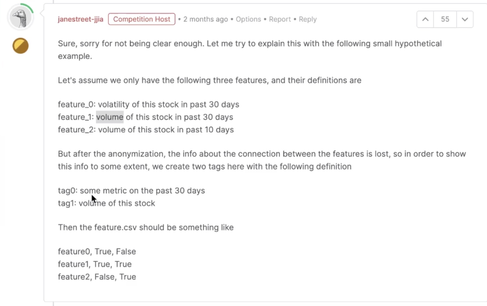
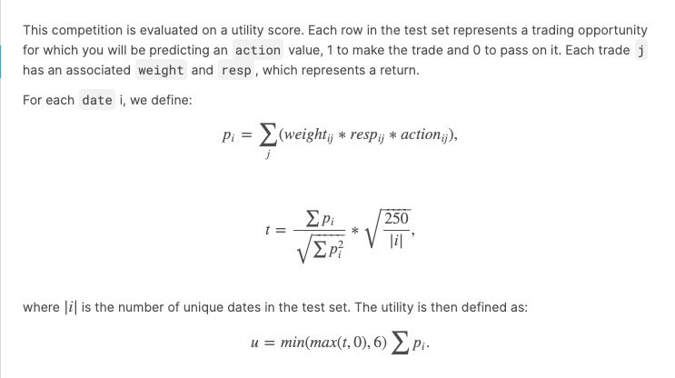
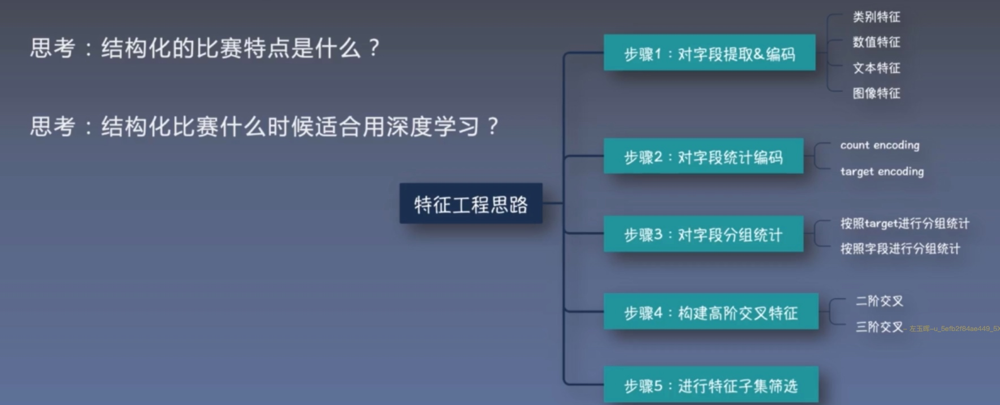
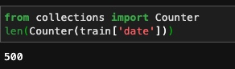
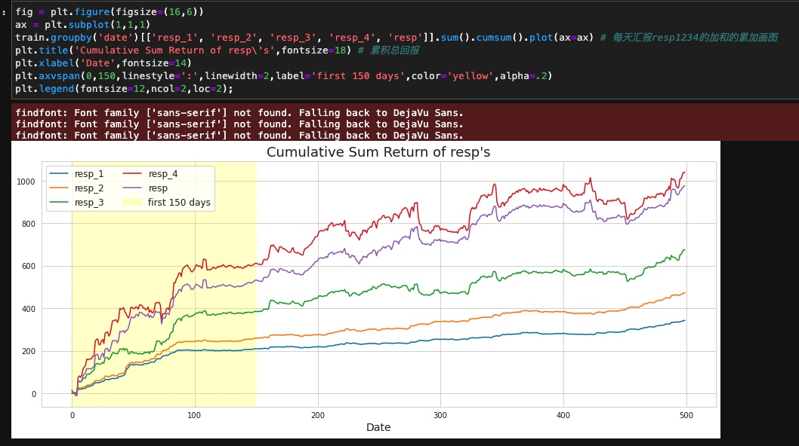
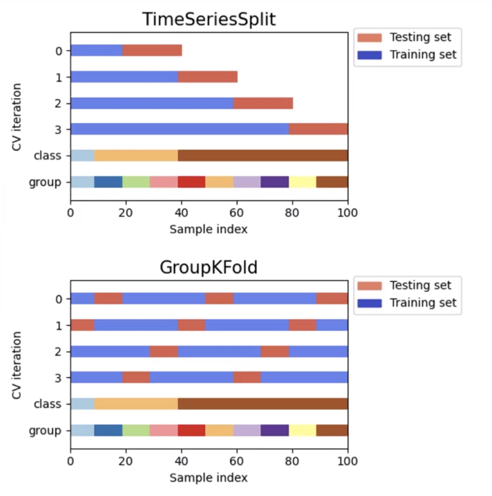
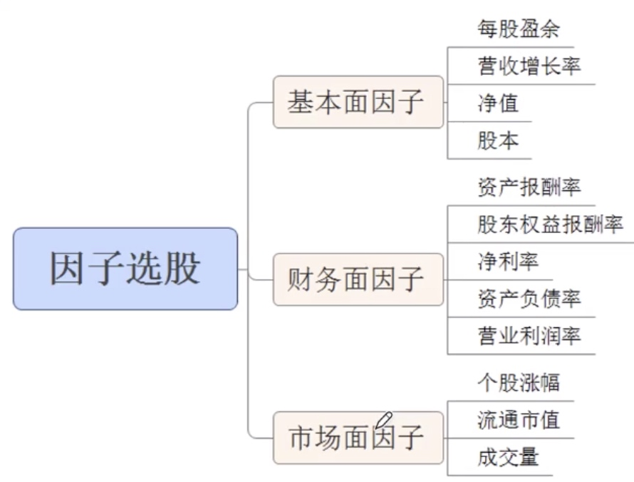

# Kaggle:Jane Street Market Prediction

https://www.kaggle.com/c/jane-street-market-prediction

[TOC]

##赛题信息
###任务
构建交易模型(买入卖出)，目标是获得最大的回报
比赛特点:多标签、匿名数据、时间序列、金融量化

###数据
- 匿名时序结果化数据
- features.csv:特征的元信息(每个匿名特征的属性)用来理解分析特征、构建新的特征
- 

- feature_{0-129}:真实市场数据
- weight:交易的权重(含义未知)参与最终打分，当weight为0时不参与打分。选weight字段非0的参与训练。(测试集也有)
- 每行：一次交易机会，action=1做交易，action=0跳过(相当于对每一行进行二分类)
- resp:收益回报，有正有负，resp取值为负时，action应该预测为0

resp1-resp4 只在训练集出现，可以加入训练。
是不同时间维度的收益返回值。

难点：数据为匿名数据，需要对字段进行分析和理解；数据字段需要特殊的统计、分析和处理(数据字段原始形式)；数据字段的编码方式和特征提取方式。

resp是后期跟进走势计算得到的回报，短时间不可知。
能不能综合resp取值进行回归训练？

- ts_id:每天次序(每天累加得到)
- date:日期

训练集中每条记录的含义
- 每一条是一次交易机会
- feature0很有可能是买入或卖出的标识(交易方向)
- 其他特征是根据交易时刻计算得到的特征值

###评价
这项比赛是根据效用分数进行评估的。测试集中的每一行都表示一个交易机会，您将为该交易预测一个操作值，1表示进行交易，0表示传递交易。每个交易j具有表示回报的相关联的weight和Resp。
训练集有权重和resp，测试集没有权重resp。

其中|i|是测试集中的唯一日期数，根据时序进行加权。

###细节
- 细节1：数据字段理解
- 细节2：字段缺失值处理
- 细节3：时序周期建模
- 细节4：模型调参方法
- 细节5：模型集成(树模型+神经网络)

代码细节：自编码器对数据进行编码，然后用全连接网络进行分类

要点：
- 数据理解和特征工程(50%)
- 赛题模型和超参数(20%)
- 模型集成(30%)

数据量大、匿名数据集

##EDA
这个匿名数据的比赛要做很多的数据分析，特征工程做的可能不多。
共五百天的数据(两年周期，一年工作日250天)

看一下回报值累积情况

[Feature 0, beyond feature 0](https://www.kaggle.com/nanomathias/feature-0-beyond-feature-0)
[Market Pred-Feature Comparison+Date Analysis](https://www.kaggle.com/doosrijanam/market-pred-feature-comparison-date-analysis)
[【中文汉语】Jane Market Simple EDA](https://www.kaggle.com/sherrytp/jane-market-simple-eda)

做可视化有什么用？
可视化后了解哪些特征趋势是相同的，然后我们做一个交又特征（两个特征之间的组合相似特征做交又比不相似特征做交叉得到的收益更高）

### 划分训练集和验证集
时序数据划分方法
- 简单滑窗
- 分组滑窗

[
Found the Holy Grail: GroupTimeSeriesSplit](https://www.kaggle.com/jorijnsmit/found-the-holy-grail-grouptimeseriessplit)

###时序建模方法
日期因子规则方法
- 计算周期因子
- 计算周期平均值
- 预测=因子*平均值
[时间序列规则法快速入门](https://www.jianshu.com/p/31e20f00c26f)

日期特征建模(赛题适合)
- 星期从周一到周天，共7个变量
- 节假日转化为0-1变量
- 距离节假日的天数
用途：当序列与日期强相关时

滑窗建模方法
- 使用时序交叉验证
- 使用不同时间窗口统计
用途：当序列有长有短时

序列建模方法
- 采用LSTM/Seq2Seq建模
用途：数据量足够大，且预测周期长

时序建模工具库
- [Facebook-prophet](https://facebook.github.io/prophet/docs/quick_start.html)
- [tslearn](https://tslearn.readthedocs.io/en/latest)
- [tsfresh](https://tsfresh.readthedocs.io/en/latest)
- [pyts](https://pyts.readthedocs.io/en/stable)

###缺失值填充可能关键
缺失值分析使用missingno库
均值还是中位数填充说不好

## 量化选股模型：多因子模型
原理：采用一系列的因子作为选股的条件，满足因子的股票则买入，不满足则卖出。
优点：简单，比较稳定

因子模型：公司、环境、市场等；
- 公司：财务指标、利润、负债等
- 环境：宏观经济、利率、汇率等
- 市场：资金流向、市场动量。
- 

赛题思考：
- 赛题数据中哪些指标是与公司往期股价(短期指标)相关的？
- 哪些指标是与公司整体利润(中长期指标)相关的？
- 哪些是与环境整体(与股票无关)无关的？

赛题怎么来的？
1.赛题数据由多个股票/期货等金融商品构成
2.赛题数据记录每次处罚策略时该金融商品的信息

测试集，用相同逻辑找到重复的行，每一行进行预测，预测相同的resp

##参考文献
[Kaggle量化大赛2021：前竞赛Top邀你来组队~](https://zhuanlan.zhihu.com/p/321814950?utm_source=wechat_timeline)
[Kaggle Jane Street 市场预测数据竞赛12月回顾](https://zhuanlan.zhihu.com/p/340535782)
[sns.distplot()用法](https://www.cnblogs.com/cgmcoding/p/13384535.html)
[xgboost Baseline](https://www.kaggle.com/wendelfariaslopes/easy-and-simple-xgboost-good-score)
[单独MLP baseline](https://www.kaggle.com/tarlannazarov/own-jane-street-with-keras-nn)
