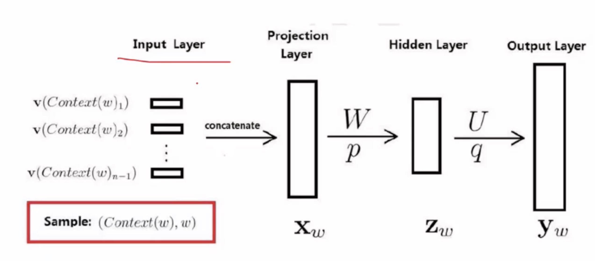
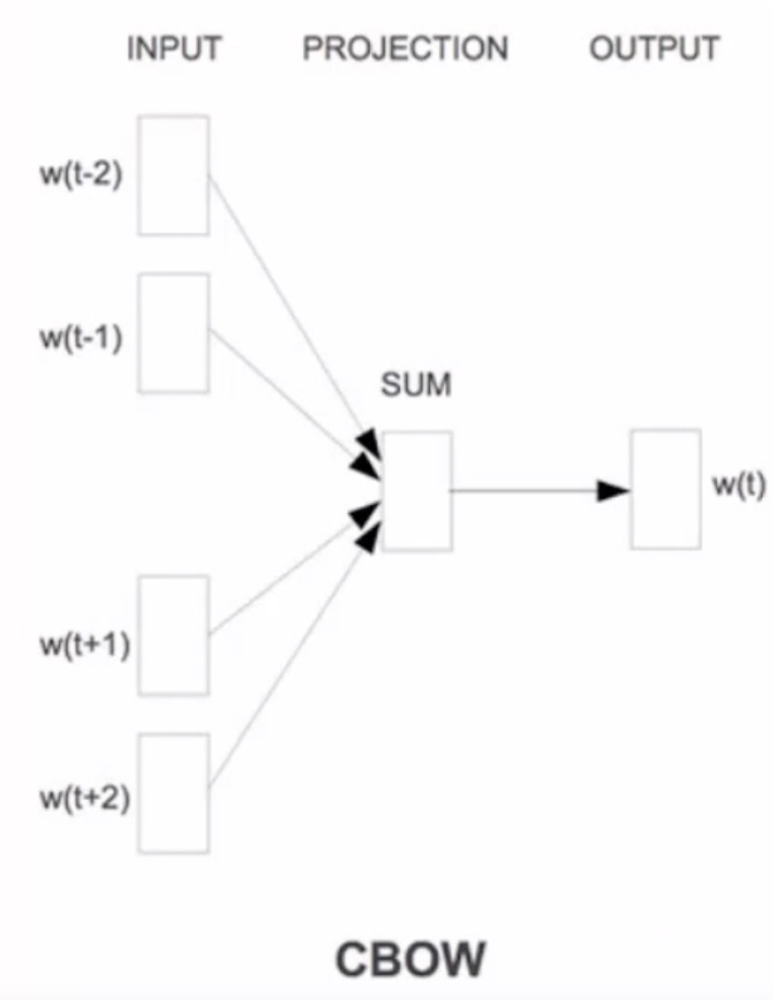
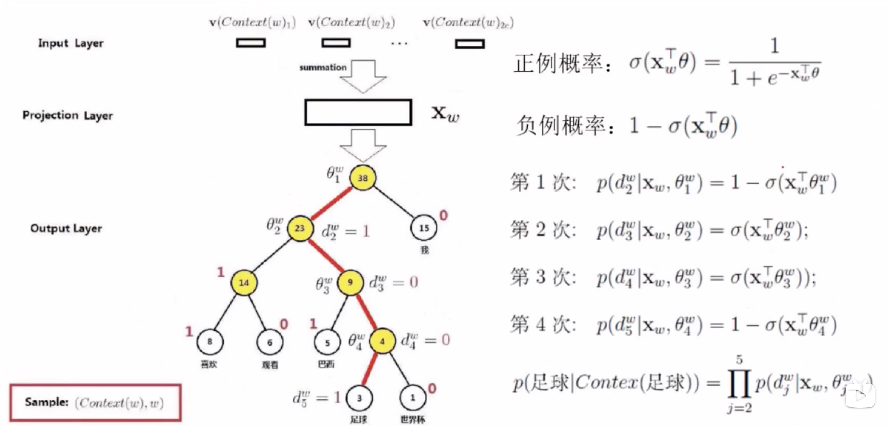
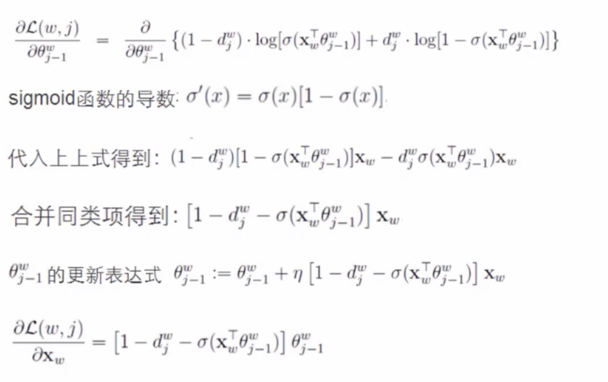
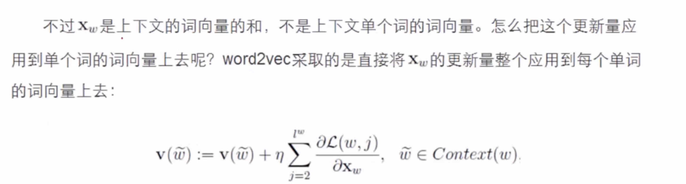

# Word2Vec

分层、负采样思想

##语言模型
语言模型：P(S),用来计算一个句子概率的模型。
$$
\begin{equation}\begin{split} 
P(S) &= P(w_1,w_2,w_3,w_4,w_5,...,w_n)\\
&=P(w_1)p(w_2|w_1)P(w_3|w_1,w_2)...P(w_n|w_1,w_2,...,w_{n-1})
\end{split}\end{equation}
$$

这句话出现w_i词的概率 = 这句话包含这个词的概率比上不加这个词的概率。
比如 说自然语言处理
下一个词是处理的概率 = 自然语言处理的概率比上自然语言的概率。
$$ 
\begin{equation}\begin{split} 
P(w_i|w_1,w_2,...,w_{i-1}) = \frac {P(w_1,w_2,...,w_{i-1},w_i)}{P(w_1,w_2,...,w_{i-1})} 
\end{split}\end{equation}
$$

但由于数据过于稀疏、参数空间太大。组合的词约多，数据是约稀疏的。
解决思路：
假设下一个词的出现依赖它前面的一个词：
$$
\begin{equation}\begin{split} 
P(S) &=P(w_1)p(w_2|w_1)P(w_3|w_1,w_2)...P(w_n|w_1,w_2,...,w_{n-1})\\
&=P(w_1)P(w_2|w_1)P(w_3|w_2)...P(w_n|w_{n-1})
\end{split}\end{equation}
$$
假设下一个词的出现依赖它前面的两个词：
$$
\begin{equation}\begin{split} 
P(S) &=P(w_1)p(w_2|w_1)P(w_3|w_1,w_2)...P(w_n|w_1,w_2,...,w_{n-1})\\
&=P(w_1)P(w_2|w_1)P(w_3|w_1,w_2)...P(w_n|w_{n-1},w_{n-2})
\end{split}\end{equation}
$$

也就是n-gram模型，指定了n=1就是跟前面一个词相关。
假设词典的大小语料库是N的，则模型参数量级是$(O(N^n))$

##网络模型

训练样本：(Context(w),w) 包含前n-1个词分别的向量，假定每个词向量大小m
投影层:(n-1)*m 首尾拼接起来的大向量。
输出：$y_m = (y_{w,1},y_{w,2},...,y_{w,N})^T$ 表示上下文为Context(w)时，下一个词恰好为词典中第i个词的概率。
归一化：$$P(w|Context(w)) = \frac{e^{P{(y_w,i_w)}}}{\sum_{i=1}^N e^{(y_w,i)}}$$

###CBOW
CBOW 是 Continuous Bag-of-Words Model 的缩写，是种根据上下文的词语预测当前词语的出现概率的模型

输入层是上下文的词语的词向量，在训练 CBOW 模型，词向量只是个副产品，确切来说，是 CBOW 模型的一个参数训练开始的时候，词向量是个随机值，随着训练的进行不断被更新）。

投影层对其求和，所谓求和，就是简单的向量加法。

输出层输出最可能的 w。由于语料库中词汇量是固定的 C 个，所以上述过程其实可以看做一个多分类问题。给定特征，从 C 个分类中挑一个。

借助哈夫曼树做二分类

$p^w$从根结点出发到达 w 对应叶子结点的路径 
$l^w$路径中包含结点的个数 
$p^w_1,p^w_2,...,p^w_{l^w}$路径 $p^w$ 中的各个节点
$d_2^w,d_3^w,...,d_{l^w}^w \in \{0,1\}$ 词 W 的编码，$d^w_j$ 表示路径 $p^w$ 第j个节点对应的编码（根节点无编码）
$\theta_1^w,\theta_2^w,...,\theta_{l^w-1}^w \in R^m$ 路径 $p^w$ 中非叶节点对应的参数向量

目标

$$
\begin{equation}\begin{split} 
P(d_j^w| X_w,\theta_{j-1}^w) = [\sigma(x_w^T\theta_{j-1}^w)]^{1-d_j^w} \cdot [1 - \sigma(x_w^T\theta_{j-1}^w)]^{d_j^w}
\end{split}\end{equation}
$$
代入目标函数：
$$
\begin{equation}\begin{split} 
L &= \sum_{w\in C} log P(w|Context(w))\\
&= \sum_{w\in C}log \prod_{j=2}^{l^w} \{[\sigma(x_w^T\theta_{j-1}^w)]^{1-d_j^w} \cdot [1 - \sigma(x_w^T\theta_{j-1}^w)]^{d_j^w} \}\\
&= \sum_{w\in C}\sum_{j=2}^{l^w}\{[\sigma(x_w^T\theta_{j-1}^w)]^{1-d_j^w} \cdot [1 - \sigma(x_w^T\theta_{j-1}^w)]^{d_j^w}\}
\end{split}\end{equation}
$$

##参考文献
