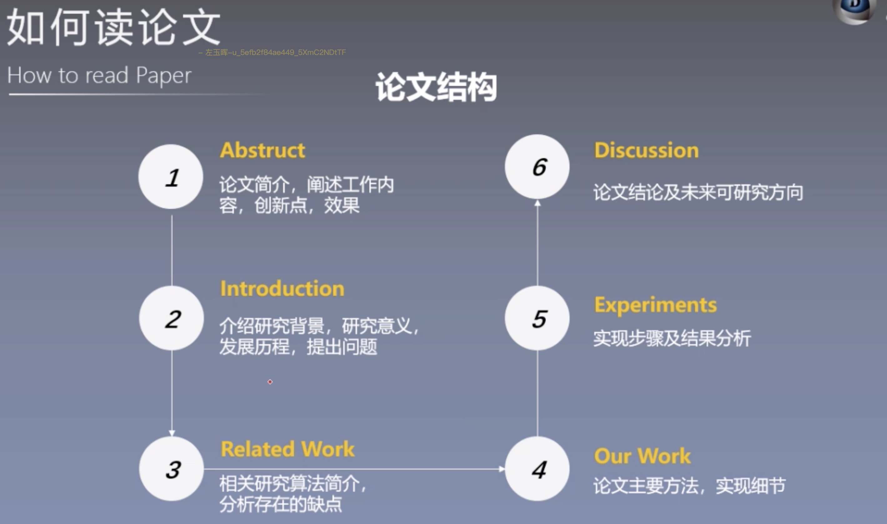
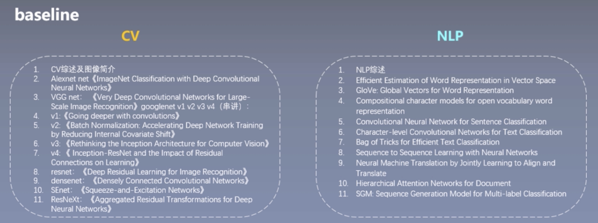

# 如何读论文
[TOC]
## 为什么要读论文
- 构建知识体系
- 紧跟前沿技术
- 培养科研逻辑
- 写论文

## 读哪些论文
- 综述论文
  - 入门
- 专题论文
高质量期刊会议：CVPR、ECCV、ICCV、AAAI NIPS、CLR、ICML 等
高引论文：同行间普遍认可，参考，借鉴的论文
知名团队：Yoshua Bengio、Yann Lecun  Geoffrey Hinton、Andrew Ng 等
有代码论文：" Talk is cheap. Show me the code.“推荐网站https://paperswithcode.com

## 如何找论文
未知论文题目:依关键词搜索相关领域论文。
1.[知网](https://www.cnki.net/):寻找优质综述，快速入门
2.[百度学术](https://xueshu.baidu.com/)、[Google scholar]()
3.[arXiv](https://arxiv.org) 论文预印本平台
4.顶会:CVPR、ECCV、ICCV、AAAI NIPS、CLR、ICML 等

是否优质，看IF
IF(Impact Factor，影响因子):期刊前N年发表的论文被引数除以前N年发表的论文数，通常N=2或N=5。
JCR(Journal Citation Reports,期刊引证报告):统计SCI期刊的论文引用数据，给出各期刊IF
SCI期刊分区:
- JCR方式，一、二、三、四区各占25%
- 中科院方式,一区为前5%,二区5%-20%,三区20%-50%,四区50%-100%

知道论文题目
sci-hub:一个能绕过科研论文收费的网站
https://sci-hub.tw
https://sci-hub.si
https://sci-hub.se
网站地址总变动

PMID (PubMed Unique Identifier,Pubmed 唯一标识码）: PubMed 搜索引擎中收录的生命科学和医学等领域的文献编号
DOI (Digital Object Unique Identifier，数字对象唯一标识符），相当于文献的数字身证。

## 如何整理论文
- 统一命名：时间-作者-题名或 时间-关键词-题名
- 按类归入文件夹
- 检索:电脑自带搜索工具搜索关键词
- 论文管理软件:endNote/Mendeley/Zotero/Citavi

## 如何读论文
- 泛读
- 精度
- 总结启发点

第一遍的重点是要快，花五到十分钟快速浏览一遍，获得一个全景印象。关注如下几个方面
1. 仔细阅读标题、摘要、简介（the title, abstract, and introduction)
2. 阅读章节和子章节的标题（the section and sub- section headings)
3. 扫一眼数学内容（the mathematical content），了解理论基础 
4. 阅读结论（the conclusions)
5. 浏览参考文献（(the references），勾选读过的 paper

结束之后，回答 5 个问题
1. 类型（Category）：评估（measurement）、系统分析（analysis）、研究原型（research prototype) 
2. 上下文（context）：相关论文、理论基础 
3. 正确性（Correctness：假设都成立吗？
4. 贡献（ontributions) 
5. 清晰度（Clarity）：写的好吗？

这个时候要决定是否继续阅读？是否感兴趣，是否关注这个研究领域，作者是否做了无效的假设。同样的，如果你自己写 paper，也要写好摘要和章节标题，如果读者在五分钟内找不到要点，可能就不会继续阋读了。

第二遍的重点是要精，仔细阅读每一部分内容，但是注意不要陷入细节。把自己当成评审员，记下要点、不理解的内容、想问作者的问题，在空白处写下评论。重点关注图表和插图是否存在错误，这往往是決定一篇 paper 是否真正优秀的关键。标注没有读过的参考文献，以便进一步阅读。
这一遍通常要花费一个小时以上，这个时候应该掌握了 paper的內容，可以有足够的论据总结出  paper 的主旨。如果这篇 paper 只是有兴趣，但不是重点研究的领域，到这个程度就可以了。
有时也有可能没有读懂，这有可能是因为不熟悉这个领域，也可能是论文本身写的不好，也可能是累了。这个是时候可以有三种选择
1. 暂时搁置
2. 了解背景材料后重新阅读
3. 坚持继续读

第三遍的关键是尝试重新实现一遍（virtually reimplement the paper）。按照作者的假设，提出自己的想法，重新设计实现方案，并与原文的方案进行比较。关注每一个细节，挑战每一个假设，记录下整个思路，并将有用的证明和技术加入到自己的工具库中。

通过这样的方式，能够自己从头重建整个系统。同时可以发现原文存在的问题：能指出隐含的假设，遗漏的验和潜在的问题。

## paper学习路径
文献分析（literature survey):
想深入了解一个领域，仅仅阅读一篇 paper是不够的，可能需要读数十篇。这时需要通过文献分析的方法找到合适的 paper，也有三个步骤
1. 选择合适的关键词，使用 Google Scholar 或 Cite Seer 找到该领域最近被引用最多的三到五篇paper
2. 找到参考文献中引用量最多的作者，他们是这个领域最重要的研究人员，关注他们的最近发布的paper。和 conferences
3. 访问这些 top conferences 的网站，找到最近的高质量 paper
反复重复这几个步骤，不断找出这个领域的最重要 paper 并阅读，不断总结归纳。

## 写论文结构

