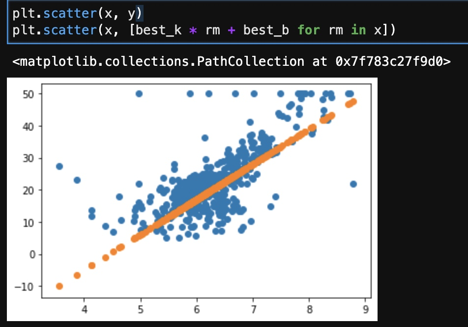
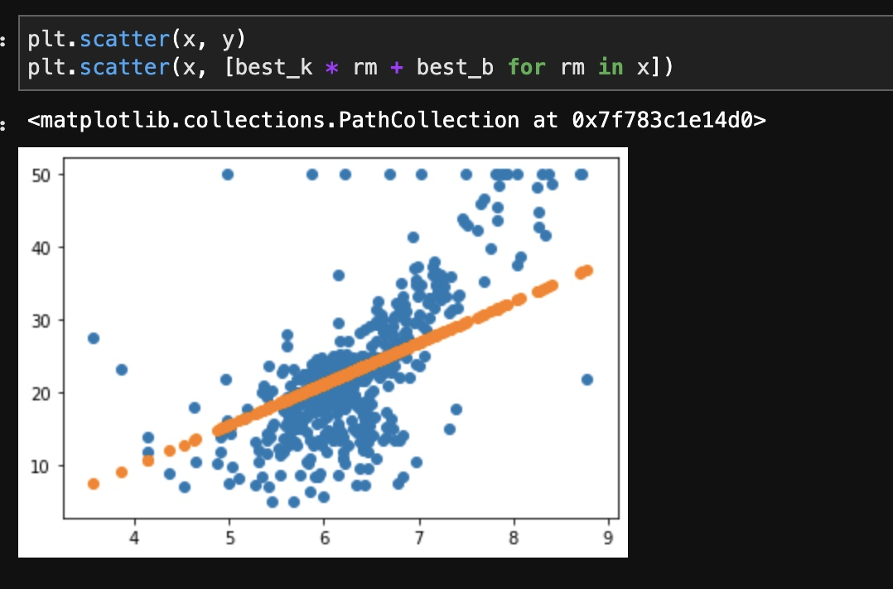
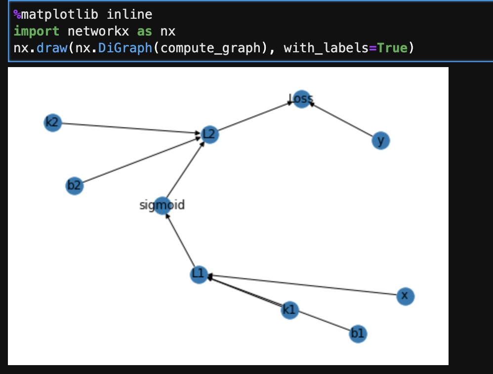
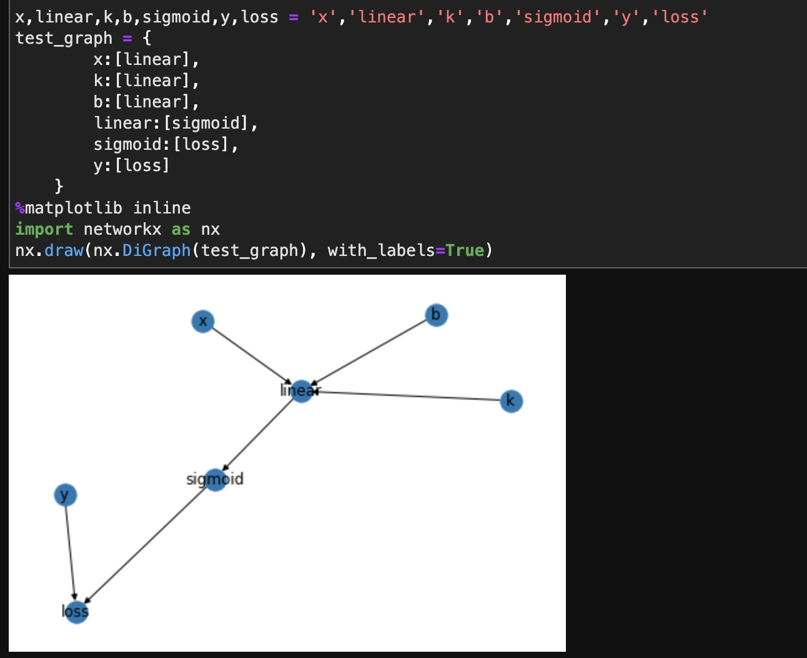

# 手工构建深度学习框架
数据集：from sklearn.datasets import load_boston

[TOC]
##KNN
一句话实现基于距离的KNN

```
def KNN(dataDict,query_x,topn=3):
    return np.mean([p for x,p in sorted(dataDict.items(), key=lambda e:(e[0]-query_x)**2)[:topn]])
```

分部实现
```
def KNN(query_x, history, top_n=3):
    sorted_notes = sorted(history.items(), key=lambda x_y: (x_y[0] - query_x) ** 2) 
    similar_notes = sorted_notes[:top_n]
    similar_ys = [y for _, y in similar_notes]
    
    return np.mean(similar_ys)
```

##蒙特卡洛模拟 随机接近拟合
为了更快的获得结果，通过拟合函数来获得预测能力。
$$ f(rm) = k * rm + b $$ 
定义损失函数
$$ Loss(k, b) = \frac{1}{n} \sum_{i \in N} (\hat{y_i} - y_i) ^ 2 $$
$$ Loss(k, b) = \frac{1}{n} \sum_{i \in N} ((k * rm_i + b) - y_i) ^ 2 $$

```
def loss(y_hat, y):
    return np.mean((y_hat - y) ** 2)
```


```
import random

min_loss = float('inf') # 最小loss定义为无穷
best_k, best_b = None, None # 保存 最好的参数 k和b

k_b_history = [] # 记录最好参数历史

for step in range(1000):
    min_v, max_v = -100, 100
    k, b = random.randrange(min_v, max_v), random.randrange(min_v, max_v) # 随机k和b
    y_hats = [k * rm_i  + b for rm_i in x]
    current_loss = loss(y_hats, y) # 计算loss
    
    if current_loss < min_loss: # 保留最小的loss的参数
        min_loss = current_loss
        best_k, best_b = k, b
        k_b_history.append([best_k,best_b])
        print('在第{}步，我们获得了函数 f(rm) = {} * rm + {}, 此时loss是: {}'.format(step, k, b, current_loss))
```
效果



##加入梯度下降
随机选取参数太慢了，效果不好。
$$ Loss(k, b) = \frac{1}{n} \sum_{i \in N} ((k * rm_i + b) - y_i) ^ 2 $$

$$ \frac{\partial{loss(k, b)}}{\partial{k}} = \frac{2}{n}\sum_{i \in N}(k * rm_i + b - y_i) * rm_i $$

$$ \frac{\partial{loss(k, b)}}{\partial{b}} = \frac{2}{n}\sum_{i \in N}(k * rm_i + b - y_i)$$
加入梯度下降，快速的选取参数。
偏导公式
```
def partial_k(k, b, x, y):
    return 2 * np.mean((k * x + b - y) * x)

def partial_b(k, b, x, y):
    return 2 * np.mean(k * x + b - y)
```

```
k, b = random.random(), random.random()
min_loss = float('inf')
best_k, bes_b = None, None
learning_rate = 1e-2
k_b_history = []

for step in range(2000):
    k, b = k + (-1 * partial_k(k, b, x, y) * learning_rate), b + (-1 * partial_b(k, b, x, y) * learning_rate) # 梯度方向更新k和b
    y_hats = k * x + b # 当前预测值
    current_loss = loss(y_hats, y) # 计算损失
    
    if current_loss < min_loss: # 保留最好的结果
        min_loss = current_loss
        best_k, best_b = k, b
        k_b_history.append([best_k,best_b])
        print('在第{}步，我们获得了函数 f(rm) = {} * rm + {}, 此时loss是: {}'.format(step, k, b, current_loss))
```

效果


## 引出深度学习
深度学习基本思想：用基本模块经过复合叠加来拟合复杂函数。这些基本模块就是所谓的激活函数(Active functions)，其作用是让模型拟合非线性关系。没激活函数就只能拟合线性函数
$$ f(x) = k * x + b $$
$$ f(x) = k2 * \sigma(k_1 * x + b_1) + b2 $$
$$ \sigma(x) = \frac{1}{1 + e^{(-x)}} $$ 

```
def sigmoid(x):
    return 1 / (1 + np.exp(-x))
```
为什么要有激活函数：为了能让函数拟合非线性关系

深度学习框架最核心的是基于计算图思想。
构建一个计算图的例子
```
compute_graph = {
    'k1':['L1'],
    'b1':['L1'],
    'x':['L1'],
    'L1':['sigmoid'],
    'k2':['L2'],
    'b2':['L2'],
    'sigmoid':['L2'],
    'L2':['Loss'],
    'y':['Loss']
}
```


反向传播通过链式法则获取参数的梯度
$$\frac{\partial{loss}}{\partial{k1}}= \frac{\partial{loss}}{\partial{L2}} \frac{\partial{L2}}{\partial{sigmoid}} \frac{\partial{sigmoid}}{\partial{L1}} \frac{\partial{L1}}{\partial{k1}}  $$


##拓扑排序
通过拓扑排序获得前向传播顺序
定义一个简单的计算图


```
def topologic(graph):
    """
    graph dict
    {
        node:[node1,node2,..,noden] #链接它的点
        
        x:[linear],
        k:[linear],
        b:[linear],
        linear:[sigmoid],
        sigmoid:[loss],
        y:[loss]
    }
    """
    sorted_node = []
    while graph:
        all_nodes_have_inputs = reduce(lambda a,b:a+b,list(graph.values())) #所有有输入的节点
        all_nodes_have_outputs = list(graph.keys()) # 所有有输出的节点
        all_nodes_only_have_outputs_no_inputs = set(all_nodes_have_outputs) - set(all_nodes_have_inputs) 
        
#          for n in graph: 
#             all_nodes_have_input += graph[n]
#             all_nodes_have_output.append(n)
        
        if all_nodes_only_have_outputs_no_inputs:
            node = random.choice(list(all_nodes_only_have_outputs_no_inputs))
            sorted_node.append(node)
            
            if len(graph)==1:
                sorted_node+=graph[node]
            
            graph.pop(node)
            
            for _,links in graph.items():
                if node in links:
                    links.remove(node)
        else:
            raise TypeError('this graph has circle,which cannot get topological order')
        
    return sorted_node
    
```
得到结果
['b', 'k', 'x', 'linear', 'y', 'sigmoid', 'loss']

## 二维框架实现
先从二维实现后再推向，可以处理多维数据的神经网络框架。
###神经节点父类
首先定义一个神经节点

```
class Node:
    def __init__(self, inputs=[], name=None, is_trainable=False):
        self.inputs = inputs
        self.outputs = []
        self.name = name
        self.value = None
        self.gradients = dict() # 存储loss对某个值的偏导
        self.is_trainable = is_trainable
        
        for node in inputs:
            node.outputs.append(self)
            
    def forward(self):
        print('I am {},I have no human, I calculate myself value by myself'.format(self.name))
        
    def backward(self):
        for n in self.inputs:
            
            print('I get ∂{}/∂{}'.format(self.name,n.name))
            
    def __repr__(self):
        return 'Node: {}'.format(self.name)
```
###站位节点
拓扑排序最开始的需要喂值的节点，交Placeholder

```
# 站位节点，没有输入的节点，其值要指定
class Placeholder(Node):
    def __init__(self, name=None, is_trainable=False):
        Node.__init__(self, name=name, is_trainable=is_trainable)
            
    def forward(self, value=None):
        print('I am {},I was assigned value:{} by human!!'.format(self.name,self.value))
        
    def backward(self):
        self.gradients[self] = self.outputs[0].gradients[self]
        print('I got myself gradients:{}'.format(self.outputs[0].gradients[self]))
    
            
    def __repr__(self):
        return 'Placeholder: {}'.format(self.name)
```

###线性节点

```
# 线性节点
class Linear(Node):
    def __init__(self, x, k, b, name=None):
        Node.__init__(self, inputs=[x, k, b], name=name)
            
    def forward(self):
        x, k, b = self.inputs[0], self.inputs[1], self.inputs[2]
        self.value = k.value * x.value + b.value
        print('I am {},I have no human, I calculate myself value:{} by myself'.format(self.name,self.value))
        
    def backward(self):
#         self.gradients[self.inputs[0]] =  '*'.join([self.outputs[0].gradients[self],'∂{}/∂{}'.format(self.name,self.inputs[0].name)]) # linear的输入对他自己的偏导
#         self.gradients[self.inputs[1]] =  '*'.join([self.outputs[0].gradients[self],'∂{}/∂{}'.format(self.name,self.inputs[1].name)]) # 
#         self.gradients[self.inputs[2]] =  '*'.join([self.outputs[0].gradients[self],'∂{}/∂{}'.format(self.name,self.inputs[2].name)]) # linear的输入对他自己的偏导
        x, k, b = self.inputs[0], self.inputs[1], self.inputs[2]
        self.gradients[self.inputs[0]] =  self.outputs[0].gradients[self] * k.value
        self.gradients[self.inputs[1]] =  self.outputs[0].gradients[self] * x.value
        self.gradients[self.inputs[2]] =  self.outputs[0].gradients[self] * 1
        
        print('self.gradients[self.inputs[0]]: {}'.format(self.gradients[self.inputs[0]]))
        print('self.gradients[self.inputs[1]]: {}'.format(self.gradients[self.inputs[1]]))
        print('self.gradients[self.inputs[2]]: {}'.format(self.gradients[self.inputs[2]]))
            
    def __repr__(self):
        return 'Linear: {}'.format(self.name)
```

###sigmoid激活节点

```
# sigmoid 激活节点
class Sigmoid(Node):
    def __init__(self, x, name=None):
        Node.__init__(self, inputs=[x], name=name)
    
    def _sigmoid(self, x):
        return 1/(1 + np.exp(-x))
            
    def forward(self):
        x = self.inputs[0]
        self.value = self._sigmoid(x.value)
        print('I am {},I have no human, I calculate myself value{} by myself'.format(self.name,self.value))
        
    def backward(self):
        x = self.inputs[0]
#         self.gradients[self.inputs[0]] =  '*'.join([self.outputs[0].gradients[self],'∂{}/∂{}'.format(self.name,self.inputs[0].name)]) # sigmoid的output是loss 对他自己的偏导
        self.gradients[self.inputs[0]] =  self.outputs[0].gradients[self] * (self._sigmoid(x.value) * (1- self._sigmoid(x.value)))
        print('self.gradients[self.inputs[0]]: {}'.format(self.gradients[self.inputs[0]]))
            
    def __repr__(self):
        return 'Sigmoid: {}'.format(self.name)
```

###MSE损失函数节点

```
# 损失函数
class Loss(Node):
    def __init__(self, y, y_hat,name=None):
        Node.__init__(self, inputs=[y, y_hat], name=name)
    
            
    def forward(self):
        y = self.inputs[0]
        y_hat = self.inputs[1]
        self.value = np.mean((y.value - y_hat.value)**2)
        print('I am {},I have no human, I calculate myself value{} by myself'.format(self.name,self.value))
        
    def backward(self):
        y = self.inputs[0]
        y_hat = self.inputs[1]
#         self.gradients[self.inputs[0]] = '∂{}/∂{}'.format(self.name,self.inputs[0].name) # y
#         self.gradients[self.inputs[1]] = '∂{}/∂{}'.format(self.name,self.inputs[1].name) # y_hat
        self.gradients[self.inputs[0]] = 2 * np.mean(y.value - y_hat.value)
        self.gradients[self.inputs[1]] = -2 * np.mean(y.value - y_hat.value)
        print('self.gradients[self.inputs[0]]: {} | {}'.format(self.inputs[0].name, self.gradients[self.inputs[0]]))
        print('self.gradients[self.inputs[1]]: {} | {}'.format(self.inputs[1].name, self.gradients[self.inputs[1]]))
        
    def __repr__(self):
        return 'Loss: {}'.format(self.name)   

```
###节点赋值
```
## Our Simple Model Elements
node_x = Placeholder(name='x') # 需要被赋值的量
node_y = Placeholder(name='y')
node_k = Placeholder(name='k', is_trainable=True)
node_b = Placeholder(name='b', is_trainable=True)
node_linear = Linear(x=node_x, k=node_k, b=node_b,name='linear')
node_sigmoid = Sigmoid(x=node_linear,name='sigmoid')
node_loss = Loss(y=node_y, y_hat=node_sigmoid,name='loss')
```
###初始化参数值

```
from collections import defaultdict
feed_dict = {
    node_x:3,
    node_y:random.random(),
    node_k:random.random(),
    node_b:0.38
}
```
###神经网络计算过程

将节点转换为神经网络计算图安装拓扑排序输出计算顺序

```
def convert_feed_dict_to_graph(feed_dict):
    need_expend = [n for n in feed_dict]
    
    comput_graph = defaultdict(list)
    
    while need_expend:
        n = need_expend.pop(0)
        
        if n in comput_graph:
            continue
            
        if isinstance(n,Placeholder):
            n.value = feed_dict[n]
            
        for m in n.outputs:
            comput_graph[n].append(m)
            need_expend.append(m)
    return comput_graph
    
sorted_nodes = topologic(convert_feed_dict_to_graph(feed_dict))
sorted_nodes
```

###前向传播

```
def forward(graph_sorted_nodes):
    for node in graph_sorted_nodes:
        node.forward()
        if isinstance(node,Loss):
            print('loss value:{}'.format(node.value))
```
###反向传播

```
def backward(graph_sorted_nodes):
    for node in graph_sorted_nodes[::-1]:
        print('\nI am: {}'.format(node.name))
        node.backward()
```

###优化方法

```
def optimize(graph_nodes,learning_rate=1e-3):
    learning_rate=learning_rate
    for node in sorted_nodes:
        if node.is_trainable:
            node.value = node.value -1 *node.gradients[node]*learning_rate
            cmp = 'large' if node.gradients[node] >0 else 'small'
            print('{} value is to {},I need update myself to {}'.format(node.name,cmp,node.value))
```

###训练过程

```
loss_history = []
for _ in range(100):
    run_one_epoch(sorted_nodes)
    __loss_node = sorted_nodes[-1]
    assert isinstance(__loss_node, Loss)
    loss_history.append(__loss_node.value)
    optimize(sorted_nodes,learning_rate=1e-1)
```

###多维框架
见GitHub[-->](https://github.com/Coding-Zuo/MyDeep-learning-framework)

###打包发布到pypi
见另一文章

##参考文献
[详解蒙特卡洛方法：这些数学你搞懂了吗？](https://mp.weixin.qq.com/s/HF7xyfWjq1S5EQI9UM1qrg)
[牙医笔记](https://github.com/zwdnet/MyBlog/blob/38359c1bba239a6e170694bb55237eb38f821904/source/_posts/%E9%87%8F%E5%8C%96%E6%8A%95%E8%B5%84%E5%AD%A6%E4%B9%A0%E7%AC%94%E8%AE%B099%E2%80%94%E2%80%94%E5%88%9B%E9%80%A0%E4%BD%A0%E7%9A%84%E7%AC%AC%E4%B8%80%E4%B8%AA%E6%B7%B1%E5%BA%A6%E5%AD%A6%E4%B9%A0%E6%A1%86%E6%9E%B6.md)
[牙医框架](https://github.com/zwdnet/JSMPwork/blob/main/MyFrame.py)
