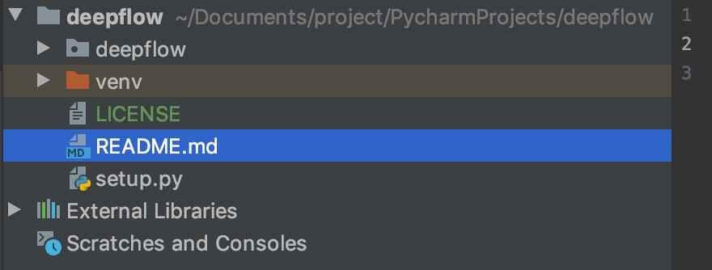
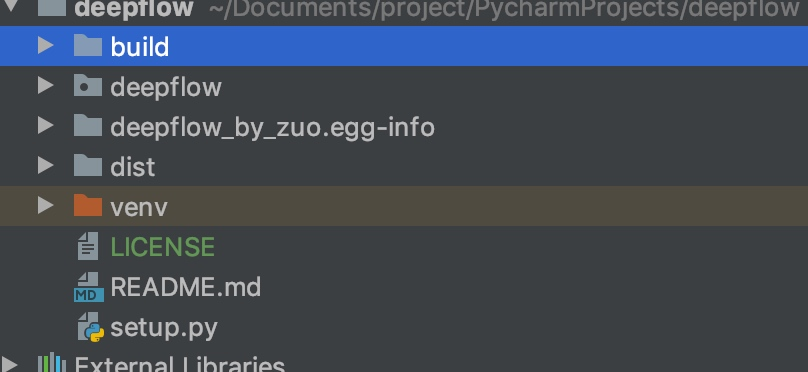
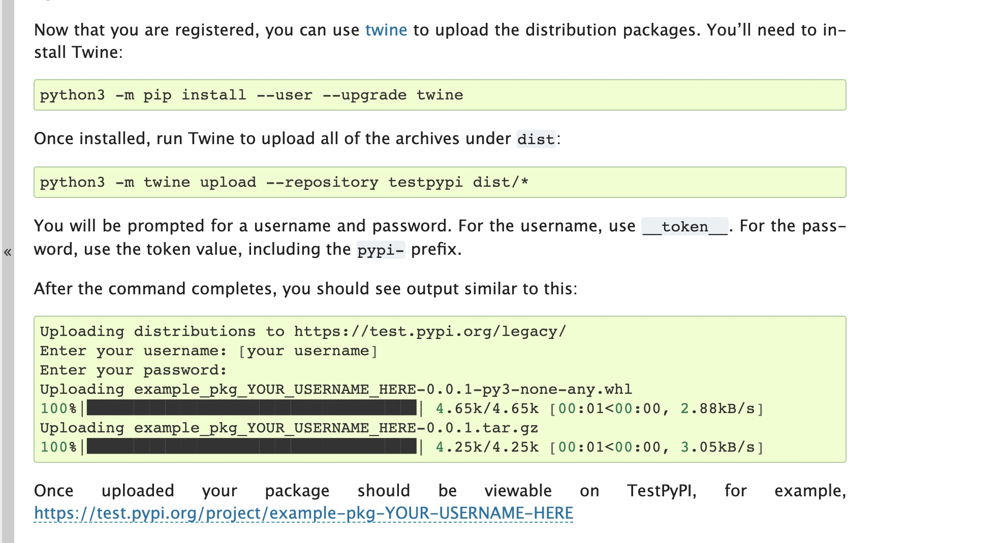

# 发布python代码
打开这个发布文档网站
https://packaging.python.org/tutorials/packaging-projects/
[发布你自己的轮子 - PyPI打包上传实践](https://segmentfault.com/a/1190000008663126)

##前奏
打开pycharm工程目录

按照网站上创建LICENSE、README和setup这些文件内容网站上复制下来。

执行
python3 -m pip install --user --upgrade setuptools wheel

打包
python3 setup.py sdist bdist_wheel

多了一些文件
把dist拷给别人 pip install一下就可以用了。

##上传
接下来就是上传到pypi
去pypi注册一个账号
https://pypi.org/project/PySearcher/#description
然后根据账号密码上传

python3 -m twine upload --repository pypi dist/* 

##安装
如果配置了一些pip源，这些pip源是每个几个小时从pypi同步。
可能不能马上pip install

###如何修改mac上的pip源
终端：cd ~/

 

查看是否有 .pip 文件夹：ls -a

没有就新建一个文件夹：mkdir .pip

 

然后在.pip 文件夹内新建一个文件 touch pip.conf，

最近阿里云不是很好用推荐清华大学的源 2018.7.27

[global]
index-url = https://pypi.tuna.tsinghua.edu.cn/simple
[install]
trusted-host=pypi.tuna.tsinghua.edu.cn

编辑 pip.conf 文件，写入阿里云
[global]

index-url = http://mirrors.aliyun.com/pypi/simple/

[install]

trusted-host=mirrors.aliyun.com

或者可以使用豆瓣的镜像：

[global]

index-url = http://pypi.douban.com/simple

[install]

trusted-host=pypi.douban.com

###想要马上装的话就把这些源给注释掉
就可以pip install了
用时直接import
