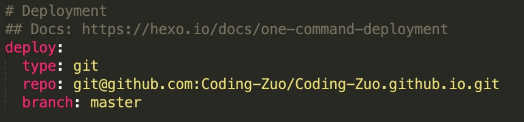

# Hexo+github博客


##安装初始化
有node有git环境
npm install -g hexo-cli

```
# 在你的家目录下创建一个blog文件夹
mkdir blog
# 进入目录
cd blog
# 初始化目录
hexo init
hexo install
npm install hexo-deployer-git --save
开启本地服务 
# hexo s
```
##vim _config.yml 

冒号后面加空格
git@github.com:Coding-Zuo/Coding-Zuo.github.io.git

[Mac 系统下搭建hexo个人博客](https://www.jianshu.com/p/77db3862595c)