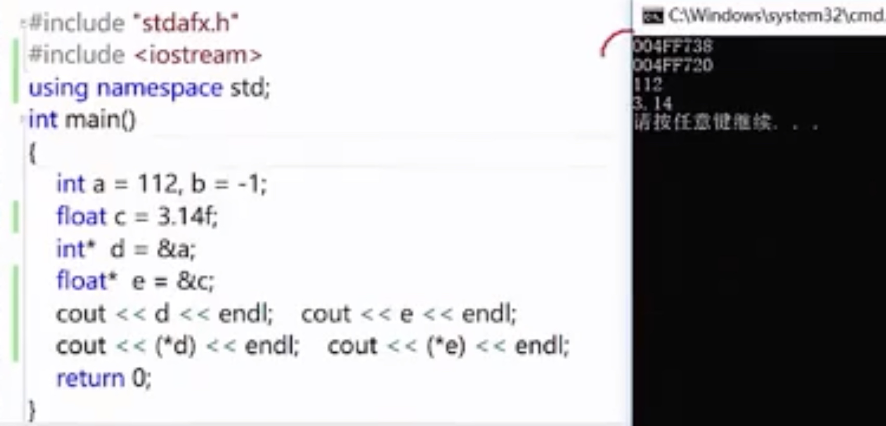

# C++指针

[TOC]

##计算机体系中的存储层次

按照离CPU由近到远的顺序依次是CPU寄存器、 Cache、内存、硬盘，越靠近CPU的存储器容量越小但访问速度越快。
寄存器、 Cache和内存中的数据都是掉电丢失的，这称为易失性存储器（Volatile Memory） ，与之相对的，硬盘是一种非易失性存储器（ Non-volatile Memory） 。

## C++中内存单元内容与地址
- 内存由很多内存单元组成，这些内存单元用于存放各种类型的数据。
- 计算机对内存的每个内存单元都进行了编号，这个编号就称为内存地址。地址决定了内存单元在内存中的位置。
- 记住这些内容单元地址不方便，于是C++的编译器让我们通过名字(变量)来访问这些内存位置。

第三个是浮点数映射出的一个值
###指针的定义和间接访问操作
- 指针的定义基本形式:指针本身就是一个变量，其符合变量定义的基本形式。
- 它存储的是值的地址。
- 对于类型T，T*是:到T的指针类型
- 一个类型为T*的变量能保存一个类型T的对象的地址。

间接访问
- 通过指针访问它所指向地址的过程为间接访问(indirection)或引用指针(dereferencing the point)
- 这个用于执行间接访问操作符是单目操作符*

### 变量、地址和指针小结
- 一个变量有三个重要的信息：
 - 变量的地址位置
 - 变量所存的信息
 - 变量的类型
- 指针变量是一个专门用来记录变量的地址的变量
- 通过指针变量可以间接操作另一个变量的值

##左值与右值

### 数组与指针

strHelloWorld不可变
strHelloWordl[index]的值可变
pStrHelloWorld可变
pStrHelloWorld[index]的值取决于所指区间的存储区域是否可变

所指区域有很多种看下面

###左值右值
**概念**:一般说法，编译器为其单独分配了一块存储空间，可以取其地址的。
左值可以放在运算符的左边；
右值指的是数据本身，不能取到其自身地址，右值只能复制运算右边。

**具体分析**：
左值最常见的情况如函数和数据成员的名字
右值是没有标识符、不可以取地址的表达式，一般也称为‘临时对象’。
比如：a=b+c
&a是允许的操作，而&(b+c)不能通过编译
因此a是一个左值，(b+c)是右值

## 几种C++中的原始指针

###一般类型指针T*
T是一个泛型指针，泛指任何一种类型。和泛型不是一样的。

### 指针的数组和数组的指针
**指针的数组(array of pointers)与数组的指针(a point to an array)**

指针的数组T* t[] ，数组的每个元素都是一个指针
数组的指针T(*t)[] ，一个指针指向的是一个数组

### const pointer与pointer to const

关于const修饰的部分
- 看左侧最近的部分
- 如果左侧没有，则看右侧

说明
第二行，const修饰的是char，const右面*pStr1指针指向的内容是可变的，但指向空间存储区域是不可变的。
第三行，pStr2的指向不能发生变化
第四行，pStr3指向的内容和指向空间区域都是不可变的

### 指向指针的指针

*操作符具有从右向左的结合性，**相当于*(*c)，必须从里向外逐层求值。
*c得到的是c指向的位置，即b；
**c = *b, 得到变量a的值；

